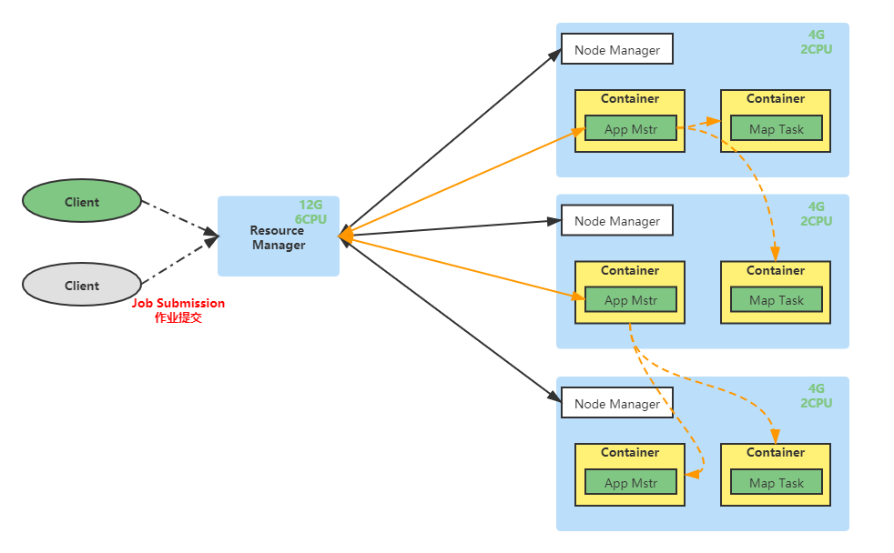

# Hadoop 总结

## 一.  Hadoop 概述
### 1.1  Hadoop概念
1. Hadoop 是由Apache基金会所开发的**分布式系统基础架构**。
2. 主要解决,**海量数据**的**存储**和海量数据的**分析计算**问题
3. 通常来讲，Hadoop通常是指一个更广泛的概念--Hadoop生态圈

### 1.2  Hadoop 三大发行版本

① Apache

② Cloudera

③ Hortonworks

### 1.3  Hadoop 优势

① 高可靠性： Hadoop底层维护多个数据副本，所以即使Hadoop某个计算元素或存储出现故障，也不会导致数据的丢失。

② 高拓展性：在集群间分配任务数据，可方便的拓展数以千计的节点。

③ 高效性：在Map Reduce的思想下，Hadoop是并行工作的，以加快任务处理速度。

④ 高容错性：能够自动将失败的任务重新分配。

### 1.4  Hadoop 组成

在Hadoop1.x版本中，Hadoop的Map Reduce同时是处理业务逻辑运算和资源的调度，耦合性较大。

在Hadoop2.x版本中，增加了Yarn。Yarn只负责资源的调度，Map Reduce只负责运算。

Hadoop3.x版本在组成上没有再做变化。

### 1.5  HDFS 架构概念

HDFS是Hadoop Distributed File System，简称HDFS，是一个分布式文件系统。

① NameNode（NN）：存储文件的**元数据**，如文件名，文件目录结构，文件属性（生成时间、副本数、文件权限），以及每个文件的块列表和块所在的DataNode等

② DataNode（DN）：在本地文件系统**存储文件块数据**，以及**块数据的校验和**。

③ Secondary NameNode：每隔一段时间对NameNode元数据备份

### 1.6  Yarn 架构概述

Yet Another Resource Negotiator简称Yarn，另一种资源协调者，是Hadoop的资源管理器。

① ResouceManager（RM）：整个集群资源（CPU、内存等）的老大

② NodeManager（NM）：单节点服务器资源老大

③ ApplicationMaster（AM）：单个任务运行的老大

④ Container：容器，相当于一台独立的服务器，里面封装了任务运行所需要的资源，**如内存、CPU、磁盘、网络等。**

注意：

客户端可以有多个，集群上可以运行多个ApplicationMaster，每个NodeManager上可以有多个Container

### 1.7  MapReduce 架构概述

MapReduce将计算过程分为两个阶段：Map和Reduce

① Map阶段并行处理输入数据

② Reduce阶段对Map结果进行汇总

## 二.  Hadoop 环境搭建（todo）

### 2.n  常用端口号说明

|                                  | Hadoop2.x  | Hadoop3.x            |
| -------------------------------- | ---------- | -------------------- |
| NameNode内部通信端口             | 8020、9000 | 8020、9000、**9820** |
| NameNode HTTP UI（对外暴露端口） | **50070**  | **9870**             |
| MapReduce任务执行情况查看端口    | 8088       | 8088                 |
| 历史服务器通信端口               | 19888      | 19888                |

## 三.  Hadoop 运行模式（todo）

## 四.  常见错误及解决方案（todo）

## 五.  HDFS

### 5.1  HDFS概述

#### 5.1.1  产生背景和定义

​	随着数据量越来越大,在一个操作系统存不下所有的数据,那么就分配到更多的操作系统管理的磁盘中,但是不方便管理和维护,迫切**需要一种系统来管理多台计算器上的文件**,这就是分布式文件管理系统。**HDFS只是分布式文件管理系统中的一种**。

​	HDFS（Hadoop Distributed File System），它是一个文件系统，用于存储文件，通过目录树来定位文件：其次，它是分布式的，由很多服务器联合起来实现其功能，集群中的服务器有各自的角色。

​	HDFS的使用场景：**适合一次写入，多次读取得场景**。一个文件经过创建、写入和关闭之后就不需要改变。

#### 5.1.2  优缺点

- **优点：**
  - **高容错性**
    - 数据自动保存多个副本。它通过增加副本形式，提高容错性。
    - 某一个副本丢失以后，它可以自动恢复。
  - **适合处理大数据**
    - 数据规模：能够处理数据规模达到GB、TB、甚至PB级别的数据
    - 文件规模：能够处理**百万**规模以上的**文件数量**。
  - 可**构建在廉价机器上**，通过多副本机制，提高可靠性。
- **缺点：**
  - **不适合低延时的数据访问，比如毫秒级的存储数据，是做不到的。**
  - **无法高效的对大量小文件进行存储。**
    - 存储大量小文件的话，它会占用NameNode大量的内存来存储文件目录和块信息。这样是不可取的，因为NameNode的内存总是有限的。
    - 小文件存储的寻址时间会超过读取时间，它违反了HDFS的设计目标。
  - **不支持并发写入、文件随机修改**
    - 一个文件只能有一个写，不允许多个线程同时写
    - 仅支持数据append（追加），不支持文件的随机修改

#### 5.1.3  组成架构

#### 5.1.4  产生背景和定义
#### 5.1.5  产生背景和定义
#### 5.1.6  产生背景和定义
#### 5.1.7  产生背景和定义
#### 5.1.8  产生背景和定义
#### 5.1.9  产生背景和定义

### 5.2  HDFS的Shell相关操作

### 5.3  HDFS的客户端API

### 5.4  HDFS的读写流程(重点)

### 5.5  NN和2NN

### 5.6  DataNode工作机制

## 六.  Hadoop 概述

## 七.  Hadoop 概述

## 八.  Hadoop 概述