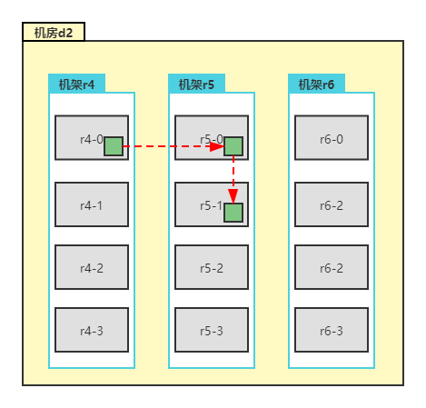
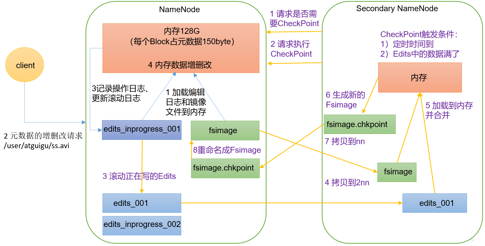
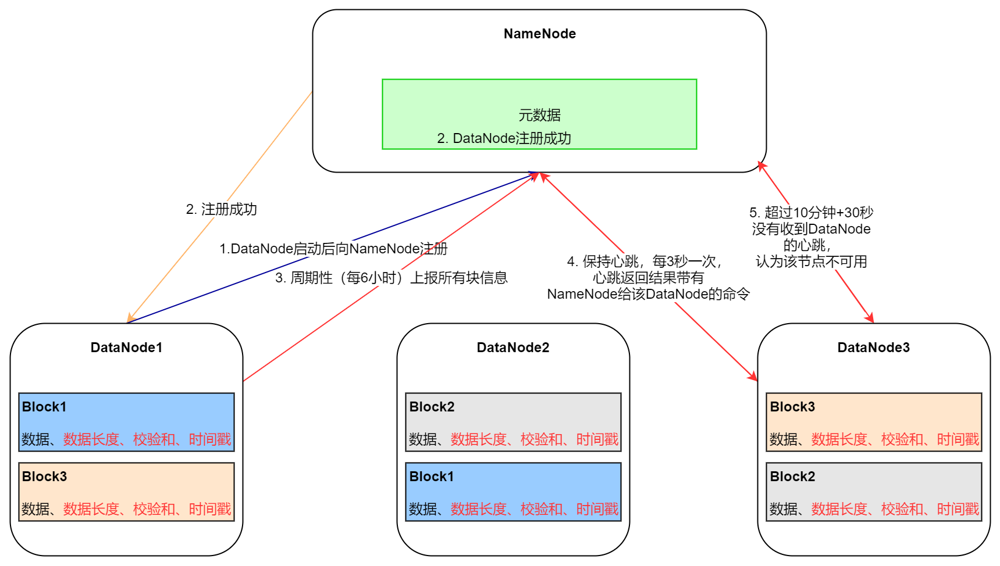

# Hadoop 总结

## 一.  Hadoop 概述
### 1.1  Hadoop概念
1. Hadoop 是由Apache基金会所开发的**分布式系统基础架构**。
2. 主要解决,**海量数据**的**存储**和海量数据的**分析计算**问题
3. 通常来讲，Hadoop通常是指一个更广泛的概念--Hadoop生态圈

### 1.2  Hadoop 三大发行版本

① Apache

② Cloudera

③ Hortonworks

### 1.3  Hadoop 优势

① 高可靠性： Hadoop底层维护多个数据副本，所以即使Hadoop某个计算元素或存储出现故障，也不会导致数据的丢失。

② 高拓展性：在集群间分配任务数据，可方便的拓展数以千计的节点。

③ 高效性：在Map Reduce的思想下，Hadoop是并行工作的，以加快任务处理速度。

④ 高容错性：能够自动将失败的任务重新分配。

### 1.4  Hadoop 组成


在Hadoop1.x版本中，Hadoop的Map Reduce同时是处理业务逻辑运算和资源的调度，耦合性较大。

在Hadoop2.x版本中，增加了Yarn。Yarn只负责资源的调度，Map Reduce只负责运算。

Hadoop3.x版本在组成上没有再做变化。

### 1.5  HDFS 架构概念

HDFS是Hadoop Distributed File System，简称HDFS，是一个分布式文件系统。

① NameNode（NN）：存储文件的**元数据**，如文件名，文件目录结构，文件属性（生成时间、副本数、文件权限），以及每个文件的块列表和块所在的DataNode等

② DataNode（DN）：在本地文件系统**存储文件块数据**，以及**块数据的校验和**。

③ Secondary NameNode：每隔一段时间对NameNode元数据备份

### 1.6  Yarn 架构概述

Yet Another Resource Negotiator简称Yarn，另一种资源协调者，是Hadoop的资源管理器。


① ResouceManager（RM）：整个集群资源（CPU、内存等）的老大

② NodeManager（NM）：单节点服务器资源老大

③ ApplicationMaster（AM）：单个任务运行的老大

④ Container：容器，相当于一台独立的服务器，里面封装了任务运行所需要的资源，**如内存、CPU、磁盘、网络等。**

注意：

客户端可以有多个，集群上可以运行多个ApplicationMaster，每个NodeManager上可以有多个Container

### 1.7  MapReduce 架构概述

MapReduce将计算过程分为两个阶段：Map和Reduce

① Map阶段并行处理输入数据

② Reduce阶段对Map结果进行汇总


## 二.  Hadoop 环境搭建（todo）

### 2.n  常用端口号说明

|                                  | Hadoop2.x  | Hadoop3.x            |
| -------------------------------- | ---------- | -------------------- |
| NameNode内部通信端口             | 8020、9000 | 8020、9000、**9820** |
| NameNode HTTP UI（对外暴露端口） | **50070**  | **9870**             |
| MapReduce任务执行情况查看端口    | 8088       | 8088                 |
| 历史服务器通信端口               | 19888      | 19888                |


## 三.  Hadoop 运行模式（todo）

## 四.  常见错误及解决方案（todo）

## 五.  HDFS

### 5.1  HDFS概述

#### 5.1.1  产生背景和定义

​	随着数据量越来越大,在一个操作系统存不下所有的数据,那么就分配到更多的操作系统管理的磁盘中,但是不方便管理和维护,迫切**需要一种系统来管理多台计算器上的文件**,这就是分布式文件管理系统。**HDFS只是分布式文件管理系统中的一种**。

​	HDFS（Hadoop Distributed File System），它是一个文件系统，用于存储文件，通过目录树来定位文件：其次，它是分布式的，由很多服务器联合起来实现其功能，集群中的服务器有各自的角色。

​	HDFS的使用场景：**适合一次写入，多次读取得场景**。一个文件经过创建、写入和关闭之后就不需要改变。


#### 5.1.2  优缺点

- **优点：**
  - **高容错性**
    - 数据自动保存多个副本。它通过增加副本形式，提高容错性。
    - 某一个副本丢失以后，它可以自动恢复。
  - **适合处理大数据**
    - 数据规模：能够处理数据规模达到GB、TB、甚至PB级别的数据
    - 文件规模：能够处理**百万**规模以上的**文件数量**。
  - 可**构建在廉价机器上**，通过多副本机制，提高可靠性。
- **缺点：**
  - **不适合低延时的数据访问，比如毫秒级的存储数据，是做不到的。**
  - **无法高效的对大量小文件进行存储。**
    - 存储大量小文件的话，它会占用NameNode大量的内存来存储文件目录和块信息。这样是不可取的，因为NameNode的内存总是有限的。
    - 小文件存储的寻址时间会超过读取时间，它违反了HDFS的设计目标。
  - **不支持并发写入、文件随机修改**
    - 一个文件只能有一个写，不允许多个线程同时写
    - 仅支持数据append（追加），不支持文件的随机修改
  
  

#### 5.1.3  组成架构


​	HDFS采用Master/Slave架构，一个HDFS集群是由一个NameNode和一定数量的DataNode组成的。

- **NameNode（NN）**：就是Master，它是一个中心服务器。负责：
  - 管理HDFS的名称空间
  - 配置副本策略
  - 管理数据块（Block）映射信息
  - 处理客户端读写请求
- **DataNode（DN）**：就是Slave。NameNode下达命令，DataNode执行实际操作。
  - 存储实际的数据块
  - 执行数据块的读写操作
- **Clent**：客户端
  - 文件切分。文件上传HDFS时，Client将文件切分成一个个块（Block），然后进行上传
  - 与NameNode交互，获取文件的位置信息
  - 与DataNode交互，读写数据
  - Client提供一些命令来管理HDFS，比如NameNode格式化
  - Clent可以通过一些命令来访问HDFS，比如对HDFS增删查改操作
- **Secondary NameNode**：并非NameNode的热备。当NameNode挂掉的时候，它并不能马上替换NameNode并提供服务。
  - 辅组NameNode，分担器工作量，比如定期合并Fsimage和Edits，并推送给NameNode
  - 在紧急情况下，可辅助恢复NameNode


#### 5.1.4 HDFS Block大小<font color=red>（面试重点）</font>

​	HDFS中的文件在物理上时分块（block）存储的，块的大小可以通过参数（dfs.blocksize）来设置，在Hadoop 1.x 默认是64m，在Hadoop 2.x和Hadoop 3.x中默认为128m。<font color=red>**HDFS块的大小设置主要取决于磁盘传输速率**</font>。

​	目前普通的硬盘的传输速率普遍为100m/s，固态硬盘能达到200~300m/s。专家认为当寻址时间（查询到目标块所花费的时间）为传输时间的1%时，则为最佳状态。如果寻址时间约为10ms，即查找到目标block的时间为10ms。那么传输时间为 10ms/0.01=1000ms = 1s。那么如果是普通磁盘的话，那么块大小就设置为128m，如果是固态硬盘，则可以设置为256m。

​	HDFS块的大小不能设置太小也不能设置太大。如果<font color=red>**设置太小，会增加寻址时间**</font>，程序一直在找块的开始位置。如果块<font color=red>**设置太大，从磁盘传输数据的时间会明显大于定位这个块开始位置所需的时间**</font>。而且快太大，也会导致程序在处理这块数据是，会非常慢。


### 5.2  HDFS的Shell相关操作（todo）

### 5.3  HDFS的客户端API（todo）

### 5.4  <font color=red>HDFS的读写流程 (重点)</font>

#### 5.4.1 HDFS写数据流程


① HDFS客户端要往集群传送数据，首先需要在客户端创建一个分布式的文件系统客户端，创建完之后，向NameNode发送上传文件请求。

② NameNode需要对要上传的文件进行校验，校验文件权限和文件是否存在等合法性校验,校验完之后给客户端响应是否可以上传

③ 当校验通过后，客户端向NameNode请求获取上传文件块存放的节点列表

④ NameNode经过筛选之后将合适的节点信息返回客户端

⑤ 客户端创建数据管道流与DataNode建立通信，建立通信之后

⑥ 应答成功

⑦ 数据传输，以Packet（chunk512byte + chunksum4byte）为单位（64k）进行数据传输，发送时有一个ack packet队列，存放了传输的packet，当应答成功时，将packet从队列里移除


#### 5.4.2 网络拓扑-节点距离计算

​	在HDFS写数据过程中，NameNode会选择距离待上传数据距离最近的DataNode接收数据。<font color=red>**节点距离：两个节点到达最近的共同祖先的距离总和。**</font>

如下图: 


Distance(r2-3，r2-3) = 0 (在同一节点上)

Distance（r3-1，r3-2）= 2 （在同一机架的不同节点）

Distance（r1-0，r2-0）= 4 （同一机房或数据中心不同机架上）

Distance（r1-1，r4-0） = 6 （不同机房或数据中心的节点）


#### 5.4.3 机架感知（副本存储节点选择）

源码位置：**BlockPlacementPolicyDefault**类中的**chooseTargetOrder**方法中。



<font color=red>**① 第一个副本在Client所处节点上。**</font>

<font color=red>**② 第二个副本在另一个机架上随机一个节点。(保证数据的可靠性)**</font>

<font color=red>**③ 第三个副本在第二个副本所在机架的随机节点（传输效率高）**</font>


#### 5.4.2 HDFS读数据流程


① 客户端通过DistributedFileSystem向NameNode请求下载文件

② NameNode通过查询元数据，找到文件块所在的DataNode地址。

③ 选择节点最近的一台DataNode，请求读取数据。

④ DataNode开始传输数据给客户端（从磁盘里面读取数据输入流，以Packet为单位来做校验）

⑤ 如果DataNode1负载达到量级之后，通过负载均衡可以从另一个节点NameNode读取数据。假如读取第二块时，DataNode1已经达到负载，那么从DataNode开始读取数据。

⑥ 客户端以Packet为单位接收，现在本地缓存，然后写入目标文件。（注意：读取数据是串行读取的，第一块读完之后读第二块进行追加）


### 5.5  NameNode和SecondaryNameNode工作机制

​	NameNode的功能是用来存储元数据的，那么元数据存储在哪里？内存还是磁盘？

​	假设元数据存储在NameNode节点的磁盘中，因为经常需要进行随机访问，还有响应客户端请求，效率就非常低。如果元数据存储在内存中，数据可靠性就不能得到保证，一旦服务宕机，元数据就丢失，会导致元数据丢失。<font color=red>**因此，就产生了FsImage，用FsImage在磁盘中备份元数据。**</font>

​	但是，这样又有一个新问题，当在内存中的元数据更新时，如果同时更新FsImage，（如果随机读写）就会导致效率过低，但是如果不更新，就会发生一致性问题，一旦NameNode节点断电，就会产生数据丢失。<font color=red>**因此，引入Edits文件（只进行追加，效率很高）。用来存储元数据操作，每当元数据有更新或者添加元数据时，修改内存中的元数据并最佳到Edits中。**</font>这样，一旦NameNode节点断电，可以通过FsIamge和Edits的合并，合成元数据。

​	但是，如果长时间添加数据到Edits中，会导致该文件数据过大，效率地下，而且一旦断电，恢复元数据需要的时间过长。因此，需要定期进行FsImage和Edits合并，如果这个操作由NameNode节点完成，又会效率过低。<font color=red>**因此，引入一个新得节点SecodaryNameNode，专门用于FsImage和Edits的合并。**</font>


#### 5.5.1  Fsimage和Edits概念

- **FsImage文件：** HDFS文件系统元数据的有一个<font color=red>**永久性的检查点**</font>，其中包含HDFS文件系统的所以有目录和文件inode的序列化信息。
- **Edits文件：**存放HDFS文件系统的所有更新操作和路径，文件系统客户端执行的所以也有写操作首先会被记录到Edits文件中
- **seen_txid：**除了以上两个文件之外，该文件也在$HADOOP_HOME/data/tmp/dfs/name/current目录下，seen_txid保存的是一个数字，就是最后一个edits_对应的数字


#### 5.5.2  工作机制



- **第一阶段：NameNode启动**

  ① 第一次启动NameNode格式化后，创建Fsimage和Edits文件。如果不是第一次启动，直接加载镜像文件Fsimage和编辑日志到内存。

  ② 客户端对元数据进行增删改的请求

  ③ NameNode 记录操作日志，更新滚动日志

  ④ NameNode 在内存中对元数据进行增删改

- **第二阶段：SecondaryNameNode工作**

  ① SecondaryNameNode询问NameNode是否需要CheckPoint。直接带回NameNode是否检查结果

  ② SecondaryNameNode请求执行CheckPoint。

  ③ NameNode滚动正在写的Edits文件。

  ④ 将滚动前的编辑日志和镜像文件拷贝到SecondaryNameNode

  ⑤ SecondaryNameNode加载编辑日志和镜像文件到内存，并合并

  ⑥ 生成新的镜像文件fsimage.chkpoint

  ⑦ 拷贝fsimage.chkpoint到NameNode

  ⑧ NameNode将fsimage.chkpoint重命名为fsimage，替换原有的fsimage

  

### 5.6  DataNode工作机制

​	一个数据块（Block）在DataNode上以文件形式存储在磁盘上，包括两个文件，一个是数据本身，一个是元数据包括数据块的长度、块数据、校验和以及时间戳。



① DataNode启动后会向NameNode注册，告诉NameNode，自身节点上有哪些活着的块信息。

② NameNode接收到DataNode的注册信息后，会把对应的信息记录在元数据里面。然后返回注册成功。

③ 注册通过后，周期性（6小时）向NameNode上报所有的块信息。（以确保块信息的状态是否完好等）

​	这里涉及到两个参数：

```xml
<!-- DataNode 向NameNode汇报当前节点信息的时间间隔，默认6小时 -->
<property>
	<name>dfs.blockreport.intervalMsec</name>
    <value>21600000</value>
</property>
<!-- DataNode 扫描自己节点块信息列表的时间,自查块信息是否损坏等，默认6小时 -->
<property>
    <name>dfs.datanode.directoryscan.interval</name>
    <value>21600s</value>
</property>
```

④ DataNode会和nameNode保持心跳，每3秒一次，心跳返回结果带有NameNode给该DataNode的命令（如复制块数据到另一台节点或删除某数据块）。

⑤ 如果超过10分钟+30秒（<font color=red>2\*dfs.namenode.heartbeat.recheck-interval + 10\*dfs.heartbeat.interval</font>）没有收到某个节点的心跳，则任务该节点不可用。


## 六.  MapReduce

### 6.1  MapReduce概述

#### 6.1.1  定义

​	MapReduce是有一个<font color=red>**分布式运算程序**</font>的编程框架，是用户开发“基于Hadoop的数据分析应用“的核心框架

​	MapReduce核心功能是将与用户编写的业务逻辑代码和自带默认组件整合成一个完整的分布式运算程序，并发运行在一个Hadoop集群上。


#### 6.1.2  优缺点

- **优点：**

  - **易于编程**： 用户只关系业务逻辑。实现框架的接口。

    它简单的实现一些接口，就可以已完成一个分布式程序，这个分布式程序可以分布到大量廉价的PC机器上运行。

  - **良好的扩展性**：可以动态增加服务器，解决计算资源不足问题

  - **高容错性**：任何一台机器挂掉，可以以将任务转移到其他节点

    MapReduce设计的初衷就是使程序能够部署在廉价的PC机器上，这就要求它具有很高的容错性。比如其中一台机器挂了，它可以把上面的计算任务转移到另一个节点上运行，不至于这个任务运行失败，而且这个过程不需要人工参与，而完全是由Hadoop内部完成的。

  - **适合海量数据的离线处理（PB级以上）**：可以实现几千台服务器共同并发工作，提供数据处理能力。

- **缺点：**

  - **不擅长实时计算**：

    MapReduce无法像Mysql一样一样，在毫秒或者秒级别内返回结果。

  - **不擅长流式计算：** 

    流式计算的输入数据是动态的，而MapReduce的输入数据是静态的，不能动态变化。这是也因为MapReduce自身的设计特点决定了数据源必须是静态的。

  - **不擅长DAG（有向无环图）计算：**

    多个应用程序存在依赖关系，后一个应用程序的输入为前一个应用的输出。在这种情况下，MapReduce并不是不能做，而是使用后，<font color=red>**每个MapReduce作业的输出结果会写入到磁盘，会照成大量的磁盘IO，导致性能非常低。**</font>
    
    

#### 6.1.3  MapReduce核心思想


​	MapReduce核心思想<font color=red>**分而治之，先分再合。移动计算到数据端**</font>一个Map/Reduce *作业（job）* 通常会把输入的数据集切分为若干独立的数据块，由 *map任务（task）*以完全并行的方式处理它们。框架会对map的输出先进行排序， 然后把结果输入给*reduce任务*。通常作业的输入和输出都会被存储在文件系统中。 整个框架负责任务的调度和监控，以及重新执行已经失败的任务。即将一个大的、复杂的工作或任务，拆分成多个小的任务，并行处理，最终进行合并。适用于大量复杂的、时效性不高的任务处理场景（大规模离线数据处理场景）。

​	① 分布式的运算程序往往需要分成至少两个阶段

​	① 第一阶段Map负责分，将复杂的任务分解成若干小的任务来处理，MapTask并发实例完全并行处理，互不干扰。

​	② 第二阶段Reduce阶段负责合，对Map阶段的结果进行全局汇总。ReduceTask也是并发处理互不干扰，它的数据依赖于上一个阶段的运行结果。

​	③ MapReduce编程模型只能包含一个Map阶段合一个Reduce阶段，如果用户业务逻辑非常复杂，那就只能多个MapReduce串行运行。


#### 6.1.4  MapReduce 进程

​	一个完整的MapReduce程序再分布式运行时有三类实例进程：

​	① **MrAppMaster**：负责整个程序的过程调度及状态协调（ApplicationMaster的子类）

​	② **MapTask**：负责Map阶段的整个数据处理流程（查看进程的时候，叫YarnChild）

​	③ **ReduceTask**：负责Reduce阶段的整个数据处理流程。（查看进程的时候，叫YarnChild）


### 6.2  序列化


### 6.3  核心框架原理

### 6.4  数据压缩


## 七.  Hadoop 概述

### 7.1  数据压缩


## 八.  Hadoop 概述

### 8.1  数据压缩