- [JVM 知识](#jvm-%E7%9F%A5%E8%AF%86)
  - [1. 内存结构](#1-%E5%86%85%E5%AD%98%E7%BB%93%E6%9E%84)
    - [1.1 内存结构概览](#11-%E5%86%85%E5%AD%98%E7%BB%93%E6%9E%84%E6%A6%82%E8%A7%88)
    - [1.2 类加载子系统](#12-%E7%B1%BB%E5%8A%A0%E8%BD%BD%E5%AD%90%E7%B3%BB%E7%BB%9F)
      - [1.2.1 类加载器](#121-%E7%B1%BB%E5%8A%A0%E8%BD%BD%E5%99%A8)
      - [1.2.2  **ClassLoader类**](#122--classloader%E7%B1%BB)
      - [1.2.3  **双亲委派机制**](#123--%E5%8F%8C%E4%BA%B2%E5%A7%94%E6%B4%BE%E6%9C%BA%E5%88%B6)
      - [1.2.4  **其他**](#124--%E5%85%B6%E4%BB%96)
    - [1.3 运行时数据区](#13-%E8%BF%90%E8%A1%8C%E6%97%B6%E6%95%B0%E6%8D%AE%E5%8C%BA)
      - [1.3.1  **程序计数器（PC寄存器 Program Counter Register）**](#131--%E7%A8%8B%E5%BA%8F%E8%AE%A1%E6%95%B0%E5%99%A8pc%E5%AF%84%E5%AD%98%E5%99%A8-program-counter-register)
      - [1.3.2  **虚拟机栈**(JVM Stacks)](#132--%E8%99%9A%E6%8B%9F%E6%9C%BA%E6%A0%88jvm-stacks)
        - [**1.3.2.1 JVM的架构模型**](#1321-jvm%E7%9A%84%E6%9E%B6%E6%9E%84%E6%A8%A1%E5%9E%8B)
        - [**1.3.2.2 栈帧的内部结构 **](#1322-%E6%A0%88%E5%B8%A7%E7%9A%84%E5%86%85%E9%83%A8%E7%BB%93%E6%9E%84-)
        - [**1.3.2.3 局部变量表**](#1323-%E5%B1%80%E9%83%A8%E5%8F%98%E9%87%8F%E8%A1%A8)
        - [**1.3.2.4 操作数栈 （数组实现）**](#1324-%E6%93%8D%E4%BD%9C%E6%95%B0%E6%A0%88-%E6%95%B0%E7%BB%84%E5%AE%9E%E7%8E%B0)
        - [**1.3.2.5 动态链接**（或指向运行时常量池的方法引用）](#1325-%E5%8A%A8%E6%80%81%E9%93%BE%E6%8E%A5%E6%88%96%E6%8C%87%E5%90%91%E8%BF%90%E8%A1%8C%E6%97%B6%E5%B8%B8%E9%87%8F%E6%B1%A0%E7%9A%84%E6%96%B9%E6%B3%95%E5%BC%95%E7%94%A8)
        - [**1.3.2.6 方法返回地址**](#1326-%E6%96%B9%E6%B3%95%E8%BF%94%E5%9B%9E%E5%9C%B0%E5%9D%80)
        - [**1.3.2.7 附加信息**](#1327-%E9%99%84%E5%8A%A0%E4%BF%A1%E6%81%AF)
        - [**1.3.2.8 关于虚拟机栈的几个面试题**](#1328-%E5%85%B3%E4%BA%8E%E8%99%9A%E6%8B%9F%E6%9C%BA%E6%A0%88%E7%9A%84%E5%87%A0%E4%B8%AA%E9%9D%A2%E8%AF%95%E9%A2%98)
      - [1.3.3  **本地方法栈（Native Method Stacks）**](#133--%E6%9C%AC%E5%9C%B0%E6%96%B9%E6%B3%95%E6%A0%88native-method-stacks)
      - [1.3.4  **堆（Heap）**](#134--%E5%A0%86heap)
        - [**1.3.4.1 内存细分**](#1341-%E5%86%85%E5%AD%98%E7%BB%86%E5%88%86)
        - [**1.3.4.2 堆空间大小的设置**](#1342-%E5%A0%86%E7%A9%BA%E9%97%B4%E5%A4%A7%E5%B0%8F%E7%9A%84%E8%AE%BE%E7%BD%AE)
        - [**1.3.4.3 年轻代与老年代**](#1343-%E5%B9%B4%E8%BD%BB%E4%BB%A3%E4%B8%8E%E8%80%81%E5%B9%B4%E4%BB%A3)
        - [**1.3.4.4 对象分配过程**](#1344-%E5%AF%B9%E8%B1%A1%E5%88%86%E9%85%8D%E8%BF%87%E7%A8%8B)
        - [**1.3.4.5 Minor GC、Major GC与Full GC**](#1345-minor-gcmajor-gc%E4%B8%8Efull-gc)
        - [**1.3.4.6 堆空间的分代思想**](#1346-%E5%A0%86%E7%A9%BA%E9%97%B4%E7%9A%84%E5%88%86%E4%BB%A3%E6%80%9D%E6%83%B3)
        - [**1.3.4.7 内存分配策略（或对象提升（Promotion）规则**](#1347-%E5%86%85%E5%AD%98%E5%88%86%E9%85%8D%E7%AD%96%E7%95%A5%E6%88%96%E5%AF%B9%E8%B1%A1%E6%8F%90%E5%8D%87promotion%E8%A7%84%E5%88%99)
        - [**1.3.4.8 TLAB（Thread Local Allocation Buffer）**](#1348-tlabthread-local-allocation-buffer)
        - [**1.3.4.8  堆空间常用的JVM参数**](#1348--%E5%A0%86%E7%A9%BA%E9%97%B4%E5%B8%B8%E7%94%A8%E7%9A%84jvm%E5%8F%82%E6%95%B0)
        - [**1.3.4.9  补充**](#1349--%E8%A1%A5%E5%85%85)
      - [1.3.5  **方法区（Method Area [Metaspace]）**](#135--%E6%96%B9%E6%B3%95%E5%8C%BAmethod-area-metaspace)
        - [**1.3.5.1 运行时数据区划分**](#1351-%E8%BF%90%E8%A1%8C%E6%97%B6%E6%95%B0%E6%8D%AE%E5%8C%BA%E5%88%92%E5%88%86)
        - [**1.3.5.2 Hotspot中方法区的演进**](#1352-hotspot%E4%B8%AD%E6%96%B9%E6%B3%95%E5%8C%BA%E7%9A%84%E6%BC%94%E8%BF%9B)
        - [**1.3.5.3 设置方法区大小与OOM**](#1353-%E8%AE%BE%E7%BD%AE%E6%96%B9%E6%B3%95%E5%8C%BA%E5%A4%A7%E5%B0%8F%E4%B8%8Eoom)
        - [**1.3.5.4 方法区内部结构**](#1354-%E6%96%B9%E6%B3%95%E5%8C%BA%E5%86%85%E9%83%A8%E7%BB%93%E6%9E%84)
        - [**1.3.5.5 方法区的演进（Hotspot虚拟机）**](#1355-%E6%96%B9%E6%B3%95%E5%8C%BA%E7%9A%84%E6%BC%94%E8%BF%9Bhotspot%E8%99%9A%E6%8B%9F%E6%9C%BA)
        - [**1.3.5.6 方法区的垃圾回收**](#1356-%E6%96%B9%E6%B3%95%E5%8C%BA%E7%9A%84%E5%9E%83%E5%9C%BE%E5%9B%9E%E6%94%B6)
    - [1.4 相关面试题](#14-%E7%9B%B8%E5%85%B3%E9%9D%A2%E8%AF%95%E9%A2%98)
    - [1.5 对象的实例化内存布局与访问定位](#15-%E5%AF%B9%E8%B1%A1%E7%9A%84%E5%AE%9E%E4%BE%8B%E5%8C%96%E5%86%85%E5%AD%98%E5%B8%83%E5%B1%80%E4%B8%8E%E8%AE%BF%E9%97%AE%E5%AE%9A%E4%BD%8D)
      - [1.5.1  **对象的实例化**](#151--%E5%AF%B9%E8%B1%A1%E7%9A%84%E5%AE%9E%E4%BE%8B%E5%8C%96)
      - [1.5.2  **对象的内存布局**](#152--%E5%AF%B9%E8%B1%A1%E7%9A%84%E5%86%85%E5%AD%98%E5%B8%83%E5%B1%80)
      - [1.5.3  **对象的的访问定位**](#153--%E5%AF%B9%E8%B1%A1%E7%9A%84%E7%9A%84%E8%AE%BF%E9%97%AE%E5%AE%9A%E4%BD%8D)
    - [1.6 直接内存（Direct Memory）](#16-%E7%9B%B4%E6%8E%A5%E5%86%85%E5%AD%98direct-memory)
    - [1.7 本地方法接口和本地方法库](#17-%E6%9C%AC%E5%9C%B0%E6%96%B9%E6%B3%95%E6%8E%A5%E5%8F%A3%E5%92%8C%E6%9C%AC%E5%9C%B0%E6%96%B9%E6%B3%95%E5%BA%93)
      - [1.7.1  **本地方法**](#171--%E6%9C%AC%E5%9C%B0%E6%96%B9%E6%B3%95)
    - [1.8 执行引擎](#18-%E6%89%A7%E8%A1%8C%E5%BC%95%E6%93%8E)
    - [1.9 StringTable](#19-stringtable)
      - [1.9.1  **String的基本特性**](#191--string%E7%9A%84%E5%9F%BA%E6%9C%AC%E7%89%B9%E6%80%A7)
      - [1.9.2  **String的内存分配**](#192--string%E7%9A%84%E5%86%85%E5%AD%98%E5%88%86%E9%85%8D)
      - [1.9.3  **字符串拼接操作**](#193--%E5%AD%97%E7%AC%A6%E4%B8%B2%E6%8B%BC%E6%8E%A5%E6%93%8D%E4%BD%9C)
      - [1.9.4  **intern()的使用**](#194--intern%E7%9A%84%E4%BD%BF%E7%94%A8)
  - [2. 垃圾回收](#2-%E5%9E%83%E5%9C%BE%E5%9B%9E%E6%94%B6)
    - [2.1 标记阶段](#21-%E6%A0%87%E8%AE%B0%E9%98%B6%E6%AE%B5)
      - [2.1.1 标记阶段：引用计数算法](#211-%E6%A0%87%E8%AE%B0%E9%98%B6%E6%AE%B5%E5%BC%95%E7%94%A8%E8%AE%A1%E6%95%B0%E7%AE%97%E6%B3%95)
      - [2.1.2 标记阶段：可达性分析算法（根搜索算法、追踪性垃圾收集）](#212-%E6%A0%87%E8%AE%B0%E9%98%B6%E6%AE%B5%E5%8F%AF%E8%BE%BE%E6%80%A7%E5%88%86%E6%9E%90%E7%AE%97%E6%B3%95%E6%A0%B9%E6%90%9C%E7%B4%A2%E7%AE%97%E6%B3%95%E8%BF%BD%E8%B8%AA%E6%80%A7%E5%9E%83%E5%9C%BE%E6%94%B6%E9%9B%86)
      - [2.1.3 对象的finalization机制](#213-%E5%AF%B9%E8%B1%A1%E7%9A%84finalization%E6%9C%BA%E5%88%B6)
    - [2.2 清除阶段](#22-%E6%B8%85%E9%99%A4%E9%98%B6%E6%AE%B5)
      - [2.2.1 清除阶段: 标记-清除算法（Mark-Sweep）](#221-%E6%B8%85%E9%99%A4%E9%98%B6%E6%AE%B5-%E6%A0%87%E8%AE%B0-%E6%B8%85%E9%99%A4%E7%AE%97%E6%B3%95mark-sweep)
      - [2.2.2 清除阶段: 复制算法](#222-%E6%B8%85%E9%99%A4%E9%98%B6%E6%AE%B5-%E5%A4%8D%E5%88%B6%E7%AE%97%E6%B3%95)
      - [2.2.3 清除阶段: 标记-压缩算法（或标记-整理，Mark-Compact）](#223-%E6%B8%85%E9%99%A4%E9%98%B6%E6%AE%B5-%E6%A0%87%E8%AE%B0-%E5%8E%8B%E7%BC%A9%E7%AE%97%E6%B3%95%E6%88%96%E6%A0%87%E8%AE%B0-%E6%95%B4%E7%90%86mark-compact)
      - [2.2.4 算法对比](#224-%E7%AE%97%E6%B3%95%E5%AF%B9%E6%AF%94)
    - [2.3 收集算法](#23-%E6%94%B6%E9%9B%86%E7%AE%97%E6%B3%95)
      - [2.3.1 分代收集算法](#231-%E5%88%86%E4%BB%A3%E6%94%B6%E9%9B%86%E7%AE%97%E6%B3%95)
      - [2.3.2 增量收集算法](#232-%E5%A2%9E%E9%87%8F%E6%94%B6%E9%9B%86%E7%AE%97%E6%B3%95)
      - [2.3.3 分区算法](#233-%E5%88%86%E5%8C%BA%E7%AE%97%E6%B3%95)
    - [2.4 垃圾回收相关概念](#24-%E5%9E%83%E5%9C%BE%E5%9B%9E%E6%94%B6%E7%9B%B8%E5%85%B3%E6%A6%82%E5%BF%B5)
      - [2.4.1 System.gc()](#241-systemgc)
      - [2.4.2 内存溢出](#242-%E5%86%85%E5%AD%98%E6%BA%A2%E5%87%BA)
      - [2.4.3 内存泄漏（Memory Leak）](#243-%E5%86%85%E5%AD%98%E6%B3%84%E6%BC%8Fmemory-leak)
      - [2.4.4 Stop The World](#244-stop-the-world)
      - [2.4.5 并行与并发](#245-%E5%B9%B6%E8%A1%8C%E4%B8%8E%E5%B9%B6%E5%8F%91)
      - [2.4.6 垃圾回收中的并行与并发](#246-%E5%9E%83%E5%9C%BE%E5%9B%9E%E6%94%B6%E4%B8%AD%E7%9A%84%E5%B9%B6%E8%A1%8C%E4%B8%8E%E5%B9%B6%E5%8F%91)
      - [2.4.7 安全点与安全区域（了解）](#247-%E5%AE%89%E5%85%A8%E7%82%B9%E4%B8%8E%E5%AE%89%E5%85%A8%E5%8C%BA%E5%9F%9F%E4%BA%86%E8%A7%A3)
      - [2.4.8 引用](#248-%E5%BC%95%E7%94%A8)
    - [2.5 垃圾回收器](#25-%E5%9E%83%E5%9C%BE%E5%9B%9E%E6%94%B6%E5%99%A8)
      - [2.5.1 垃圾回收器的分类](#251-%E5%9E%83%E5%9C%BE%E5%9B%9E%E6%94%B6%E5%99%A8%E7%9A%84%E5%88%86%E7%B1%BB)
      - [2.5.2 评估GC的性能指标](#252-%E8%AF%84%E4%BC%B0gc%E7%9A%84%E6%80%A7%E8%83%BD%E6%8C%87%E6%A0%87)
      - [2.5.3 垃圾回收器的组合关系](#253-%E5%9E%83%E5%9C%BE%E5%9B%9E%E6%94%B6%E5%99%A8%E7%9A%84%E7%BB%84%E5%90%88%E5%85%B3%E7%B3%BB)
      - [2.5.4 Serial回收器：串行回收](#254-serial%E5%9B%9E%E6%94%B6%E5%99%A8%E4%B8%B2%E8%A1%8C%E5%9B%9E%E6%94%B6)
      - [2.5.4 ParNew回收器：并行回收](#254-parnew%E5%9B%9E%E6%94%B6%E5%99%A8%E5%B9%B6%E8%A1%8C%E5%9B%9E%E6%94%B6)
      - [2.5.5 Parallel回收器：吞吐量优先](#255-parallel%E5%9B%9E%E6%94%B6%E5%99%A8%E5%90%9E%E5%90%90%E9%87%8F%E4%BC%98%E5%85%88)
      - [2.5.6 CMS回收器：低延迟](#256-cms%E5%9B%9E%E6%94%B6%E5%99%A8%E4%BD%8E%E5%BB%B6%E8%BF%9F)
      - [2.5.7 G1回收器：区域化分代式](#257-g1%E5%9B%9E%E6%94%B6%E5%99%A8%E5%8C%BA%E5%9F%9F%E5%8C%96%E5%88%86%E4%BB%A3%E5%BC%8F)
        - [**2.5.7.1 G1 概述**](#2571-g1-%E6%A6%82%E8%BF%B0)
        - [**2.5.7.2 分区Region：化整为零 **](#2572-%E5%88%86%E5%8C%BAregion%E5%8C%96%E6%95%B4%E4%B8%BA%E9%9B%B6-)
        - [**2.5.7.3 G1特点 **](#2573-g1%E7%89%B9%E7%82%B9-)
        - [**2.5.7.4  G1适用场景**](#2574--g1%E9%80%82%E7%94%A8%E5%9C%BA%E6%99%AF)
        - [**2.5.7.5  G1回收器垃圾回收过程**](#2575--g1%E5%9B%9E%E6%94%B6%E5%99%A8%E5%9E%83%E5%9C%BE%E5%9B%9E%E6%94%B6%E8%BF%87%E7%A8%8B)
        - [**2.5.7.3  G1相关参数设置**](#2573--g1%E7%9B%B8%E5%85%B3%E5%8F%82%E6%95%B0%E8%AE%BE%E7%BD%AE)
    - [2.6 GC日志分析](#26-gc%E6%97%A5%E5%BF%97%E5%88%86%E6%9E%90)
  - [3. 字节码与类的加载](#3-%E5%AD%97%E8%8A%82%E7%A0%81%E4%B8%8E%E7%B1%BB%E7%9A%84%E5%8A%A0%E8%BD%BD)
  - [4. 性能监控与调优](#4-%E6%80%A7%E8%83%BD%E7%9B%91%E6%8E%A7%E4%B8%8E%E8%B0%83%E4%BC%98)


# JVM 知识

## 1. 内存结构

### 1.1 内存结构概览


  <center style="font-size:18px;color:#1E90FF">图1.内存结构简图</center> 


  <center style="font-size:18px;color:#1E90FF">图2.内存结构详细图</center> 

### 1.2 类加载子系统


  <center style="font-size:18px;color:#1E90FF">图3.类加载子系统</center>

负责从文件系统或者网络中加载Class文件,class文件在文件开头有特定的文件标识

类加载器(Class Loader)只负责class文件的加载,至于它是否可以运行,由执行引擎(Execution Engine)决定。

加载的**类信息**存放于一块称为**方法区**的内存空间。 除了类信息之外，方法区中还会存放**运行时常量池信息**，可能还包括字符串字面量和数字常量（这部分常量信息是class文件中常量池部分的内存映射）

- **加载（Loading）**

    1. 通过一个类的全限定名获取定义此类的二进制字节流
    2. 将这个字节流所代表的静态存储结构转化为方法区的运行时数据结构
    3. **在内存中生成一个代表这个类的java.lang.Class对象**，作为方法区这个类的各种数据的访问入口

- **链接（Linking）**

    1. 验证(Verify):

       主要包含四种验证, **文件格式验证，元数据验证，字节码验证，符号引用验证**。

       目的在于确保class文件的字节流中包含信息符合当前虚拟机要求，保证被加载类的正确性，不会危害虚拟机自身安全。

    2. 准备(Prepare):

       为**类变量**分配内存并设置该类变量的**默认初始值，即零值**。

       ```java
       public class Demo{
           private static int a = 1; // 此阶段(prepare): a = 0 
           // Initialization阶段才赋值 a = 1
       }
       ```

       ***这里不包含用final修饰的static，因为final修饰此时是个常量，final在编译的时候就会分配了，准备阶段会显示初始化***

       这里不会为实例变量分配初始化值，类变量会分配在方法区中，而实例变量是会随着对象一起分配到java堆中。

    3. 解析(Resolve):

       **将常量池内的符号引用转换为直接引用的过程。**

       **事实上，解析操作往往会伴随着jvm在执行完初始化之后再执行。**

       符号引用就是一组符号来描述所引用的目标。符号引用的字面量形式明确定义在《java虚拟机规范》的class文件格式中。直接引用就是直接指向目标的指针、相对偏移量或者一个间接定位到目标的句柄。

       解析动作主要针对类或者接口、字段、类方法、接口方法、方法类型等。对常量池中的CONSTANT_ClASS_INFO、CONSTANT_FIELDREF_INFO、CONSTANT_METHODREF_INFO等。

- **初始化(Initialization)**

  初始化阶段就是执行类构造器方法<clinit>()的过程。

  此方法不需要定义，是javac编译器**自动收集**类中的**所有类变量的赋值动作和静态代码块中的语句**合并而来的。

  构造方法中指令按语句在源文件中出现的顺序执行。

  ```java
  	public class Demo {
          private static int num = 1;
          static {
              num = 2;
              number = 20;
          }
          private static int number = 10; // 链接(linking)的prepare阶段： number = 0; initial阶段: 先20再10, 最终 number=10; 
      }
  ```

  <clinit>() 不同于类的构造器。（关联：构造器是虚拟机视角下的<init>())

  若该类具有父类，JVM会保证字类的<clinit>()执行之前，父类的<clinit>()已经执行完毕。

  **虚拟机必须保证一个类的<clinit>() 方法在多线程下被同步加锁**。

#### 1.2.1 类加载器

从jvm角度，类加载器分为两种类型

1. 引导类（启动类）加载器(Bootstrap ClassLoader) （Native代码C++语言实现的）
2. 其他加载器(所有派生于抽象类ClassLoader的类加载器)（Java 实现的）


  <center style="font-size:18px;color:#1E90FF">图4.ClassLoader类图</center>

从开发角度分为4种

1. 引导类（启动类）加载器BootstrapClassLoader
2. 拓展类加载器ExtensionClassLoader（ExcClassLoader）
3. 系统类加载器SystemClassLoader（AppClassLoader）
4. 自定义加载器


<center style="font-size:18px;color:#1E90FF">图5.类加载器</center>

   这里的四者之间的关系是**组合关系**（包含）。而不是父子继承关系。例如一各文件夹/a/b/c.txt，c的上一级是b，b的上一级是a，但是不能说a、b、c之间是一种继承关系，或者可以这样理解，类的加载器是具有等级制度的，等级跟等级之间可以理解为上下级也行，但是不能理解为继承关系。

根据一下代码简单理解下类加载器之间的层级关系

```java
public class ClassLoaderDemo {
    public static void main(String[] args) {
        // 获取系统类加载器
        ClassLoader systemClassLoader = ClassLoader.getSystemClassLoader();
        System.out.println(systemClassLoader);

        // 获取其上一级： 扩展类加载器
        ClassLoader extClassLoader = systemClassLoader.getParent();
        System.out.println(extClassLoader);

        // 获取其上一级：获取不到引导类加载器
        ClassLoader bootstrapClassLoader = extClassLoader.getParent();
        System.out.println(bootstrapClassLoader);

        // 获取用户自定义类的类加载器
        ClassLoader classLoader = ClassLoaderDemo.class.getClassLoader();
        System.out.println(classLoader);

        // 获取java类库Strin类的类加载器
        ClassLoader classLoader1 = String.class.getClassLoader();
        System.out.println(classLoader1);
    }
}

/** 结果
sun.misc.Launcher$AppClassLoader@18b4aac2
sun.misc.Launcher$ExtClassLoader@74a14482
null
sun.misc.Launcher$AppClassLoader@18b4aac2
null

第一行返回了一个系统类加载器
第二行返回说明了拓展类加载器为系统类加载器的上层
第三行返回结果为空，获取不到引动类加载器bootstrapclassloader，因为bootstrapclassloader是native(c++)语言编写的
第一行和第四行结果说明用户自定义的类默认使用的是系统类加载器进行加载的
第三行和第五行结果说明Java的核心类库都是使用引导类加载器(bootstrapclassloader)进行加载的
*/
```

无论类加载器的类型如何划分，在程序中我们最常见的类加载器始终只有3个。

- **启动类加载器（Bootstrap ClassLoader）**
  - 这个类加载器使用C/C++语言实现的，嵌套在JVM内部
  - 它用来加载Java的核心类库（JAVA_HOME/jre/lib/rt.jar、resources.jar或sun.boot.class.path路径下的内容），用于提供JVM自身需要的类
  - 并不继承自java.lang.ClassLoader，没有父类加载器（C++实现的肯定不可能再去继承java的体系结构了）
  - 加载拓展类和应用类加载器，并指定为他们的父类加载器
  - 出于安全考虑，BootstrapClassLoader只加载包名为java、javax、sun等开头的类
- **拓展类加载器（Extension ClassLoader）**
  - java语言编写，有sun.misc.Launcher$ExtClassLoader实现。（Launcher的内部类）
  - 派生于ClassLoader类
  - 父类加载器为启动类加载器（BootstrapClassLoader）
  - 从java.ext.dirs系统属性所指定的目录中加载类库，或从JAVA_HOME/jre/lib/ext目录下加载类库。**如果用户创建的JAR放在此目录下，也会自动由拓展类加载器加载**
- **应用程序加载器（系统类加载器，AppClassLoader）**
  - java语言编写，有sun.misc.Launcher$AppClassLoader实现。（Launcher的内部类）
  - 派生于ClassLoader类
  - 父类加载器为启动类加载器（BootstrapClassLoader）
  - 它负责加载环境变量classpath或者系统属性java.class.path指定路径下的类库
  - **该类加载器是程序中默认的类加载器**，一般来说，Java应用的类都是由它来完成加载
  - 通过ClassLoader#getSystemClassLoader()方法可以获取到该类加载器


#### 1.2.2  **ClassLoader类**

ClassLoader类，它是一个抽象类，其后所有的类加载器都继承自ClassLoader（不包括启动类加载器BootstrapClassLoader）

ClassLoader主要方法

| 方法名称                                             | 描述                                                         |
| ---------------------------------------------------- | ------------------------------------------------------------ |
| loadClass(String name)                               | 加载名称为name的类，返回结果为java.lang.Class类的实例        |
| findClass(String name)                               | 查找名称为name的类，返回结果为java.lang.Class类的实例        |
| findLoaded(String name)                              | 查找名为name的已经被加载过的类，返回结果为java.lang.Class类的实例 |
| defineClass(String name, byte[] b, int off, int len) | 把字节数组b中的内容转换为一个Java类，返回结果为java.lang.Class类的实例 |
| resovleClass(Class<?> c)                             | 连接指定的一个java类                                         |
| getParent()                                          | 返回该类加载器的超类加载器                                   |

几种获取ClassLoader的途径

```javascript
// 方式1. 获取当前类的ClassLoader
clazz.getClassLoader()
example:
	Class.forName("java.lang.String").getClassLoader();
// 方式2. 获取当前线程上下文的ClassLoader
Thread.currentThread().getContextClassLoader()
// 方式3. 获取系统的ClassLoader
ClassLoader.getSystemClassLoader()
// 方式4. 获取调用者的ClassLoader
DriverManager.getCallerClassLoader()
```


#### 1.2.3  **双亲委派机制**

Java虚拟机对class文件采用的是**按需加载**的方式，依旧是说当需要使用该类时才会将它的class文件加载到内存生成class对象。而且加载某个类的class文件时，java虚拟机采用的是双亲委派模式，即把请求交由父类处理，它是一种任务委派模式。

**工作原理：**

1. 如果一个类加载器收到了类加载请求，它并不会自己先去加载，而是把这个请求委托给父类的加载器去执行

2. 如果父类的加载器还存在其父类加载器，则进一步向上委托，依次递归，请求最终将到达顶层的启动类加载器

3. 如果父类加载器可以完成类加载任务，就成功返回，倘若父类加载器无法完成此加载任务，子类加载器才会尝试自己去加载，这就是双亲委派模式。

   
   
   <center style="font-size:18px;color:#1E90FF">图6.双亲委派</center>

代码示例理解:

```java
// 在src下自己创建一个java.lang包，创建一个String类
package java.lang;

public class String {
    static {
        System.out.println("自定义String类静态方法");
    }
}
```

```java
package org.example;

public class StringTest {
    public static void main(String[] args) {
        String str = new java.lang.String();
        System.out.println("hello world");
        
        StringTest test = new StringTest();
        System.out.println(test.getClass().getClassLoader());
    }
}

/** 结果
hello world
sun.misc.Launcher$AppClassLoader@18b4aac2

从结果来看,静态代码块没有被执行，说明String并没有加载自己定义的String类。
而是加载了java核心类库定义的String类。由此说明当加载String时，一直向上委派，委派到BootstrapClassLoader时，
发现该类是以java.开头属于启动类加载器的加载范围，因此启动类加载器直接加载了java核心类库的String类。
而StringTest类向上委托时，BootstrapClassLoader和ExtensionClassLoader发现
StringTest不在他们的加载路径下，最终交由系统类加载器自己加载
*/
```

```java
// 在自定义java.lang包的String类种加入main方法
package java.lang;

public class String {
    static {
        System.out.println("自定义String类静态方法");
    }

    public static void main(String[] args) {
        System.out.println("hello,string");
    }
}

/** 结果
错误: 在类 java.lang.String 中找不到 main 方法, 请将 main 方法定义为:
   public static void main(String[] args)
否则 JavaFX 应用程序类必须扩展javafx.application.Application

从此结果来看，main方法执行时,此时需要加载Strin类，类在加载的时候根据双亲委派机制，加载了java核心类库的String类，核心类库中String是没有main方法的
因此此时去执行main方法，就会报错
*/
```

```java
package java.lang;

public class Demo {
    public static void main(String[] args) {
        System.out.println("hello, demo");
    }
}
/** 结果
Error: A JNI error has occurred, please check your installation and try again
Exception in thread "main" java.lang.SecurityException: Prohibited package name: java.lang
	at java.lang.ClassLoader.preDefineClass(ClassLoader.java:655)
	at java.lang.ClassLoader.defineClass(ClassLoader.java:754)
	at java.security.SecureClassLoader.defineClass(SecureClassLoader.java:142)
	at java.net.URLClassLoader.defineClass(URLClassLoader.java:468)
	at java.net.URLClassLoader.access$100(URLClassLoader.java:74)
	at java.net.URLClassLoader$1.run(URLClassLoader.java:369)
	at java.net.URLClassLoader$1.run(URLClassLoader.java:363)
	at java.security.AccessController.doPrivileged(Native Method)
	at java.net.URLClassLoader.findClass(URLClassLoader.java:362)
	at java.lang.ClassLoader.loadClass(ClassLoader.java:418)
	at sun.misc.Launcher$AppClassLoader.loadClass(Launcher.java:355)
	at java.lang.ClassLoader.loadClass(ClassLoader.java:351)
	at sun.launcher.LauncherHelper.checkAndLoadMain(LauncherHelper.java:601)

如果能被加载，那么可能会对引导类加载器造成印象，为了安全性和核心API被随意篡改，不允许用户自定义类使用核心api的包名命名
*/
```

**双亲委派的优势：**

- 避免类的重复加载
- 保护程序安全，防止核心API被随意篡改
  - 自定义类： java.lang.String
  - 自定义类： java.lang.Demo

**沙箱安全机制**

上述自定义String类时，会先使用BootstrapClassLoader进行加载，在加载过程中会先加载jdk自带的文件(rt.jar包中的java\lang\String.class), 报错信息说没有main方法，因为加载的是rt.jar包下的String类。这样可以保证对java核心源代码的安全保护，这就是沙箱安全机制。


#### 1.2.4  **其他**

**在jvm中表示两个class对象是否为同一个对象存在两个必要条件：**

1. 类的完整类名必须一致，包括包名。
2. 加载这个类的ClassLoader（指ClassLoader实例对象）必须相同

换句话说，在jvm中，即使这两个类对象（class对象）来源于同一个Class文件，被同一个虚拟机所加载，单只要加载它们的ClassLoader实例对象不同，那么这两个类对象也是不相等的。


jvm必须知道一个类型是由启动加载器加载的还是由其他类加载器加载的。

**如果一个类型是由其他类加载器加载的，那么jvm会将这个类加载器的一个引用作为类型信息的一部分保存在方法区中。**

当解析一个类型到另有一个类型的引用的时候，jvm需要保证这两个类型类加载器是相同的（不太理解时，学习动态链接）。


java程序对类的使用分为：主动使用（会初始化）和被动使用。

- 主动使用又分为七种

  - 创建类的实例
  - 访问某个类或接口的静态变量，或者对该静态变量赋值
  - 调用类的静态方法
  - 反射（比如 Class.forName(“xxx”)）
  - 初始化一个类的字类
  - Java虚拟机启动时被标记为启动类的类
  - JDK 7 开始提供的动态语言支持： java.lang.invoke.MethodHandle实例解析结果REF_getStatic、REF_putStatic、REF_invokeStatic句柄对应的类没有初始化，则初始化
- 除了以上7中，其他使用Java类的方法都是被看作是对类的被动使用，**都不会导致类的初始化**

### 1.3 运行时数据区


<center style="font-size:18px;color:#1E90FF">图7.数据加载图</center>

​	网络或者硬盘上的数据要被CPU计算，首先需要先加载到内存然后再经过CPU加载计算，内存是非常重要的系统资源，是CPU和硬盘的中间仓库及桥梁，承载着操作系统和应用程序的试试以运行。JVM内存布局规定了Java在运行过程中内存申请、分配、管理的策略，保证了JVM的高效率稳定运行。**不同的jvm对于内存的划分方式和管理机制存在着部分差异。**


<center style="font-size:18px;color:#1E90FF">图8.JDK8运行时数据区结构</center>

  JDK1.8将方法区替换成了元空间使用的是本地内存。

  Java虚拟机定义了若干种程序运行期间会使用到的运行时数据区，其中有一些会随着虚拟机启动而创建，随着虚拟机退出而销毁。另外一些则是与线程一一对应的，这些线程对应的数据区域会随着线程开始和结束而创建和销毁。因此分为线程私有区域和线程公用区域。

- 每个线程私有： 程序计算器，本地方法栈，虚拟机栈
- **线程间共享**： 堆、堆外内存（永久代或者元空间，代码缓存区）


<center style="font-size:18px;color:#1E90FF">图9.运行时数据区划分</center>

  **每个JVM只有一个Runtime实例。即为运行时环境，相当于内存结构的中间的那个框框：运行时环境（运行时数据区）。**

#### 1.3.1  **程序计数器（PC寄存器 Program Counter Register）**

JVM中的程序计数寄存器（Program Counter Register）中，Register的命名源于CPU的寄存器，寄存器存储指令相关的现场信息。CPU只有把数据装载到寄存器才能够运行。这里并非是广义上所指的物理寄存器，或许将其翻译为PC计数器（或指令计数器）会更加贴切（也成为程序钩子），并且不容易引起一些不必要的误会。**JVM中的PC寄存器是对物理PC寄存器的一种抽象模拟。**

**作用： PC寄存器用来存储指向下一条指令的地址，也即将要执行的指令代码。由执行引擎读取下一条指令。**


<center style="font-size:18px;color:#1E90FF">图10.PC寄存器</center>

1. 它是一块很小的内存空间，几乎可以忽略不记。也是运行速度最快的存储区域。
2. 在JVM规范中，每个线程都有自己的程序计数器，是线程私有的，生命周期与线程的生命周期保持一致。
3. 任何时间一个线程都只有一个 方法在执行官，也就是所谓的当前方法。程序计数器会存储当前线程正在执行的Java方法的JVM指令地址；或者，如果是在执行native方法，则是未指定值（undefined)。（因为这里指的是java层面的东西，调用C就显示不出来了）
4. 它是程序控制流的指示器，分支、循环、跳转、异常处理、线程恢复等基础功能都需要依赖这个计数器来完成。
5. 字节码解释器工作时就是通过改变这个计数器的值来选取下一条需要执行的字节码指令。
6. **它是唯一一个在Java虚拟机规范中没有规定任何OutOfMemeryError情况的区域。**


<center style="font-size:18px;color:#1E90FF">图11.PC寄存器示例图</center>

- **使用PC寄存器存储字节码指令地址有什么用？为什么使用PC寄存器记录当前线程的执行地址？**

  因为CPU需要不停的切换各个线程，这时候切换回来以后，就得知道接着从哪开始继续执行。JVM的字节码解释器就需要通过改变PC寄存器的值来明确下有一条应该执行什么样的字节码指令。

- **PC寄存器为什么会被设定为线程私有**

  所谓的多线程在有一个特定的时间段内只会执行其中某一个线程的方法，CPU会不停的做任务切换，这样必然导致经常中断或恢复，为了能够准确地记录各个线程正在执行的当前字节码指令地址，最好的办法自然是为每一个线程都分配一个PC寄存器，这样一来各个线程之间便可以进行独立计算，从而不会出现互相干扰的情况。
  
  

#### 1.3.2  **虚拟机栈**(JVM Stacks)


<center style="font-size:18px;color:#1E90FF">图12.跨平台性</center>

Java具有跨平台性的。一次编译，多次执行。虽然各个平台的Java虚拟机内部实现细节不尽相同，但是他们共同执行的字节码内容却是一样的。


<center style="font-size:18px;color:#1E90FF">图13.代码执行流程</center>

Java编译器编译过程中，任何一个节点执行失败就会造成编译失败。

Java 虚拟机使用类加载器（Class Loader）加载class文件。类加载完成之后，会进行字节码校验，字节码校验通过后，JVM解释器会把字节码翻译成机器码（即：汇编语言）交由操作系统执行。

操作系统并不识别字节码指令，只能够识别机器指令，JVM的主要任务就是负责将字节码装载到其内部，解释/编译为对应平台的机器指令（即：汇编语言）执行


<center style="font-size:18px;color:#1E90FF">图14.语言翻译</center>

但不是所有代码都是解释执行的，JVM对此做了优化。比如，以Hotspot虚拟机来说，它本身提供了JIT(Just in Time)


##### **1.3.2.1 JVM的架构模型**

Java编译器输入的指令流基本上是一种**基于栈的指令集架构**，另外一种指令集架构则是**基于寄存器的指令集架构**。

- **基于栈式架构的特点：**
  - 设计和实现更简单，适用于资源受限的系统。
  - 避开了寄存器的分配难题：使用零地址指令方式分配。
  - 指令流中的指令大部分是零地址指令，其执行过程依赖于操作栈。指令集更小，编译器容易实现。
  - 不需要硬件支持，可以执行更好，更好实现跨平台。
- **基于寄存器架构的特点：**
  - 典型的应用是x86的二进制指令集：比如传统的PC以及Android的Davlik虚拟机。
  - 指令集架构则完全依赖硬件，可以执行差
  - 性能优秀和执行更高效。
  - 花费更少的指令去完成一项操作。
  - 在大部分情况下，基于寄存器架构的指令集往往都以一地址指令、二地址指令和三地址指令为主。

由于跨平台性的考虑，**Java的指令都是根据栈来设计的**。不同平台CPU架构不同，所以不能设计为基于寄存器的。栈式由于式基于内存，入栈出栈，不依赖硬件。有点是跨平台性，指令集小，编译器容易实现，缺点是性能 下降，实现同样的功能需要更多的指令。

**栈是运行时的单位，而堆是存储的单位。**即：栈解决程序的运行问题，即程序如何之心，或者说如何处理数据。堆解决的是数据存储的问题，即数据怎么放，放哪里。

Java虚拟机栈（Java Virtual Machine Stack)，早期也叫Java栈。每个线程在创建时都会创建一个虚拟机栈，其内部保存一个个的栈帧（Stack Frame）,对应一次次的方法调用。**Java虚拟机栈是线程私有的，生命周期和线程一致，主管Java进程的运行，它保存方法的局部变量，部分结果，并参与方法的调用和返回。**


**栈的特点：**

- 栈是一种快速有效的分配存储方式，访问速度仅次于程序计数器。
- JVM直接对Java栈的操作只有两个：
  - 每个方法执行，伴随着进栈（入栈、压栈）
  - 执行结束之后的出栈工作
- 对于栈来说，不存在垃圾回收问题。

**栈中可能出现的两个异常：**

- Java 虚拟机规范允许Java栈的大小是动态的或者是固定不变的（通过参数  **-Xss** [stack size]设置线程的最大栈空间，栈的大小直接决定了函数调用的最大可达深度, eg. -Xss 10m）。

  - 如果采用固定大小的Java虚拟机栈，那每一各线程的Java虚拟机栈容量可以在线程创建的时候独立选定。如果线程请求分配的栈容量超过虚拟机栈允许的最大容量，Java虚拟机将会抛出一个**StackOverflowError**异常。

    ```java
    // 栈溢出举例
    public class StackOverFlowDemo {
        public static void main(String[] args) {
            main(args);
        }
    }
    ```

    

  - 如果Java虚拟机栈可以动态扩展，并且在尝试拓展的时候无法申请到足够的内存，或者在创建新的线程时没有足够的内存区创建对应的虚拟机栈，那么Java虚拟机将会抛出一个**OutOfMemoryError**异常。

**栈中存储什么？**

每个线程都有自己的栈，栈中的数据都是以**栈帧(Stack Frame)**的格式存在。

在这个线程上正在执行的每个方法都各自对应一个栈帧。

栈帧是一个内存区块，是一个数据集，维系着方法执行过程中的 各种数据信息。

**栈运行原理**

JVM直接对栈的操作只有两个，就是对栈帧的**压栈**和**出栈**，遵循**“先进后出”/“后进先出”**原则。

在一条活动线程中，一个时间点上，只会有一个活动的栈帧。即只有当前正在执行的方法的栈帧（栈顶栈帧）是有效的，这个栈帧被称为**当前栈桢（Current Frame）**，与当前栈帧相对应的方法就是当前方法（Current Method），定义这个方法的类就是当前类（Current Class）

执行引擎运行的所有字节码指令只针对当前栈帧进行操作。如果在该方法中调用了其他方法，对应的新栈帧会被创建出来，放在栈的顶端，成为新的当前桢。


<center style="font-size:18px;color:#1E90FF">图15.方法与栈帧</center>

不同的线程中所包含的栈帧是不允许存在相互引用的，即不可能在一个栈帧之中引用另外一个线程的栈帧。

如果当前方法调用了其他方法，方法返回之际，当前栈帧会传回此方法的执行结果给前一个栈帧，接着，虚拟机会丢弃当前栈帧，使得前一个栈帧重新成为当前栈帧。Java方法有两种返回函数的方式，**一种是正常的函数返回，使用return指令。另一种是抛出异常。不管用哪种方式，都会导致栈帧被弹出。**


##### **1.3.2.2 栈帧的内部结构 **

- 局部变量表（Local Variables）
- 操作数栈（Operand Stack）（或表达式栈）
- 动态链接（Dynamic Linking）（或者指向运行时常量池的方法引用）
- 方法返回地址（Return Address）（或方法正常退出或者异常退出的定义）
- 一些附加信息

（动态链接、方法返回地址、附加信息又称为桢数据区）


<center style="font-size:18px;color:#1E90FF">图16.栈帧内部结构</center>


##### **1.3.2.3 局部变量表**

- 局部变量表也被称之为局部变量数组或本地变量表。
- 为一个**数字数组**，主要用于存储**方法参数**和定义在**方法体内的局部变量**，这些数据类型包括各类基本数据类型、对象引用（reference），以及returnAddress类型。
- 由于局部变量表是建立在线程的栈上，是线程私有的数据，因此**不存在数据安全问题**。
- **局部变量表所需的容量大小是在编译器确定下来的**，并保存在方法的maximum local variable数据项中。在方法运行期间是不会改变局部变量表的大小的。
- **方法嵌套调用的次数由栈的大小决定。**一般来讲，**栈越大，方法嵌套调用次数越多**。对于一个函数而言它的参数和局部变量越多，使得局部变量表膨胀，它的栈帧就越大，以满足方法调用所需传递的信息增大的需求。进而函数调用就会占用更多的栈空间，导致其嵌套调用次数就会减少。
- **局部变量表中的变量只在当前方法调用中有效**。在方法执行时，虚拟机通过使用局部变量表完成参数值到参数变量列表的传递过程。**当方法调用结束后，随着方法栈帧的销毁，局部变量表也会随之销毁**。

- 局部变量表，最基本的存储单元是Slot（变量槽）
- 参数值的存放总是在局部变量数组的index0开始，到数组长度-1的索引结束。
- 局部变量表中存放编译期可知的各种基本数据类型（8种），引用类型（reference），returnAddress类型的变量
- 在局部变量表里，32位以内的类型只占用一个slot（包括returnAddress类型），64位类型（long和double）占用两个slot。
  - byte、short、char在存储前被转换位int，boolean也转换为int，0表示false，1表示true
  - long和double则占据两个slot
  


<center style="font-size:18px;color:#1E90FF">图17.slot理解</center>

- JVM会为局部变量表的每一个Slot都分配一个访问索引，通过这个索引即可成功访问到局部变量表中指定的局部变量

- 当一个实例方法被调用的时候，它的方法参数和方法体内部定义的局部变量将会**按照顺序**被复制到局部变量表中的每一个Slot上

- **如果需要访问局部变量表中一个64bit的局部变量值时，只需要使用第一个索引即可**（如 q 占据4、5，只需要访问4就行）。

- 如果当前桢是由**构造方法**或者**实例方法**创建的，**那么该对象引用this将会存放在index为0的Slot处**，其余的参数按照参数表顺序继续排列。（这就是为什么静态方法不能使用this的原因，因为在静态方法的局部变量表里面，不存在this变量）

- Slot的重复利用：**栈帧种的局部变量表中的槽位是可以重复利用的**，如果一个局部变量过了其作用域，那么在其作用域之后申明的新的局部变量就很有可能会复用过期局部变量的槽位，**从而达到节约资源的目的**。

  ```java
  public class SlotDemo {
      public void slotTest() {
          int a = 0;
          {
              int b = 0;
              b = a + 1;
          }
          int c = a + 1;
      }
  } 
  ```


**变量的分类：**

- 按照数据类型
  - 基本数据类型变量
  - 引用数据类型变量
- 按照类中声明位置
  - 成员变量（在使用前，都经历过默认初始化赋值）
    - 类变量（static修饰的）： Linking的prepare阶段：给类变量默认赋值 --》 initial阶段：给类变量显示赋值及静态代码块赋值
    - 实例变量（非static修饰的）： 随着对象的创建，会在堆空间中分配实例变量空间，并进行默认赋值
  - 局部变量： 在使用前，必须要显示赋值！否则，编译不通过

在栈帧中，与性能调优关系最为密切的部分就是前面提到的局部变量表。在方法执行时，虚拟机使用局部变量表完成方法的传递。

**局部变量表中的变量也是重要的垃圾回收根节点，只要被局部变量表中直接或间接引用的对象都不会被回收。**


##### **1.3.2.4 操作数栈 （数组实现）**

- 每一个独立的栈帧中除了局部变量表之外，还包含一个后进先出的操作数栈，也称之为表达式栈。


- 操作数栈，在方法执行过程中，根据字节码指令，往栈中写入数据或提取数据，即入栈/出栈。（默写字节码指令将值压入操作数栈，其余的字节码指令将操作数取出栈。使用它们后（如执行复制，交换，求和等操作）再把结果压入栈。


<center style="font-size:18px;color:#1E90FF">图18.操作数</center>


- 操作数栈，**主要用于保存计算过程中的中间结果，同时作为计算过程中变量临时的存储空间。**
- 操作数栈就是JVM执行引擎的一个工作区，当一个方法刚开始执行的时候，一个新的栈帧也会随之被创建出来，**这个方法的操作数栈是空的。（空并不代表没有创建，数组一旦创建，其长度就是确定的）**
- **每一个操作数栈都会拥有一个明确的站深度用于存储数值，其所需的最大深度在编译期就定义好了**，保存在方法的Code属性中国，为max_stack的值
- 栈中的任何一个元素都是可以任意的Java数据类型
  - 32bit的类型占用一个栈单位深度
  - 64bit的类型占用2个栈单位深度
- 操作数栈**并非采用访问索引的方式来进行操作数据的，而是只能通过标准的入栈（push）和出栈（pop）操作来完成一次数据访问。**
- 如果被调用的方法带有返回值的化，其返回值将会被压入当前栈帧的操作数栈中，并更新PC寄存器中下一条需要执行的字节码指令
- 操作数栈中元素的数据类型必须与字节码执行的序列严格匹配，这由编译器在编译期间进行验证，同时类加载过程中的类检验阶段的数据流分析需要再次验证
- Java虚拟机的**解释引擎是基于栈的执行引擎**，其中的栈指的就是操作数栈。

**代码演示：**

```java
public class OperandStackTest {
    public void testAddOperation() {
        byte i = 15;
        int j = 8;
        int k = i + j;
    }
}
```


<center style="font-size:18px;color:#1E90FF">图19.操作数栈追踪</center>

- 第一步，执行PC寄存器记录指令地址所在指令，将值15压入操作数栈
- 第二步，取出操作数栈的数据15放到局部变量表索引为1的位置，（非静态方法索引为0的位置放了this变量）
- 第三步，将值8压入操作数栈
- 第四步，取出操作数栈的数据8放到局部变量表索引为2的位置
- 第五步，取出局部变量表坐标为1的15入栈
- 第六步，取出局部变量表坐标为1的8入栈
- 第七步，取出操作数栈中的15和8做求和计算再压入操作数栈
- 第八步，将23存到局部变量表坐标为3的位置
- 第九步，退出返回

**常见的 i++ 和 ++i的区别（通过字节码理解）**

待总结

**栈顶缓存技术**

基于栈式架构的虚拟机所使用的零地址指令更加紧凑，但完成一项操作的时候必然需要使用更多的入栈和出栈指令，这同时也就意味着将需要更多的指令分派次数和内存读写次数。

由于操作数是存储在内存中的，因此频繁地执行内存读/写操作必然会影响执行速度。为了解决这个问题，Hotspot JVM的设计者们提出了**栈顶缓存技术,将栈顶元素全部缓存在物理CPU的寄存器中**,以此降低对内存的读/写次数，提升执行引擎的执行效率。


##### **1.3.2.5 动态链接**（或指向运行时常量池的方法引用）

- 每一个栈帧内部都包含一个**指向运行时常量池中该栈帧所属方法的引用**。包含这个引用的目的就是为了支持当前方法的代码能够实现**动态链接（Dynamic Linking）**。比如invokedynamic指令
- 在Java源码文件被编译到字节码文件中时，所有的变量和方法引用都作为符号引用（Symbolic Reference）保存在class文件的常量池中。比如：描述一个方法调用了另外的其他方法时，就是通过常量池中指向方法的符号引用来表示的，**那么动态链接的作用就是为了将这些符号引用转换为调用方法的直接引用。**
- 常量池的作用就是为了以提供一些符号和常量，便于指令的识别。


<center style="font-size:18px;color:#1E90FF">图20.动态链接</center>

**方法的调用**

在JVM中，将符号引用转化为调用方法的直接引用与放过发的绑定机制相关。

对应方法的绑定机制有早期绑定和晚期绑定。绑定时一个字段、方法或者类在符号引用被替换为直接引用的过程，这仅仅发生一次。

- 静态链接：

  当一个字节码文件在被装载进JVM内部时，如果被调用的**目标方法在编译期可知**，且在运行期保持不变时。这种情况下将调用方法的符号有引用转换为直接引用的过程称之为静态链接。

  - 对应方法的绑定机制为：早期绑定，就是指**被调用的目标方法如果在编译期可知，且运行期保持不变时，即可将这个方法与所属的类型进行绑定**，这样一来，由于明确了被调用的目标方法究竟是哪一个，因此也就可以使用静态链接的方式将符号引用转换为直接引用。

- 动态链接：

  如果**被调用的方法在编译期无法被确定下来**，也就是说，只能够在程序运行期将调用方法的符号引用转换为直接引用，由于这种引用转换过程具备动态性，因此也就被称之为动态链接。

  - 对应方法的晚期绑定机制： 如果**被调用的方法在编译期无法被确定下来，只能够在程序运行期根据实际的类型绑定相关的方法**，这种绑定方式也就被称为晚期绑定。

**虚方法与非虚方法**

- 非虚方法
  - 如果方法在编译期就确定了具体的调用版本，这个版本在运行时是不可变的。这一样的方法成为非虚方法。
  - 静态方法、私有方法、final方法、实例构造器、父类方法都是非虚方法
- 虚方法
  - 以上之外的其他方法为虚方法


虚拟机中提供了以下几条方法调用指令：

- 普通调用指令
  - invokestatic：调用静态方法，解析阶段确定唯一方法版本
  - invokespecial：调用<init>方法、私有及父类方法，解析阶段确定唯一方法版本
  - invokevirtual：调用所有虚方法
  - invokeinterface：调用接口方法
- 动态调用指令
  - invokedynamic：动态解析出需要调用的方法，然后执行

前四条指令固化在虚拟机内部，方法的调用执行不可人为干预，而invokedynamic指令则支持由用户确定方法版本。其中**invokestatic指令和invokespecial指令调用用的方法成为非虚方法，其余的（final修饰除外）称为虚方法**

**Java语言中方法重写的本质：**

1. 找到操作数栈顶的第一个元素所执行的对象的实际类型，记作 C。
2. 如果在类型C中找到与常量中的描述符合简单名称都相符的方法，则进行访问权限校验，如果通过则返回这个方法的直接引用，查找过程结束。如果不通过，则返回java.lang.IllegalAccessError异常。
3. 否则，按照继承关系从下往上一次对C的各个父类进行第2步的搜索和验证过程。
4. 如果始终没有找到合适的方法，则抛出java.lang.AbstractMethodError异常。

IllegalAccessError介绍：

程序试图访问或修改一个属性或调用一个方法，这个属性或方法，你没有权限访问。一般的，这个会引起编译器异常。这个错误如果发生在运行时，就说明一个类发生了不兼容的改变。

##### **1.3.2.6 方法返回地址**

- 存放调用该方法的pc寄存器的值。
- 一个方法结束，由两种形式：1. 正常执行完成。2.  出现未处理的异常，非正常退出。
- 无论通过哪种方式退出，在方法退出后都返回到该方法被调用的位置。方法正常退出时，**调用者的PC计数器的值作为返回地址，即调用该方法的指令的下一条指令的地址。**而通过异常退出的，返回地址是要通过异常表来确定，栈帧中一般不会保存这部分信息。
- 本质上，方法的退出就是当前栈帧出栈的过程。此时，需要恢复上层方法的局部变量表、操作数栈、将返回值压入调用者栈帧的操作数栈、设置PC寄存器值等，让调用者方法继续执行下去。
- **正常完成出口和异常完成出口的区别在于：通过异常完成出口退出的不会给他的上层调用者产生任何的返回值。**

当一个方法开始执行后，只有两种方式可以退出这个方法：

1. 执行引擎遇到任意一个方法返回的字节码指令（return），会有返回值传递给上层的方法调用者，简称正常完成出口。

   1. 一个方法在正常调用完成之后究竟需要使用哪一个返回指令还需要根据方法返回值的实际数据类型而定。
   2. 在字节码指令中，返回指令包含ireturn（当返回值是boolean、byte、char、short和int类型时使用）、lreturn、freturn、dreturn以及areturn，另外还有一个return指令供声明为void的方法、实例初始化方法、类和接口的初始化方法使用。

2. 在方法执行的过程中遇到了异常（Exception），并且这个异常没有在方法内进行处理，也就是只要在本方法的异常表中没有搜索到匹配的异常处理器，就会导致方法退出。简称**异常完成出口**。

   方法执行过程中抛出异常时的异常处理，存储在一个异常处理表，方便在发生异常的时候找到处理异常的代码。

```
  public static void main(java.lang.String[]);
    descriptor: ([Ljava/lang/String;)V
    flags: ACC_PUBLIC, ACC_STATIC
    Code:
      stack=2, locals=4, args_size=1
         0: ldc           #2                  // class org/example/App
         2: invokevirtual #3                  // Method java/lang/Class.getClassLoader:()Ljava/lang/ClassLoader;
         5: ldc           #4                  // String consume.properties
         7: invokevirtual #5                  // Method java/lang/ClassLoader.getResourceAsStream:(Ljava/lang/String;)Ljava/io/InputStream;
        10: astore_1
        11: new           #6                  // class java/util/Properties
        14: dup
        15: invokespecial #7                  // Method java/util/Properties."<init>":()V
        18: astore_2
        19: aload_2
        20: aload_1
        21: invokevirtual #8                  // Method java/util/Properties.load:(Ljava/io/InputStream;)V
        24: goto          32
        27: astore_3
        28: aload_3
        29: invokevirtual #10                 // Method java/io/IOException.printStackTrace:()V
        32: aload_2
        33: ldc           #11                 // String aa
        35: invokevirtual #12                 // Method java/util/Properties.getProperty:(Ljava/lang/String;)Ljava/lang/String;
        38: astore_3
        39: getstatic     #13                 // Field java/lang/System.out:Ljava/io/PrintStream;
        42: aload_3
        43: invokevirtual #14                 // Method java/io/PrintStream.println:(Ljava/lang/String;)V
        46: return
      Exception table:
         from    to  target type
            19    24    27   Class java/io/IOException  // 如果时19-24行指令地址发生异常按照27行处理方式处理
```

##### **1.3.2.7 附加信息**

栈帧中还允许携带与Java虚拟机实现相关的一些附加信息。例如，对程序调试提供支持的信息。

##### **1.3.2.8 关于虚拟机栈的几个面试题**

1. 举例栈溢出的情况（StackOveflowError）
   1. 通过设置-Xss设置栈的大小，当栈空间不足的 时候就出现StackOverflowError
   2. 如果不设置栈大小，自动扩容的，当栈帧不断添加，超过内存空间时，会出现OOM。
2. 调整栈大小，就能保证不出现溢出吗？ 不能
3. 分配的栈内存越大越好吗？不是，根据情况而定，栈越大占用的内存就越大，但是其他内存结构中就相对越少。其他地方就容易出现溢出等情况。
4. 垃圾回收是否会涉及到虚拟机栈？ 不会的
5. 方法中定义的局部变量是否线程安全？具体问题具体分析，如果这个变量只在当前线程当前方法内区操作那么就是线程安全的，如果这个变量定义后，需要和被多个线程共享，就可能存在线程不安全的情况。如main方法定义了一个StringBuilder对象 s。然后在main方法中创建了两个线程，都对s进行操作。就存在线程安全问题。


#### 1.3.3  **本地方法栈（Native Method Stacks）**

可以先看1.4 再回来看这节

- Java虚拟机栈用于管理Java方法的调用，而本地方法栈用于管理本地方法的调用
- 本地方法栈，也是线程私有的。
- 允许被实现成固定或者是动态扩展的内存大小。（在内存溢出方面是相同的）
  - 如果线程请求分配的栈容量超过本地方法栈允许的最大容量，Java虚拟机将会抛出一个StackOverflowError异常
  - 如果本地方法栈式可以动态扩容的，并且在尝试扩展的时候无法申请到足够的内存，或者在创建新的线程时没有足够的内存去创建对应的本地方法栈，那么Java虚拟机将会抛出一个OutOfMemoryError异常
- 本地方法是C语言实现的。
- 它的具体做法是Native Method Stack中登记native方法，在Execution Engine执行时加载本地方法库。
- **当某个线程调用一个本地方法时，它就进入了一个全新的并且不在受虚拟机限制的世界。他和虚拟机拥有同样的权限。**
  - 本地方法可以通过本地方法接口**来访问虚拟机内部的运行时数据区**
  - 它甚至可以直接使用本地处理器中的寄存器
  - 直接从本地内存的堆中分配任意数量的内存
- 并不是所有的JVM都支持本地方法。因为Java虚拟机规范并没有明确要求本地方法栈的使用语言、具体实现方式、数据结构等。如果JVM产品不打算支持native方法，也可以无需实现本地方法栈。
- 在Hotspot JVM中，直接将本地方法栈和虚拟机栈合二为一。


#### 1.3.4  **堆（Heap）**

- 一个JVM实例只存在一个堆内存，堆也是Java内存管理的核心区域。
- Java 堆区在JVM启动的时候即被创建，其空间大小也就确定了。是JVM管理的最大一块内存空间。
  - 堆内存的大小是可以调节的。
- Java虚拟机规范规定，堆可以**处于物理上不连续的内存空间中，但在逻辑上它应该被视为连续的**。
- **所有的线程共享Java堆，在这里还可以划分线程私有的缓冲区（Thread Local Allocation Buffer，TLAB）**
- Java虚拟机规范中堆Java堆的描述是：**所有的对象实例以及数组都应当在运行时分配在堆上**。（应该是几乎所有，因为还有栈上分配的情况）
- **数组和对象可能永远不会存储在栈上**，因为栈帧中保存引用，这个引用指向对象或者数组在队中的位置。


<center style="font-size:18px;color:#1E90FF">图21.动态链接</center>

- 在方法结束后，堆中的对象不会立马被移除，仅仅在垃圾回收的时候才会被移除。
- 堆，是GC（Garbage Collection，垃圾收集器）执行垃圾回收的重点区域。


##### **1.3.4.1 内存细分**

现代垃圾收集器大部分都基于分带收集理论设计，堆空间细分为：


<center style="font-size:18px;color:#1E90FF">图22.堆</center>

- **Java 7及之前**堆内存逻辑上分为三部分： 新生代 + 老年代 + **永久区**
  - Young Generation Space						新生区		Young/New
    - 又被划分为Eden区和Survivor区
  - Tenure Generation Space                      养老区        Old/Tenure
  - **Permanent Space                                    永久区        Perm**
- **Java 8及之后**堆内存逻辑上分为三部分： 新生代 + 老年代 + **元空间**
  - Young Generation Space						新生区		Young/New
    - 又被划分为Eden区和Survivor区
  - Tenure Generation Space                      养老区        Old/Tenure
  - **Meta Space                                              元空间        Meta**

约定： 新生区 --> 新生代 --> 年轻代， 养老区 --> 老年区 --> 老年代，  永久区 --> 永久代


<center style="font-size:18px;color:#1E90FF">图23.堆参数作用区域</center>

##### **1.3.4.2 堆空间大小的设置**

- **-Xms**     用来设置堆空间（年轻代+老年代）的初始内存大小，默认为物理电脑内存的 1/64 。
  - -X   是jvm的运行参数
  - ms 是memory start
- **-Xmx**   用来设置堆空间（年轻代+老年代）的最大内存大小, 默认为物理电脑内存的 1/4 。
- 一旦堆区中的内存大小超过 "-Xmx"所指定的最大内存时，将会抛出OutOfMemoryError异常
- 通常会将 -Xms 和 -Xmx 两个参数配置相同值，**其目的是为了能够在java垃圾回收机制清理完堆区后不需要重新分隔计算堆区大小，从而提高性能**
- 查看设置的参数
  - jps 获取进程id ，然后  **jstat -gc**	进程id
  - **-XX:+PrintGCDetails** 根据GC信息分析查看相关内存大小


##### **1.3.4.3 年轻代与老年代**

- 存储在JVM中的Java对象可以被划分为两类：

  - 一类是生命周期较短的瞬时对象，这类对象的创建和消亡都非常迅速
  - 另外一类对象的生命周期却非常长，在某些极端的情况下还能够与JVM的声明周期保持一致

- Java堆区进一步细分的话，可以划分为年轻代（YoungGen）和老年代（OldGen）

- 其中年轻代又可以划分为Eden空间，Survior0空间和Survivor1空间（有时也叫做from区、to区）


<center style="font-size:18px;color:#1E90FF">图24.堆空间划分</center>

- 配置新生代与老年代在堆结构的占比,一般开发中不会调整这些参数
  - 默认 **-XX：NewRatio**=2，表示新生代占1，老年代占2，新生代占整个堆内存的1/3。
  - 可以修改 -XX:NewRatio=4, 表示新生代占1，老年代占4，新生代占整个堆内存的1/5。
  - **-XX:SurvivorRatio**: 设置新生代中Eden区与Surviror区的比例，默认是8
    - **-XX:-UseAdaptiveSizePolicy**：关闭自适应的内存分配策略。（实际使用时验证会发现默认比例不是8而是6，是因为开启了自适应分配策略。）
  - 在Hotspot中，Eden空间和另外两个Survivor空间缺省所占比例是8:1:1
  - **几乎所有**的java对象都是在Eden区被new出来的。
  - 绝大部分的Java对象的销毁都在新生代进行了
    - IBM公司的专门研究表明,新生代中80%的对象都是“朝生夕死”的。
  - 可以使用选项 “**-Xmn**” 设置新生代最大内存大小
    - 这个参数一般使用默认值就可以了


<center style="font-size:18px;color:#1E90FF">图25.堆空间分代比例</center>

##### **1.3.4.4 对象分配过程**


<center style="font-size:18px;color:#1E90FF">图26.对象分配过程</center>

- 当对象创建以后，首先分配到Eden区，当Eden满的时候，进行YoungGC（Minor GC），将目前还存活的对象提升到幸存者区S0（S0和S1也称from区和to区，空的区域我们称之为to区，此时S0是to区），我们会为每个对象分配一个年龄计数器，记录垃圾回收时存活次数。
- 继续往Eden区存放对象的时候，当Eden再次满的时候，又触发了YoungGC，将目前Eden区还存活的对象放到幸存者区S1中（此时S1是to区），此时如果S0区中还有存活对象，那么将S0中的对象存放到S1区当中。S0晋升到S1的存活对象年龄加1。此时为2。S0区清空变成to区。
- 对象不断的存储并触发GC，某次触发GC的时候，此时Eden有对象仍然存活，然后放置到S0区，S1区中此时有三个对象存储，发现有一个年龄为1的对象仍然存活，将之存放到S0区中，另外两个年龄为15的对象也存活，发现此时这两对象的年龄达到阈值15，将两对象晋升到老年代。存放到Old区中。**15是默认次数。可以通过参数 -XX:MaxTenuringThreshold=<N>进行设置。**
- **注意：只有Eden区满的时候才会触发YoungGC，Survivor区满的时候不会触发YoungGC（但并不是说Survivor区就没有YoungGC，当Eden区满的时候，Survivor区也会被动的进行GC）**
- **针对幸存者S0，S1区： 复制之后有交换，谁空谁是to区**
- **关于垃圾回收：频繁在新生区收集，很少在养老区收集，几乎不在永久区/元空间收集**


<center style="font-size:18px;color:#1E90FF">图26.对象分配特殊情况</center>

- 当对象相对较大的时候，判断Eden区是否放得下，放得下直接分配内存，Eden区放不下，先触发YGC。
- 然后再次判断Eden区是否能够放下。如果Eden区放不下，判断Old区是否放得下。放得下直接分配。
- 当Old放不下时，触发FGC，此时如果Old区还放不下，则报OOM。
- 在进行YoungGC时，顺便也会对Survivor区进行垃圾回收，垃圾回收时，判断to区是否还能放下存活对象
- 如果放不下，直接晋升到老年代。S0或者S1区中有对象超过阈值时，也会晋升至老年代。


##### **1.3.4.5 Minor GC、Major GC与Full GC**

JVM在进行GC时，并非每次都对上面三个内存区域（新生代、老年代、方法区）一起回收的，大部分时候回收的都是指新生代。

**针对Hotspot VM的实现，它里面的GC按照回收区域又分为两大类型： 一种是部分收集（Partial GC），一种是整堆收集（Full GC）**

- 部分收集： 不是完整收集整个Java堆的垃圾收集。其中又分为
  - 新生代收集（Minor GC/Young GC）：只是新生代的垃圾收集
  - 老年代收集（Major GC/Old GC）：只是老年代的垃圾收集
    - 目前，只有CMS GC会又单独收集老年代的行为。
    - **注意，很多时候Major GC会和Full GC混淆使用，需要具体分辨是老年代回收还是整堆回收。**
  - 混合收集（Mixed GC）：收集整个 新生代以及部分老年代的垃圾收集。
    - 目前，只有 G1 GC 会有这种行为
- 整堆收集（Full GC）：收集整个java堆和方法区的垃圾收集


**年轻代GC（Minor GC）触发机制：**

- 当年轻代空间不足时，就会触发Minor GC,这里的年轻代满指的是Eden区满，Survivor满不会触发GC。（每次Minor GC会清理年轻代的内存）
- 因为Java对象大多都具备朝生夕死的特性，所以Minor GC非常频繁，一般回收速度也比较快。这一定义既清晰又易于理解
- Minor GC会因为（STW），暂停使用其用户的线程，等垃圾回收结束，用户线程才恢复运行（Stop The World）。

**老年代GC（Major GC/Full GC）触发机制：**

- 指发生在老年代的GC，对象从老年代消失时，我们说“Major GC”或“Full GC”发生了
- 出现Major GC，经常会伴随至少一次的Minor GC（但非绝对的，在ParallelScavenge收集器的收集策略里就有直接进行Major GC的策略选择过程）
  - 也就是在老年代空间不足时，会先尝试触发Minor GC。如果之后空间还不足，则触发Major GC
- Major GC的速度一般会比Minor GC慢10倍以上，STW的时间更长
- 如果Major GC之后，内存还不足，就报OOM

**Full GC 触发机制：（后面细讲）**

触发Full GC执行的情况有五种：

1. 调用System.gc()时，系统建议执行Full GC，但是不必然执行
2. 老年代空间不足
3. 方法区空间不足
4. 通过Minor GC后进入老年代的平均大小大于老年代的可用内存
5. 有Eden区、survivor space0（From Space）区向survivor space1（To Space）区复制时，对象大小大于To Space可用内存，则把该对象转存到老年代，且老年代的可以用内存小于该对象大小

**说明：full  gc是开发或调优中尽量要避免的，这样暂停时间会短一些。**


##### **1.3.4.6 堆空间的分代思想**

为什么需要把Java堆分代？不分代就不能正常工作了吗？

不同对象的声明周期不同，经研究，70%~99%的对象是临时对象，朝生夕死的。在分代思想里，新生代存放新创建的对象，有Eden和两块大小相同的Survivor（也称from/to,s0/s1）构成，to区总为空。老年代：存放新生代中经历多次GC仍然存活的对象。

其实不分代完全可以，分代的唯一理由就是优化GC性能。如果没有分代，那所有的对象都在一块，就如同把一个学校的人都关在一个教室。GC的时候要找到哪些对象没用，这样就会对堆的所有区域进行扫描。而很多对象都是朝生夕死的，如果分代的话，把新创建的对象放到某一块，当GC的时候先把这块存储“朝生夕死”对象的区域进行回收，这样就会腾出很大的空间来。


##### **1.3.4.7 内存分配策略（或对象提升（Promotion）规则**

针对不同年龄段的对象分配原则如下：

- 优先分配到Eden
- 大对象直接分配到老年代
  - 尽量避免程序中出现过多的大对象
- 长期存活的对象分配到老年代
- 动态对象年龄判断
  - 如果Survivor区中相同年龄的所有对象大小的总和大于Survivor空间的一半，年龄大于或等于该年龄的对象可以直接进入老年代，无需等到MaxTenuringThreshold中要求的年龄
- 空间分配担保
  - -XX:HandlePromotionFailure

##### **1.3.4.8 TLAB（Thread Local Allocation Buffer）**

**为什么需要TLAB？**

- 堆区是线程共享区域，任何线程都可以访问到堆区中的共享数据
- 由于对象实例的创建在JVM中非常频繁，**因此在并发环境下从堆区中划分内存空间是线程不安全的**。
- 为避免多个线程操作同一地址，需要使用加锁等机制，进而影响分配速度。

**什么是TLAB?**

- 从内存模型而不是垃圾收集的角度，对Eden区域继续进行划分，**JVM为每个线程分配了一个私有缓存区域**，它包含在Eden空间内。

- 多线程同时分配内存时，使用TLAB可以避免一系列的非线程安全问题，同时还能提升内存分配的吞吐量，因此我们可以将这种内存分配方式称之为快速分配策略
  

  <center style="font-size:18px;color:#1E90FF">图27.TLAB</center>

- 尽管不是所有的对象实例都能够在TLAB中成功分配内存,但**JVM确实是将TLAB作为内存分配的首选**。

- 在程序中，通过"-XX:UseTLAB"设置是否开启TLAB空间，默认是开启的。

- 默认情况下，TLAB空间的内存非常小，仅占整个Eden空间的1%，当然我们可以通过选项 "-XX:TLABWasteTargetPercent"设置TLAB空间所占用Eden空间的百分比大小。

- 一旦对象在TLAB空间分配内存失败时，JVM就会尝试着通过**使用加锁机制**确保数据操作的原子性，从而直接在Eden空间中分配内存。

  

  <center style="font-size:18px;color:#1E90FF">图28.对象分配进阶</center>


##### **1.3.4.8  堆空间常用的JVM参数**

- -XX:+PrintFlagsInitial ：查看所有的参数的默认初始值
- -XX:+PrintFlagsFinal ： 查看所有的参数的最终值（可能会存在修改，不再是初始值）
- -Xms: 初始堆空间内存大小（默认为物理内存的1/64）
- -Xmx: 最大堆空间内存（默认为物理内存的1/4）
- -Xmn: 设置新生代的大小
- -XX:NewRatio: 配置新生代与老年代在堆结构的占比
- -XX:SurvivorRatio: 设置新生代中Eden和S0/S1空间的比例
- -XX:MaxTenuringThreshold: 设置新生代垃圾的最大年龄
- -XX:+PrintGCDetails: 输出详细的GC处理日志
  - 打印GC简要信息：1. -XX:PrintGC  2. -verbose:gc
- -XX:HandlePromotionFailure: 是否设置空间分配担保


##### **1.3.4.9  补充**

随着JIT编译器的发展与**逃逸分析技术**逐渐成熟**，栈上分配、标量替换优化技术**将会导致一些微妙的变化，所有的对象都分配到堆上也渐渐变得不那么“绝对”了。

在Java虚拟机中，对象是在Java堆中分配内存的，这是一个普遍的常识。但是，有一种特殊情况，那就是如果**经过逃逸分析后发现，一个对象并没有逃逸出方法的话，那么就可能被优化成栈上分配**。这样就无需在堆上分配内存，也无需进行垃圾回收了。这就是最常见的堆外存储技术。

此外，基于OpenJDK深度定制的TaoBaoVM，其中创新的GCIH（GC invisible heap）技术实现off-heap，将生命周期较长的Java对象从heap中移至heap外，并且GC不能管理GCIH内部的Java对象，以此达到降低GC的回收频率和提升GC的回收效率的目的

**逃逸分析：**

如何将堆上的对象分配到栈，需要使用逃逸分析手段。这是一种可以有效减少Java程序中同步负载和内存堆分配压力的跨函数全局数据流分析算法。为什么分配到栈上，首先栈每个线程各自一份，所以不存在数据同步问题。第二个栈中每个方法存放的是一个个栈帧，方法执行结束之后栈桢就出栈了，空间相当于得到了释放，而且栈空间不存在GC，不影响性能。

通过逃逸分析，Java Hotspot编译器能够分析出**一个新得对象的引用的使用范围**从而决定是否要将这个对象分配到栈上。

逃逸分析的基本行为就是分析对象动态作用域：

- 当一个对象在方法中被定义后，对象旨在方法内部使用，则任务没有发生逃逸，则可以分配到栈上，随着方法执行的结束，栈空间就被移除
- 当一个对象在方法中被定义后，它被外部方法所引用，则认为发生逃逸。例如作为调用参数传递到其他地方中。

**代码分析：**

```java
public class Demo {
    public Demo obj;
    
    // 方法返回Demo对象，发生逃逸
    public Demo getInstance() {
        return obj == null ? new Demo() : obj;
    }
    
    // 发生逃逸，因为obj可能存在被其他地方使用的情况
    public void setObj() {
        this.obj = new Demo();
    }
    
    // 对象d的作用域仅在当前方法中有效，没有发生逃逸，可以使用栈上分配
    public void useDemo() {
        Demo d = new Demo();
    }
    
    // 有可能引用了成员变量obj，发生逃逸
    public void useThisDemo() {
        Demo d = getInstance();
    }
    
}
```

参数设置：

从JDK7开始，Hotspot中默认已经开启了逃逸分析。

通过 -XX:+DoEscapeAnalyysis 显示开启逃逸分析，选项 -XX:+PrintEscapeAnalysis 查看逃逸分析得筛选结果

**使用逃逸分析，编译器可以堆代码做如下优化：**

- **栈上分配。**将堆分配转换为栈分配。如果一个对象在子程序中被分配，要使指向该对象的指针永远不会逃逸，对象就可能是栈分配的候选，而不是堆分配。

  - JIT编译器在编译期间根据逃逸分析结果，发现如果一个对象没有发生逃逸，就可能被优化成栈上分配。分配完成后，继续在调用栈内执行，最后线程结束，栈空间也被回收了，局部变量对象也被回收。这样就无需进行垃圾回收了。

- **同步省略。**如果一个对象被发现只能从一个线程被访问到，那么对这个对象的同步操作可以不考虑同步。

  - 线程同步的代价是相当高的，同步的后果是降低并发性和性能。在动态编译同步块的时候，JIT编译器可以结组逃逸分析来**判断同步块所使用的锁对象是否只能够被一个线程访问而没有被发布到其他线程**。如果没有，那么JIT编译器在编译这个同步块的时候就会取消对这部分代码的同步。这样就能大大提高并发性和性能。这个取消同步的过程就叫同步省略，也叫锁消除。

- **分离对象或表两个替换。**有的对象可能不需要作为一个连续的内存结构存在也可以被访问到，那么对象的部分（或全部）可以不存储在内存，而是存储在CPU寄存器中。

  - **标量**是指一个无法再分解成更小的数据的数据。Java中的原始数据类型就是标量。相对的，那些还可以分解的数据叫做**聚合量（Aggregate）**，Java中的对象就是聚合量，因为它可以分解成其他聚合量和标量。在JIT编译阶段，如果经过逃逸分析，发现一个对象不会被外界访问的话，那么经过JIT优化，就会把这个对象拆解成若干个成员变量来替换。这个过程就是变量替换。

    ```java
    public static void main(String[] args) {
        alloc();
    }
    
    private static void alloc() {
        Point p = new Point(1, 2);
        System.out.println("point.x=" + p.x +";point.y=" + p.y);
    }
    
    class Point {
        private int x;
        private int y;
    }
    ```

    上面代码，经过标量替换后，就会变成：

    ```java
    private static void alloc() {
        int x = 1;
        int y = 2;
        System.out.println("point.x=" + x +";point.y=" + y);
    }
    ```

    这样做的好处就是可以大大减少堆内存的占用，因为一旦不需要创建对象了，那么就不再需要分配堆内存了。-XX:+EliminateAllocations: 参数也用来开启标量替换，默认是打开的，允许将对象打散分配在栈上。

在开发中能使用局部变量的，就不要使用在方法外定义。

使用参数设置案例： -server -Xmx100m -Xms100m  -XX:+DoEscapeAnalyysis -XX:+EliminateAllocations -XX:+PrintGC 。

注意： -server 启动Server模式，因为在Server模式下，才可以开启逃逸分析，客户端模式下没有逃逸分析


#### 1.3.5  **方法区（Method Area [Metaspace]）**

##### **1.3.5.1 运行时数据区划分**


  <center style="font-size:18px;color:#1E90FF">图29.运行时数据区结构图</center>

  

  <center style="font-size:18px;color:#1E90FF">图30.数据共享角度运行时数据区划分</center>

  

  <center style="font-size:18px;color:#1E90FF">图31.栈堆方法区的交互关系</center>

Java虚拟机规范中明确说明：“尽管所有的方法区在逻辑上是属于堆的一部分，但一些简单的实现可能不会选择区进行垃圾收集或者进行压缩。”但是对应Hotspot JVM而言，方法区还有一个别名叫做Non-Heap（非堆），目的就是要和堆分开。所以，方法区看作是一块独立于Java堆的内存空间。

- 方法区（Method Area）与Java堆一样，是各个线程共享的内存区域
- 方法区在JVM启动的时候被创建，并且它的实际物理内存空间和Java堆区一样都可以是不连续的。
- 方法区的大小，跟堆空间一样，可以选择固定大小或者可扩展。
- 方法区的大小决定了系统可以保存多少个类，如果系统定义了太多的类，导致方法区溢出，虚拟机同样会抛出内存溢出错误：java.lang.OutOfMemoryError: PermGen space (JDK1.8之前) / Metaspace (JDK1.8后)
  - **例如加载大量的第三方jar包；tomcat部署的工程过多（30-50个）**
- 关闭JVM就会释放这个区域的内存


##### **1.3.5.2 Hotspot中方法区的演进**

- **在JDK1.7及以前，习惯上把方法区成为永久代。JDK8开始使用元空间取代了永久代**

- 本质上，方法区和永久代并不等价。仅是对Hotspot虚拟机而言的。Java虚拟机规范对如何实现方法区，不做统一要求。例如BEA JRockit/IBM J9中不存在永久代的概念
  - 现在来看，当年使用永久代，不是好的idea。（使用永久代时，也就是jdk1.7及之前用的都是JVM的内存，而JDK1.8之后元空间使用的是本地内存）导致Java程序更容易OOM（超过-XX:MaxPermSize上限）

  

  <center style="font-size:18px;color:#1E90FF">图32.方法区</center>

- 而到了JDK 8，终于完全废弃了永久代的概念。改用与JRockit，J9一样在本地内存中实现的元空间（Metaspace）来替代

- 元空间的本质和永久代类似，都是对JVM规范中方法区的实现。不过元空间与永久代最大的区别在于：**元空间不在虚拟机设置的内存中，而是使用本地内存。**

- 永久代，元空间二者并不只是名字变了，内部结构也调整了

- 根据Java虚拟机规范的规定，如果方法区无法满足新得内存分配需求时，将抛出OOM异常。


##### **1.3.5.3 设置方法区大小与OOM**

- 方法区的大小不必是固定的，jvm可以根据应用的需要动态调整
- jdk7及以前
  - 通过 -XX:PermSize来设置永久代初始分配空间。默认是20.75m
  - -XX:MaxPermSize来设定永久代最大可分配空间。32为机器默认是64m，64位机器默认是82m
  - 当JVM加载的类信息容量超过这个值，就会报OutOfMemoryError: PermGen space
- JDK8及以后
  - 元数据大小可以使用参数 -XX:MetaspaceSize和-XX:MaxMetaspaceSize指定，替代上述原有的两个参数
  - 默认值依赖于平台。windows下，-XX:MetaspaceSize是21m，-XX:MaxMetaspaceSize的值为-1，即没有限制
  - 与永久代不同，如果不指定大小，默认情况下，虚拟机会耗尽所有的可用系统内存。如果元数据区发生溢出，虚拟机一样会抛出OutOfMemoryError: Metaspace
  - -XX:MetaspaceSize: 设置初始的元空间大小。对于一个64位的服务器端JVM来说其默认的-XX:MetaspaceSize为21m。这就是初始的高水位线，一旦触及这个水位线，Full GC将会被触发并卸载没用的类（即这些类对应的类加载器不再存活），然后这个高水位线将会重置。新的高水位线的值取决于GC后释放了多少元空间。如果释放的空间不足，那么在不超过MaxMetaspaceSize时，适当提高该值。如果释放空间过多，则适当降低该值。
  - 如果初始化的高水位线设置过低，上述高水位线调整情况会发生很多次。通过垃圾回收器的日志可以观察到Full GC多次调用。为了避免频繁地GC，建议将-XX:MetaspaceSize设置为一个相对较高的值

**如何解决OOM？**

1. 要解决OOM异常或者heap space的异常，一般手段是首先通过内存映像分析工具（如Eclipse Memory Analyzer）对dump出来的堆转储快照进行分析，重点是确认内存中的对象是否是必要的，也就是要先分清楚到底是出现了内存泄漏（Memory Leak）还是内存溢出（Memory Overflow）
2. 如果是内存泄漏（某个对象不再使用，但是引用没有释放，导致该对象一直不能被回收长期驻留在内存中），可进一步通过工具查看泄露对象到GC Roots的引用链。于是就能找到泄露对象是通过怎样的路径与GC Roots相关联并导致垃圾收集器无法自动回收它们的。掌握了泄露对象的类型信息，以及GC Roots引用链的信息，就可以比较准确地定位出泄漏代码的位置。
3. 如果不存在内存泄漏，换句话说就是内存中的对象确实都还必须存活着，那就应当检查虚拟机的堆参数（-Xmx与-Xms)，与机器物理内存对比看是否还可以调大，从代码上检查是否存在某些对象生命周期过长、持有状态时间过长的情况，尝试减少程序运行期的内存消耗。


##### **1.3.5.4 方法区内部结构**

方法区用于存储已经被虚拟机加载的**类型信息、常量、静态变量、即时编译器编译后的代码缓存**等。

- **类型信息**

  对每个加载的类型（类class、接口interface、枚举enum、注解annotation），jvm必须在方法区中存储一些类型信息：

  - 这个类型的完整有效名称（全名= 包名.类名）
  - 这个类型直接父类的完整有效名（对于interface或是java.lang.Object，都没有父类）
  - 这个类型的修饰符（public，abstract、final的某个子集）
  - 这个类型直接接口的一个有序列表

- **域信息（Field 成员变量）**

  - JVM必须在方法区中保存类型的所有域的相关信息以及域的声明顺序。
  - 域的相关信息包括：域名称、域类型、域修饰符（public、private、protected ...）

  no-final的类变量

  类变量（静态变量）和类关联在一起，随着类的加载而加载，它们成为类数据在逻辑上的一部分。类变量被类的所有实例共享，即使没有类实例时你也可以访问它。

  全局常量： final static 

  被声明为final的类变量的处理方法则不同，每个全局常量在编译的时候就会被分配了。

  ```java
  public class DemoTest {
      public static void main(String[] args) {
          Demo d = null;
          d.hello();
          System.out.println(d.count); // 返回 1,不会报错
      }
  }
  
  class Demo {
      public static int count = 1;
      public static final int number = 2; // 在编译期间就已经分配了，可以从字节码中看出
      
      public static void hello() {
          System.out.print("hello");
      }
  }
  
  /** 对应字节码
    public static final int numer;
      descriptor: I
      flags: ACC_PUBLIC, ACC_STATIC, ACC_FINAL
      ConstantValue: int 2
  
    public static int count;
      descriptor: I
      flags: ACC_PUBLIC, ACC_STATIC
  */
  ```

  

- **方法信息（Method)**

  JVM必须保存所有方法的一下信息，同域信息一样包括声明顺序

  - 方法名称
  - 方法的返回类型（或 void）
  - 方法的参数的数量和类型（按顺序）
  - 方法的修饰符（public、private、protected、static ...）
  - 方法的字节码（bytecodes）、操作数栈、局部变量表及大小（abstract和native除外）
  - 异常表（abstract和native除外）
    - 每个异常处理的开始位置、结束位置、代码处理在程序计数器中的偏移地址、被捕获的异常类的常量池索引）  

- **运行时常量池**

  方法区，内部包含了运行时常量池。字节码文件，内部包含了常量池（Constant Pool）。字节码文件加载到内存之后，当中的常量池就对应了方法区中的运行时常量池。要弄清楚方法区，需要理解清楚ClassFile，因为加载类的信息都放在方法区，要理解方法区的运行时常量池，需要理解ClassFile中的常量池

  一个有效的字节码文件中除了包含类的版本信息、字段、方法以及接口等描述信息外，还包含一项信息就是常量池表（Constant Pool Table），包括各种字面量和对类型、域和方法的符号引用。

  一个java源文件中的类、接口、编译后产生一个字节码文件。而java中的字节码需要数据支持，通常这种数据会很大以至于不能直接存到字节码里，换另一种方式，可以存到常量池，这个字节码包含了指向常量池的引用。在动态链接的时候会用到运行时常量池。等到实际用到的时候再加载对应的类。如System等。

  **常量池中存储的数据类型包括： 数量值，字符串值，类引用，字段引用，方法引用**

  ```java
  public class Demo {
      public static void main(String[] args) {
          Object obj = new Object();
      }
  }
  /* Object obj = new Object(); 将会被编译成如下字节码
           0: new           #2                  // class java/lang/Object
           3: dup
           4: invokespecial #1                  // Method java/lang/Object."<init>":()V
  */
  
  
  ```

  常量池可以看做是一张表，虚拟机指令给根据这张常量表找到要执行的类名，方法名，参数类型，字面量等类型。

  ```
  Classfile /D:/data/Projects/Test/target/classes/org/example/Demo.class
    Last modified 2021-8-12; size 428 bytes
    MD5 checksum 5a8bf1f264183882e8839d4d0df5c192
    Compiled from "Demo.java"
  public class org.example.Demo
    minor version: 0
    major version: 52
    flags: ACC_PUBLIC, ACC_SUPER
  Constant pool:
     #1 = Methodref          #2.#19         // java/lang/Object."<init>":()V
     #2 = Class              #20            // java/lang/Object
     #3 = Class              #21            // org/example/Demo
     #4 = Utf8               <init>
     #5 = Utf8               ()V
     #6 = Utf8               Code
     #7 = Utf8               LineNumberTable
     #8 = Utf8               LocalVariableTable
     #9 = Utf8               this
    #10 = Utf8               Lorg/example/Demo;
    #11 = Utf8               main
    #12 = Utf8               ([Ljava/lang/String;)V
    #13 = Utf8               args
    #14 = Utf8               [Ljava/lang/String;
    #15 = Utf8               obj
    #16 = Utf8               Ljava/lang/Object;
    #17 = Utf8               SourceFile
    #18 = Utf8               Demo.java
    #19 = NameAndType        #4:#5          // "<init>":()V
    #20 = Utf8               java/lang/Object
    #21 = Utf8               org/example/Demo
  {
    public org.example.Demo();
      descriptor: ()V
      flags: ACC_PUBLIC
      Code:
        stack=1, locals=1, args_size=1
           0: aload_0
           1: invokespecial #1                  // Method java/lang/Object."<init>":()V
           4: return
        LineNumberTable:
          line 7: 0
        LocalVariableTable:
          Start  Length  Slot  Name   Signature
              0       5     0  this   Lorg/example/Demo;
    ...
    ...
  ```

  运行时常量池（Runtime Constant Pool）是方法区的一部分，常量池表（Constant Pool Table）是Class文件的一部分，**用于存放编译期生成的各种字面量与符号引用，这部分内容将在类加载后存放到方法区的运行时常量池中**。
  
  运行时常量池，在加载类和接口到虚拟机后，就会创建对应的运行时常量池。
  
  JVM为每个已加载的类型（类或接口）都维护一个常量池。池中的数据项像数组项一样，是通过索引访问的。
  
  **运行时常量池中包含多种不同的常量，包括编译期就已经明确的数值字面量，也包括到运行期解析后才能够获得的方法或者字段引用。此时不再是常量池中的符号地址了，这里换位真实地址**。
  
  运行时常量池相对于Class文件常量池的另一重要特征是：**具备动态性。（例如String.intern()方法能动态的往常量池中添加字符）**
  
  运行时常量池类似于传统编程语言中的符号表（symbol table），但是它所包含的数据却比符号表更加丰富一些。
  
  当创建类或接口的运行时常量池时，如果构造运行时常量池所需的内存空间超过了方法区所能提供的最大值，则JVM会抛出OutOfMemoryError异常。
  
  

##### **1.3.5.5 方法区的演进（Hotspot虚拟机）**

JDK1.6 及以前，有永久代（permanent generation），静态变量存放在永久代上。


JDK1.7 ，有永久代，但已经逐步“去永久代”，字符串常量池，静态变量移除，保存在堆中。


JDK1.8及以后，无永久代，类型信息、字段、方法、常量保存在本地内存的元空间，**但是字符串常量池、静态变量仍在堆。**


随着Java8的到来，Hotspot VM中再也见不到永久代了。但是这并不意味着类的元数据信息也小时了。这些数据被移到一个与堆不相连的本地内存区域，这个区域叫做元空间（Metaspace）。由于类的元数据分配在本地内存中，元空间的最大可分配空间就是系统可用内存空间。

**改动的原因：**

1. 为永久代设置控件大小是很难确定的。

   在某些场景下，如果动态加载过多，容易产生Perm区的OOM。比如某个实际Web工程中，因为功能点比较多，要不断动态加载很多类，经常出现致命错误。OutOfMemoryError:PermGen space。

   而元空间和永久代之间最大的区别在于元空间并不在虚拟机中，而是使用本地内存。因此默认情况下，元空间的大小仅受本地内存限制

2. 对永久代进行调优是很困难的。

   **方法区的垃圾收集主要回收两部分内容：常量池中废弃的常量和不再使用的类型。**

   Java虚拟机规范对方法区的约束是非常宽松的，提到过可以不要求虚拟机再方法区中实现垃圾收集。事实上也确实有未实现或未能完整实现方法区类型卸载的垃圾收集器存在（java 11的ZGC）

   一般来说这个区域的回收效果比较难令人满意，**尤其是类型的卸载，条件相当苛刻**。但是这部分区域的回收有时又确实是必要的。以前Sun公司的Bug列表中，曾出现过的若干个严重的Bug就是由于低版本的Hotspot虚拟机对此区域未完全回收而导致内存泄漏。

   判定一个常量是否“废弃”还是相对简单，而要判定一个类型是否属于“不再被使用的类”的条件就比较苛刻了。需要同时满足三个条件

   1. 该类所有的实例都已经被回收，也就是Java堆中不存在该类及其任何派生子类的实例。
   2. 加载该类的类加载器已经被回收，这个条件除非是经过精心设计的可替换类加载器的场景，如OSGI、JSP的重加载等，否则通常是很难达成的。
   3. 该类对应的java.lang.Class对象北邮再任何地方被引用，无法在任何地方通过反射访问该类的方法。

   Java虚拟机被允许对满足上述三个条件的无用类进行回收，这里说的仅仅是“被允许”，而不是和对象一样，没有引用了就必然会回收。关于是否要对类型进行回收，Hotspot虚拟机提供了-Xnoclassgc参数进行控制，还可以使用-verbose:class以及-XX:+TraceClass-Loading、-XX:+TraceUnLoading查看类加载和卸载信息

   在大量使用反射、动态代理、CGLib等字节码框架，动态生成JSP以及OSGi这类频繁自定义类加载器的场景中，通常都需要Java虚拟机具备类型卸载的能力，以保证不会对方法区造成过大的内存压力。

**StringTable为什么要调整？**

JDK7中将StringTable放到了堆空间中。因为永久代的回收效率很低，在Full GC的时候才会触发。而Full GC是老年代的空间不足、永久代不足时才会触发。这就导致StringTable回收效率不高。而我们开发中会有大量的字符串被创建，回收效率低，导致永久代内存不足。放到堆里，能及时回收内存。


##### **1.3.5.6 方法区的垃圾回收**

方法区内常量池之中主要存放的两大类常量：字面量和符号引用。

字面量比较接近Java语言层次的常量概念，如文本字符串、被声明为final的常量值等。

而符号引用则属于编译原理方面的概念，包括下面三类常量：

1. 类和接口的全限定名
2. 字段的名称和描述
3. 方法的名称和描述

Hotspot虚拟机对常量池的回收策略是很明确的，只要常量池中的常量没有被任何地方引用，就可以被回收

回收废弃常量与回收Java堆中的对象非常类似。

判断一个常量是否“废弃”还是相对简单，而要判断一个类型是否属于“不再被使用的类”的条件就比较苛刻。需要同时满足以下三个条件：

1. 该类所有的实例都已经被回收，也就是Java堆中不存在该类及任何派生子类的实例。
2. 加载该类的类加载器已经被回收，这个条件除非是经过精心设计的可替换类加载器的场景，如OSGi，JSP的重加载等，否则通常是很难达成的。
3. 该类对应的java.lang.Class对象没有在任何地方被引用，无法在任何地方通过反射访问该类的方法。

Java虚拟机被允许对满足以上三个条件的无用类进行回收，但也仅仅只是“被允许”，而并不是和对象一样，没有引用了就必然会回收。关于是否要对类型进行回收，Hotspot虚拟机提供了-Xnoclassgc参数进行控制，还可以使用-verbose:class以及-XX:+TraceClass-Loading、-XX:+TraceClassUnLoading查看类加载和卸载信息

在大量使用反射、动态代理、CGLib等字节码框架，动态生成JSP以及OSGi这类频繁自定义类加载器的场景中，**通常都需要Java虚拟机具备类型卸载的能力，以保证不会对方法区造成过大的内存压力。**


### 1.4 相关面试题

百度：

​	说一下JVM内存模式，有哪些区，分别是干什么的

蚂蚁金服：

​	Java8的内存分代改进

​	JVM内存分哪几个区，每个区的作业是什么

​	JVM内存分布/内存结构？栈和堆的区别？堆的结构？为什么有两个survivor区？

​	Eden和survivor的比例分配

小米：

​	jvm内存分区，为什么要有新生代和老年代？

字节：

​	java的内存分区

​	讲讲jvm运行时数据区

​	什么时候对象会进老年代

京东

​	jvm的内存结构，Eden和survivor比例

​	jvm内存为什么要分为新生代，老年代，持久代。新生代中为什么要分为Eden和survivor

天猫

​	jvm内存模型以及分区，需要要详细到每个分区放什么

​	jvm的内存模型，java8做了什么修改

拼多多

​	jvm内存分为哪几个区，作用是什么

美团

​	jvm内存分配

​	jvm的永久代中会发生垃圾回收吗

​	jvm内存分区，为什么要有新生代和老年代


### 1.5 对象的实例化内存布局与访问定位

#### 1.5.1  **对象的实例化**

**对象的创建方式**

-  new 
- Class 的newInstance (反射的方式：只能调用空参的构造器，权限必须的public)
- Constructor的newInstance(XXX) （反射的方式，可以调用空参、带参的构造器、权限没有要求）
- 使用clone() （不调用任何构造器，当前类需要实现Cloneable接口，实现clone()）
- 使用反序列化（从文件中、从网络中获取一个对象的二进制流）
- 第三方库Objenesis

**对象的创建步骤**

- **判断对象对应的类是否加载、链接、初始化**

  虚拟机遇到一条new指令，首先去检查这个指令的参数是否在Metaspace的常量池中定位到一个类的符号引用，并检查这个符号引用所代表的类是否已经被加载、解析、初始化（即判断类元信息是否存在）。如果没有，那么在双亲委派模式下，使用当前类的加载器以ClassLoader+包名+类名为Key进行查找对应的.class文件。如果没有找到文件，则抛出ClassNotFoundException异常，如果找到，则进行加载，并生成对应的Class对象

- **为对象分配内存**

  首先计算对象占用空间da小，接着在队中划分一块内存给新对象。如果实例成员变量是引用变量，仅分配引用变量空间即可，即4个字节大小。

  1. 如果内存规整的，那么虚拟机将采用指针碰撞法（Bump The Pointer）来为对象分配内存。意思是所有用过的内存在一百年，空闲的内存在另一边，中间存放一个指针作为分解点的指示器，分配内存就仅仅是把指针向空闲那边挪动一段与对象大小相等的距离罢了。如果垃圾收集器选择的是Serial、Parnew这种基于压缩算法的，虚拟机采用这种分配方式。一般使用带有compact（整理）过程的收集器时，使用指针碰撞。

  


  2. 如果内存不规整的，已使用的内存和未使用的内存相互交错，那么虚拟机将采用空闲列表来为对象分配内存。意思是虚拟机维护一个列表，记录那些内存块是可用的，再分配的时候从列表中找到一块足够的的空间划分给对象实例，并更新列表上的内容。这种分配方式称为“空闲列表（Free List）”

  3. 选择哪种分配方式由Java堆是否规整决定，而Java堆是否规整又由所采用的垃圾收集器是否带有压缩整理功能决定

- **处理并发安全问题**

  - 采用CAS失败重试，区域加锁保证更新的原子性
  - 每个线程预先分配一块TLAB-->通过-XX:+/-UseTLAB参数设定

- **初始化分配到的空间（默认初始化）**

  所有属性设置默认值，保证对象实例字段在不赋值时可以直接使用

- **设置对象的对象头**

  将对象的所属类（即类的元数据信息）、对象的HashCode和对象的GC信息、锁信息等数据存储在对象的对象头中。这个过程的具体设置方式取决于JVM实现

- **执行 init方法进行初始化（显示初始化）**

  在Java程序的视角来看，初始化才正式开始。初始化成员变量，执行实例化代码块，调用类的构造方法，并把对内对象的首地址赋值给引用变量。因此一般来说（由字节码中是否跟随有invokespecial指令所决定），new指令之后会接着就是执行方法，把对象按照程序员的意愿进行初始化，这样一个真正可用的对象才算完全创建出来。

  

#### 1.5.2  **对象的内存布局**

- 对象头

  包含两部分

  - 运行时元数据（Mark Word）包含：**哈希值，GC分代年龄，锁状态标志，线程持有的锁，偏向线程ID，偏向时间戳**
  - 类型指针：指向类元数据InstanceKlass,确定该对象所属的类型

  如果是数组，还需要记录数组的长度

- 实例数据（Instance Data）

  它是对象正真存储的有效信息，包括程序代码中定义的各种类型的字段（包括从父类继承下来的和本身拥有的字段）

  相同宽度的字段总是分配在一起，父类中定义的变量会出现在子类之前，如果CompactFields参数为true（默认false），子类的窄变量可能插入到父类变量的空隙

- 对其填充（Padding）

  不是必须的，也没有特别含义，仅仅起到占位符的作用

**代码图解**

```java
class Account {
    
}
public class Customer {
    int id = 1001;
    String name;
    Account acct;
    
    {
        name = "匿名客户";
    }
    
    public Customer() {
        acct = new Account();
    }
}

public class Demo {
    public static void main(String[] args) {
        Customer cus = new Customer();
    }
}

```


<center style="font-size:18px;color:#1E90FF">图33.对象内存布局图解</center>

#### 1.5.3  **对象的的访问定位**

创建对象的目的就是为了使用它，JVM是如何通过栈帧中的对象引用访问到其内部的对象实例的？


<center style="font-size:18px;color:#1E90FF">图34.对象访问定位</center>

**对象访问方式主要有两种**

- **句柄访问**
  
  - 实现：栈的本地变量表记录了对象引用reference,在堆空间开辟了一块区域，这块区域叫句柄池，放了很多的句柄，一个对象对应一个句柄，句柄有两个信息，一个是到对象实例数据的指针指向了堆空间中new的对象数据，一个是到对象类型数据的指针指向了方法区中对象的类元数据。
  - 好处：reference中存储稳定句柄地址，对象被移动（垃圾收集时移动对象很普遍）时只会改变句柄中实例数据指针即可，reference本身不需要被修改
  - 缺点：首先需要专门消耗一部分的空间用来存放句柄，其次要访问一个对象，要先找到这个引用的句柄，再通过句柄对应的指针访问对象实例，效率较低。
- **直接指针（Hotspot采用）**
  
  - 栈空间的对象指针直接指向了对象的实体，在对象实体当中有一个类型指针指向了方法区中对象的类元数据
  - 好处：直接通过对象引用就访问到对象，效率较高，也无需开辟新的空间。节省空间，速度快
  - 缺点：对象变动时，需要修改栈空间中的引用值


### 1.6 直接内存（Direct Memory）

直接内存不是虚拟机运行时数据区的一部分，也不是Java虚拟机规范中定义的内存区域

直接内存是Java堆外的、直接向系统申请的内存空间

来源于NIO，通过存在队中的DirectByteBuffer操作本地（Native）内存

通常，访问直接内存的速度会优于Java堆。即读写性能高。

读写文件，需要与磁盘交互，需要由用户态切换到内核态。在内核态时，需要内存如下图操作。使用IO，这里需要两份内存存储重复数据，效率低。


使用NIO时，操作系统划出的直接缓存区可以被java代码直接访问，只有一份。NIO适合对大文件的读写操作。


因此出于性能考虑，独写频繁的场合可能会考虑使用直接内存。Java的NIO库允许Java程序使用直接内存，用于数据缓冲区。

直接内存也可能导致OutOfMemoryError异常

由于直接内存在Java堆外，因此它的大小不会直接受限于-Xmx指定的最大堆大小，但是系统内存是有限的，Java堆和直接内存的总和依然受限于操作系统能给出的最大内存。

**缺点是分配回收成本较高，不受JVM内存回收管理**

直接内存大小可以通过MaxDirectMemorySize设置，如果不指定，默认于堆的最大值-Xmx参数一致


### 1.7 本地方法接口和本地方法库

#### 1.7.1  **本地方法**

简单地讲，**一个Native Method就是一个Java调用非Java代码的接口**。一个Native Method是这样一个Java方法：该方法的实现由非Java语言实现，比如C。这个特征并非Java所特有，很多其他的编程语言都有这一机制，比如在C++中，你可以用extern "C"告知C++编译器去调用一个C的函数。在定义一个native method时，并不提供实现体（有点像定义一个Java Interface），因为其实现体是由非Java语言在外面实现的。**本地接口的作用是融合不同的编程语言为Java所用，它的初衷是融合C/C++程序。**


**为什么要使用Native Method ？**

- **与Java环境外交互**

  Java使用起来非常方便，然而有些层次的任务用Java实现起来不容易，或者我们对程序的效率很在意时，问题就来了。**有时Java应用需要与Java外面的环境交互，这是本地方法存在的主要原因**。可以想想Java需要与一些底层系统，如操作系统或某些硬件交换信息时的情况。本地方法正是这样一种交流机制：它为我们提供了一个非常简洁的接口，而且我们无需去了解Java应用之外的繁琐细节。

- **与操作系统交互**

  JVM支持着Java语言本身的运行时库，它是Java程序赖以生存的平台，它由一个解释器（解释字节码）和一些连接到本地代码的库组成。然而不管怎样，它毕竟不是一个完整的系统，它经常依赖于一些底层系统的支持。这些底层系统常常是强大的操作系统**。通过使用本地方法，我们得以用Java实现了jre的与底层系统的交互，甚至JVM的一些部分就是C写的**。还有，如果我们要使用一些Java语言本身没有提供封装的操作系统的特性时，我们也需要使用本地方法。

- **Sun‘s Java**

  **Sun的解释器是用C实现的，这使得它像一些普通的C一样与外部交互。**jre大部分是用Java实现的，它也通过一些本地方法与外界交互。例如：java.lang.Thread的setPriority()方法是用Java实现的，但是它实现调用的是该类里的本地方法setPriority0()。这个方法是C实现的，并被植入JVM内部,在Windows 95的平台上，这个本地方法最终将调用Win32 SetPriority（）API。这是一个本地方法的具体实现由JVM直接提供，更多的情况是本地方法由外部的动态链接库提供，然后被JVM调用。


### 1.8 执行引擎

执行引擎是Java虚拟机核心的组成部分之一。“虚拟机”是一个相对于“物理机”的概念，这两种机器都有代码执行能力，其区别是物理机的执行引擎是直接建立在处理器、缓存、指令集和操作系统层面上的，**而虚拟机的执行引擎则是由软件自行实现的**，因此可以不受物理条件制约地定制指令集与执行引擎的结构体系，**能够执行那些不被硬件直接支持的指令集格式。**

JVM的主要任务是负责装载字节码到其内部，但字节码并不能够直接运行在操作系统之上 ，因为字节码指令并非等价于本地机器指令，它内部包含的仅仅只是一些能够被JVM所识别的字节码指令、符号表以及其他辅组信息。那么，如果要让一个Java程序运行起来，执行引擎的任务就是将字节码指令解释/编译为对应平台上的本地机器指令才可以。简单来说，JVM中的执行引擎充当了将高级语言翻译为机器语言的译者。


1） 执行引擎在执行的过程中究竟需要执行什么样的字节码指令完全依赖于PC寄存器

2） 每当执行完一项指令操作之后，PC寄存器就会更新下一条需要被执行的指令地址。

3） 当然方法在执行的过程中，执行引擎有可能会通过存储在局部变量表中的对象引用准确定位到存储在Java堆区中国的对象实例信息，以及通过对对象头中的元数据指针定位到目标对象的类型信息

从外观上来看，所有的Java虚拟机的执行引擎输入、输出都是一致的：输入的是字节码二进制流，处理过程是字节码解析执行的等效过程，输出的是执行结果。


大部分的程序代码转换成物理机的目标代码或虚拟机能执行的指令集之前，都需要经过上图的各个步骤。

Java代码编译是由Java源码编译器来完成的，流程图如下：


Java字节码的执行是由JVM执行引擎来完成，流程图如下：


**什么是解释器（Interpret）,什么是JIT编译器？**

解释器：当Java虚拟机启动时会根据预定义的规范**对字节码采用逐行解释的方式执行**，将每条字节码文件中的内容“翻译”为对应平台的本地机器指令执行。

JIT（Just In Time Compiler）编译器：就是虚拟机将源代码直接百年已成和本地机器平台相关的机器语言。

**为什么说Java是半编译半解释型语言？**

JDK1.0时代，将Java定位为“解释执行”还是比较准确的。再后来，Java也发展出可以直接生成本地代码的编译器。

现在JVM在执行Java代码的时候，通常会将解释执行由于编译执行二者结合起来进行。


### 1.9 StringTable
#### 1.9.1  **String的基本特性**

String:字符串，使用一对“”引起来表示。

String类声明为final的，不可被继承

String实现了Serializable接口，表示字符串是支持序列化的。实现了Comparable接口，表示String可以比较大小

String在JDK8以及以前内部定义了final char[] value 用于存储字符串数据。jdk9时改为byte[]

String代表不可变的字符序列，简称不可变性

1. 当对字符串重新赋值时，需要重写指定内存区域赋值，不能使用原有的value进行赋值。
2. 当对现有的字符串进行连接操作时，也需要重新指定内存区域赋值，不能使用原有的value进行赋值
3. 当调用String的replace()方法修改指定字符或字符串时，也需要重新制定内存区域赋值，不能使用原有value进行赋值

通过字面量的方式（区别于new）给一个字符串赋值，此时的字符串值声明在字符串常量池中。

```java
public class StringTest {
    @Test
    public void test() {
        String s1 = "abc"; // 字面量定义的方式，“abc”存储在字符串常量池中
        String s2 = "abc";
        System.out.println(s1 == s2); // 判断地址：true s1、s2都是取得常量池中的“abc”
        s1 = "hello";
        System.out.println(s1 == s2); // 判断地址：false s2现在指向的是常量池中的“hello”
        System.out.println(s1); // hello
        System.out.println(s2); // abc
    }
    
    @Test
    public void test1() {
        String s1 = "abc"; // 字面量定义的方式，“abc”存储在字符串常量池中
        String s2 = "abc";
        s2 += "def"; 
        System.out.println(s1); // abc 
        System.out.println(s2); // abcdef
    }
    
    @Test
    public void test2() {
        String s1 = "abc"; // 字面量定义的方式，“abc”存储在字符串常量池中
        s2 = s1.replace('a','m'); // 不可变性
        System.out.println(s1); // abc 
        System.out.println(s2); // mbc
    }
}

public Class StringExer {
    String str = new String("good");
    char[] ch = {'t','e','s','t'};
    
    public void change(String str,char ch[]) {
        str = "test ok";
        char[0] = 'b';
    }
    
    public static void main(String[] args) {
        StringExer ex = new StringExer();
        ex.change(ex.str,ex.ch);
        System.out.println(ex.str);// abc
        System.out.println(ex.ch); // best
    }
}
```

字符串常量池中是不会存储相同内容的字符串的

String的StringPool是一个固定大小的Hashtable，默认值大小长度是1009。如果放进String Pool的String非常多，就会造成Hash冲突严重，从而导致链表会很长，而链表长了后直接会造成的影响就是当调用String.intern时性能大幅下降

使用-XX:StringTableSize可设置StringTable的长度

在jdk6中StringTable是固定的，就是1009长度，所以如果常量池中的字符串过多就会导致效率下降很快。StringTableSize设置没有要求

在jdk7中，StringTable的默认长度是60013，1009是可设置的最小值。


#### 1.9.2  **String的内存分配**

在Java语言中有8种基本数据类型和一种比较特殊的类型String。这些类型为了使它们在运行过程中速度更快、更节省内存，都提供了一种常量池的概念。

常量池就类型一个Java系统级别提供的缓存。8种基本数据类型的常量池都是系统协调的，**String类型的常量池比较特殊。它的主要使用方法有两种。**

1. 直接使用双引号声明出来的String对象会直接存储在常量池中。比如String info = "abc";
2. 如果不是用双引号声明的String对象，可以使用String提供的intern()方法。

JDK6及之前，字符串常量池存放在永久代。

JDK7中Oracle的工程师对字符串池的逻辑做了很大的改变，即**将字符串常量池的位置调整到了Java堆内**。

1. 所有的字符串都保存在堆中，和其他普通对象一样，这样可以让你在进行调优应用时仅需要调整堆大小就可以了。

JDK8元空间，字符串常量在堆。

**StringTable调整的原因**：

1. permSize默认比较小。

 	2. 2. 永久代垃圾回收频率低。

#### 1.9.3  **字符串拼接操作**

1. 常量与常量的拼接结果在常量池，原理是编译期优化
2. 常量池中不会存在相同内容的常量
3. 只要其中有一个是变量，结果就在堆中。变量拼接的原理是StringBuilder
4. 如果拼接的结果调用intern()方法，则主动将常量池中还没有的字符串对象放入池中，并返回此对象地址。

```java
public class Demo {
    public void test() {
        String s1 = "javaEE";
        String s2 = "hadoop";
        String s3 = "javaEEHadoop";
        String s4 = "javaEE" + "hadoop";  // 编译器优化：等价于 "javaEEhadoop" 放到常量池中
        
        // 如果拼接符号的前后出现了变量，则相当于在堆空间中 new String()，具体内容为拼接的结果 
        String s5 = s1 + "hadoop"; 
        String s6 = "javaEE" + s2;
        String s7 = s1 + s2;
        // s1 + s2 底层实际执行细节（从字节码文件分析）
        // ① StringBuilder s = new StringBuilder();
        // ② s.append("javaEE")
        // ③ s.append("hadoop")
        // ④ s.toString() --> 约等于 new String("javaEEhadoop")此时new的字符串是放在堆空间中的，不是放到常量池里
        
        System.out.println(s3==s4); // true
        System.out.println(s3==s5); // false 
        System.out.println(s3==s6); // false 
        System.out.println(s3==s7); // false 
        System.out.println(s5==s6); // false 
        System.out.println(s5==s7); // false 
        System.out.println(s6==s7); // false 
        // intern(): 判断字符串常量池中是否存在javaEEhadoop值，如果存在，则返回常量池中javaEEhadoop的地址；
        // 如果不存在javaEEhadoop,则在常量池中加载一份javaEEhadoop，并返回此对象的地址
        String s8 = s6.intern();
        System.out.println(s3==s8); // true
    }
    
    public void test1() {
        // 字符串拼接操作不一定使用的是StringBuilder。如果拼接符号左右两边都是字符串常量或者常量引用，则仍然使用编译期优化。
        // 针对于final修饰类、方法、基本数据类型、、引用数据类型，能使用上建议就用上。
        final String s1 = "a";
        final String s2 = "b";
        String s3 = "ab";
        String s4 = s1 + s2;
        System.out.println(s3 == s4); // true
    }
}
```

String 变量添加与StringBuilder效率对比

```java
public class Demo {
    // cos: 4470ms
    public void m1() {
        String str = "";
        for(int i = 0; i < highLevel; i++) {
            str = str + "a"; // 每次都会创建一个StringBuilder，String
        }
    }
    
    // cos : 7ms
    public void m2() {
        // 只需要创建一个StringBuilder,还有改进空间：如果字符串长度是确定小于某个highLevel的，可以创建new StringBuilder(highLevel)；
        // 减少数组扩容时产生多余的对象
        StringBuilder str = new StringBuilder();
        for(int i = 0; i < highLevel; i++) {
            str.append("a");
        }
    }
}
```

#### 1.9.4  **intern()的使用**

如果不是用双引号声明的String对象，可以使用String提供的intern方法；

Returns a canonical representation for the string object.
A pool of strings, initially empty, is maintained privately by the class String.
When the intern method is invoked, if the pool already contains a string equal to this String object as determined by the equals(Object) method, then the string from the pool is returned. Otherwise, this String object is added to the pool and a reference to this String object is returned.

intern方法会从字符串常量池中查询当前字符串是否存在，若不存在就会将当前字符串放入常量池中，若存在则返回常量池中的对象。比如：String str = new String("hello").intern(); 也就是说，如果在任意字符串上调用String.intern方法，那么其返回结果所指向的那个类实例，必须和直接以常量形式出现的字符串实例完全相同。因此，表达式（"a" +"b"+"c").intern()  == "abc" 的值必为true；通俗点讲，Interned String就是确保字符串在内存里只有一份拷贝，这样可以节约内存空间，加快字符串操作任务的执行速度。注意这个值会被存放在字符串内部池（String Intern Pool）

**new String("ab") 到底创建了几个对象？**

两个对象，一个对象是：new关键字在堆空间创建的。另一个对象是：字符串常量池中的对象。字节码指令：ldc

**new String("a") + new String("b") 又创建了几个对象？ **

对象1： new StringBuilder, 对象2：new String("a"), 对象3：常量池中的"a", 对象4：new String("b"), 对象5：常量池中的"b"

```java
public class Demo {
    public static void main(String[] args) {
        String s = new String("1");
        s.intern(); // 调用此方法前，字符串常量池已经存在“1”
        String s2 = "1";
        System.out.println(s == s2); // jdk6: false; jdk7: false 
        
        String s3 = new String("1") + new String("1");
        s3.intern();// 在字符串常量池中生成“11”。 jdk6：创建了一个新的对象“11”，也就是又新地址
        			// 	jdk7中:此时常量中没有创建“11”，而是创建一个指向堆空间new的“11”的引用
        String s4 = "11";
        System.out.println(s3 == s4);// jdk6: false; jdk:7 true
    }
    
    public static void test() {
        String s3 = new String("1") + new String("1");
        String s4 = "11";
        String s5 = s3.intern();
        System.out.println(s3 == s4); // false
        System.out.println(s5 == s4); // true
    }
    
    public static void test1() {
        String s = new String("a") + new String("b");
        String s2 = s.intern();
        System.out.println(s2 == "ab");// jdk6: true, jdk7: true
        System.out.println(s == "ab"); // jdk6: false jdk7: true
    }
    
    public static void test2() {
        String s1 = new String("ab"); // 执行完之后会在常量池中生成 "ab"
        //String s1 = new String("a") + new String("b"); // 执行完之后不会在常量池中生成 "ab"
        s1.intern();
        String s2 = "ab";
        System.out.println(s1 == s2); // 第一行时 false 第二行时 true
    }
}
```

总结：

​	jdk1.6中，将这个字符串对象尝试放入串池。如果池中有，则并不会放入。返回已有的串池中的对象的地址。如果没有，**会把此对象复制一份**，放入串池，并返回串池中的对象地址。

​	jdk1.7起，将这个字符串对象尝试放入串池。如果池中有，则并不会放入。返回已有的串池中的对象的地址。如果没有，**则会把对象引用地址复制一份**，放入串池，并返回串池中的引用地址。


## 2. 垃圾回收

垃圾收集，不是Java语言的伴生产物。早在1960年，第一门开始使用内存动态分配和垃圾收集技术的Lisp语言诞生。

**什么是垃圾？**

垃圾是指在**运行程序中没有任何指针指向的对象**，这个对象就是需要被回收的垃圾。如果不及时对内存中的垃圾进行清理，那么，这些垃圾对象所占的内存空间会一直保留到应用程序结束，被保留的空间无法被其他对象使用。甚至可能**导致内存溢出**。

**为什么需要GC**

对于高级语言来说，一个基本认知是如果不进行垃圾回收，**内存迟早都会被消耗完**，因为不断地分配内存空间而不进行回收，就好像不停地生产生活垃圾而从来不打扫一样。除了释放没有用的对象，垃圾回收也可以清除内存里的记录碎片。碎片整理将所占用的堆内存移到堆的一段，以便**JVM将整理出来的内存分配给新的对象。**随着应用程序所应付的业务越来越庞大、复杂、用户越来越多，**没有GC就不能保证应用程序的正常进行**。而经常造成STW的GC又跟不上实际的需求，所以才会不断地尝试堆GC进行优化。


在早期的C/C++时代，垃圾回收基本上是手工进行的。开发人员可以使用new关键字进行内存申请，并使用delete关键字进行内存释放。这种方式可以灵活控制内存释放的时间，但是会给开发人员带来**频繁申请和释放内存的管理负担**。倘若有一处内存区域由于程序员编码的问题忘记被回收，那么就会产生**内存泄漏**，垃圾对象永远无法被清除，随着系统运行时间的不断增长，垃圾对象所耗内存可能持续上升，知道出现内存溢出并造成**应用程序崩溃**

现在除了Java以外，C#、Python、Ruby等语言都使用了垃自动垃圾回收的思想，也是未来发展趋势。

自动化内存管理，无需开发人员手动参与内存的分配与回收，这样降低内存泄漏和内存溢出的风险。自动内存管理机制，将程序员从繁重的内存管理中释放出来，可以更专心地专注于业务开发。

### 2.1 标记阶段

在堆里存放着几乎所有的Java对象实例，在GC执行垃圾回收之前，首先**需要区分出内存中哪些是存活对象，哪些是已经死亡的对象**。只有被标记为已经死亡的对象，GC才会在执行垃圾回收时，释放掉其所占用的内存空间，因此这个过程我们可以称为**垃圾标记阶段。**

在JVM中简单来说，当一个对象已经不再被任何的存活对象继续引用时，就可以宣判为已经死亡。判断对象存活一般有两种方式：**引用计数算法和可达性分析算法**。

#### 2.1.1 标记阶段：引用计数算法

对每个对象保存一个整形的**引用计数属性，用于记录对象被引用的情况**。对于一个对象A，只要有任何一个对象引用了A，则A的引用计数器就加1；当引用失效时，引用计数器就减1。只要对象A的引用计数器的值为0，即表示对象A不可能再被使用，可进行回收。

优点：

​	实现简单，垃圾对象便于辨识；判定效率高，回收没有延迟性。

缺点：

1. 需要单独的字段存储计数器，增加了存储空间的开销。
2. 每次赋值都需要更新计数器，伴随着加法和减法操作，增加了时间开销
3. **无法处理循环引用的情况**，这是一条致命缺陷，导致在**Java的垃圾回收器中没有使用这类算法**。


<center style="font-size:18px;color:#1E90FF">图35.循环引用</center>


引用计数算法，是很多与语言的资源回收选择，例如因人工智能更加火热的Python，它更是同时支持引用计数和垃圾收集机制。

Java没有选择引用计数，是因为其存在一个基本的难题，也就是很难处理循环引用关系。

Python 是通过手动解除（就是在合适的时机，解除引用关系）和使用弱引用weakref，weakref是python提供的标准库，旨在解决循环引用。


#### 2.1.2 标记阶段：可达性分析算法（根搜索算法、追踪性垃圾收集）

相对于引用计数算法而言，可达性分析算法不仅同样具备实现简单和执行高效等特点，更重要的是**该算法可以有效地解决在引用计数算法中循环引用的问题，防止内存泄漏的发生**。

相较于引用计数算法，这里的可达性分析就是Java、C#选择的。这种类型的垃圾收集通常也叫做追踪性垃圾收集（Tracing Garbage Collection）


**所谓"GC Roots"根集合，就是一组必须活跃的引用。在Java语言中，GC Roots包括以下几类元素：**

- 虚拟机栈中引用的对象（比如：各个线程被调用的方法中使用到的参数、局部变量等）
- 本地方法栈内JNI（通常说的本地方法）引用的对象
- 方法区中类静态变量属性引用的对象（比如：Java类的引用类型静态变量）
- 方法区中常量引用对象（比如：字符串常量池里的引用）
- 所有被同步锁synchronized持有的对象
- Java虚拟机内部的引用（基本数据类型对应的Class对象，系统类加载器，有一些常驻的异常对象如NullPointerException，OutOfMemoryError
- 反映Java虚拟机内部情况的JMXBean、JVMTI中注册的回调、本地代码缓存等。

**技巧**：

由于Root采用栈方式存放变量和指针，所以如果一个指针，它保存了堆内存里的对象，但是自己又不存放在堆内存里面，那它就是一个Root。


除了这些固定的GC Roots集合之外，根据用户所选用的垃圾收集器以及当前回收的内存区域不同，还可以有其他对象”临时性“地加入，共同构成完整GC Roots集合。比如分代收集和局部回收（Partial GC）,如果只针对Java堆中的某一块区域进行垃圾回收如针对新生代，必须考虑到内存区域是虚拟机自己的实现细节，更不是孤立封闭的，这个区域的对象完全有可能被其他区域（如老年代）的对象所引用，这时候就需要一并讲关联的区域对象也加入GC Roots集合中去考虑，才能够保可达性分析的准确性。


**基本思路：**

- 可达性分析算法是以根对象集合（GC Roots)为起点，按照**从上至下的方式搜索被根对象集合所连接的目标对象是否可达**。

- 使用可达性分析算法后，内存中的存活对象都会被根对象集合直接或间接连接着，搜索所走过的路径称为**引用链（Reference Chain）**
- 如果目标对象没有任何引用链相连，则是不可达的，就意味着该对象已经死亡，可以标记为垃圾对象。
- 在可达性分析算法中，只有能够被根对象集合直接或间接连接的对象才是存活对象。


如果要使用可达性分析算法来判断内存是否可回收，那么分析工作必须在一个能保障一致性的快照中进行。这点不满足的话分析结果的准确性就无法保证。这点也是导致GC进行时必须”Stop The World“的一个重要原因。即使是号称（几乎）不会发生停顿的CMS收集器中，**枚举根节点时也必须要停顿的。**


#### 2.1.3 对象的finalization机制

Java 语言提供了对象终止（finalization）机制来允许开发人员提供**对象被销毁之前的自定义处理逻辑**。

当垃圾回收器发现没有引用指向一个对象，即：垃圾回收此对象之前，总会先调用这个对象的 finalize() 方法。

finalize() 方法允许在子类中被重写，**用于在对象被回收时进行资源释放**。通常在这个方法中进行过一些资源释放和清理的工作，比如关闭文件、套接字和数据库连接等。

永远不要主动调用某个对象的 finalize() 方法，应该交给垃圾回收机制调用。理由包括下面三点：

1. 在 finalize() 时可能会导致对象复活。
2. finalize() 方法的执行时间时没有保障的，它完全由GC线程决定，极端情况下，若不发生GC，则 finalize() 方法将没有执行机会。
3. 一个糟糕的 finalize() 会严重影响GC的性能

由于 finalize() 方法的存在，虚拟机中的对象一般处于三种可能的状态，如果所有的根节点都无法访问到某个对象，说明对象已经不再使用了。一般来说，此对象需要被回收。但事实上，也并非是”非死不可“的，这时候它们暂时处于”缓刑“阶段。一个无法触及的对象有可能在某一个条件下”复活“自己，如果这样，那么对它的回收就是不合理的，为此，定义虚拟机中的对象可能的三种状态。

1. 可触及的：从根节点开始，可以到达这个对象。
2. 可复活的：对象的所有引用都被释放，但是对象有可能在 finalize() 中复活。
3. 不可触及的：对象的 finalize() 被调用，并且没有复活，那么就会进入不可触及状态。不可触及的对象不可能被复活，因为 **finalize() 只会被调用一次**

以上三种状态中，是由于 finalize() 方法的存在，进行的区分。只要有在对象不可触及时才可以被回收。


判定一个对象objA是否可回收，至少要经历两次标记过程：

1. 如果对象objA到GC Roots没有引用链，则进行第一次标记

2. 进行筛选，判断此对象是否有必要执行 finalize() 方法

   1. 如果对象objA没有重写 finalize() 方法，或者finalize() 方法已经被虚拟机调用过，则虚拟机视为”没有必要执行”，objA被判定为不可触及的
   2. 如果对象objA重写了 finalize() 方法，且还未执行过，那么objA会被插入到F-queue队列中，由一个虚拟机自动创建、低优先级的Finalizer线程触发其finalize() 方法执行
   3. **finalize() 方法是对象逃脱死亡的最后机会**。稍后GC会对F-Queue队列中的对象进行第二次标记。如果objA在 finalize() 方法中与引用链上的任何一个对象建立了联系，那么在第二次标记时，objA会被移出“即将回收”集合。之后，对象会再次出现没有引用存在的情况。这个情况下，finalize方法不会再被调用，对象直接变为不可触及的状态。

   

### 2.2 清除阶段

当成功区分出内存中存活对象和死亡对象后，GC接下来的任务就是执行垃圾回收，释放掉无用对象所占用的内存空间，以便有足够的可用内存空间为新对象分配内存。目前再JVM中标胶常见的三种垃圾收集算法：**标记-清除算法（Mark-Sweep）、复制算法（Copying）、标记-压缩算法（Mark-Compact）**

#### 2.2.1 清除阶段: 标记-清除算法（Mark-Sweep）

当堆空间中的有效内存空间被耗尽的时候，就会停止整个程序（也被称为stop the world），然后进行两项工作，第一项标记，第二项清除。

- **标记**：Collector从引用根节点开始遍历，标记所有被引用的对象。一般是在对象的Header中记录为可达对象。
- **清除**：Collector对堆内存从头到尾进行线性遍历，如果发现某个对象在其Header中没有标记为可达对象，则将其回收。


**缺点：**

1. 效率不算高（两次全遍历）
2. 在进行GC的时候，需要停止整个应用程序，导致用户体验差
3. 这种方式清理出来的空闲内存是不连续的，产生内存碎片。需要维护一个空闲列表。

**注意：**

​	这里所谓的清除并不是真的置空，而是把需要清除的对象地址保存在空闲的地址列表里。下次有新对象需要加载时，判断垃圾的位置空间是否够，如果够，就存放。

#### 2.2.2 清除阶段: 复制算法

将活着的内存空间分为两块，每次只使用其中一块，在垃圾回收时将正在使用的内存中的存活对象复制到未被使用的内存块中，之后清除正在使用的内存块中的所有对象，交换两个内存的角色，最后完成垃圾回收。


**优点：**

1. 没有标记和清除过程，实现简单，运行高效。
2. 复制过去以后保持空间的连续性，不会出现碎片问题。

**缺点：**

1. 此算法的缺点也是很明显的，就是需要两倍的内存空间。
2. 对于G1这种分拆成为大量region的GC，复制而不是移动，意味着GC需要维护region之间都对象引用关系，不管是内存占用或者时间开销也不小。

**特别的：**如果系统中的垃圾对象很多，复制算法就不是很理想。只有复制算法需要复制的存活对象数量并不会太大，或者说非常低才行。


#### 2.2.3 清除阶段: 标记-压缩算法（或标记-整理，Mark-Compact）

复制算法的高效性是建立在存活对象少，垃圾对象多的前提下的。这种情况在新生代经常发生，但是在老年代，更常见的情况是大部分对象都是存活对象 。如果依然使用复制算法，由于存活对象较多，复制的成本也将很高。因此，**基于老年代垃圾回收的特性，需要使用其他的算法。**

标记-清除算法的确可以应用在老年代中，但是该算法不仅执行效率地下，而且在执行完之内存回收之后还会产生内存碎片，所以JVM的设计者在此基础上进行改进，标记-压缩算法由此诞生。


第一阶段和标记清除算法一样，从根节点开始标记所有被引用的对象。第二阶段将所有的存活对象压缩到内存的一端，按顺序排放。之后，清理边界外所有的空间。

标记-压缩算法的最终效果等同于标记-清除算法执行完成后，再进行一次内存碎片整理，因此，也可以把它称为**标记-清除-压缩算法（Mark-Sweep-Compact）**。二者的本质差异在于**标记-清除**算法是一种**非移动式的回收算法**，**标记-压缩**是**移动式**的。是否移动回收后的存活对象是一项优缺点并存的风险决策。可以看到，标记的存活对象将会被整理，按照内存地址依次排列，而未被标记的内存会被清理掉。如此一来，当我们需要给新对象分配内存时，JVM只需要持有一个内存的起始地址即可，这比维护一个空闲列表显然少了许多开销。

**优点：**

1. 消除了标记-清除算法中，内存区域分散的缺点，我们需要给新对象分配内存时，JVM只需要持有一个内存的起始地址即可。
2. 消除了复制算法中，内存减半的高额代价

**缺点：**

1. 从效率上来说，标记-整理算法要低于复制算法。
2. 移动对象的同时，如果对象被其他对象引用，则还需要调整引用的地址。
3. 移动过程中，需要全程暂停用户应用程序。即：STW


#### 2.2.4 算法对比

|          | 标记-清除（Mark-Sweep） | 标记-整理压缩（Mark-Compact） | 复制（Copying）                       |
| -------- | ----------------------- | ----------------------------- | ------------------------------------- |
| 速度     | 中等                    | 最慢                          | 最快                                  |
| 空间开销 | 少（但会堆积碎片）      | 少（不堆积碎片）              | 通常需要活对象的2倍大小（不堆积碎片） |
| 移动对象 | 否                      | 是                            | 是                                    |

效率上来讲，复制算法是当之无愧的老大，但是却浪费了太多内存。

而为了尽量兼顾上面提到的三个指标，标记-整理算法相对来说更平滑一些，但是效率上不尽如人意，它比复制算法多了一个标记的阶段，比标记-清除多了一个整理内存的阶段。


### 2.3 收集算法

#### 2.3.1 分代收集算法

前面所有的这些算法中，并没有一种算法可以完全替代其他算法，它们都具有自己独特的优势和特点。分代收集算法应运而生。

分代收集算法，是基于这样一个事实：不同的对象的生命周期是不一样的。因此，**不同生命周期的对象可以采取不同的收集方式，以便提高回收效率**。一般是把Java堆分为新生代和老年代，这样就可以根据各个年代的特点使用不同的回收算法，以提高垃圾回收的效率。

**目前几乎所有的GC都是采用分代收集（Generational Collecting）算法执行垃圾回收的。**

在Hotspot虚拟机中，记忆与分代的概念，GC所使用的内存回收算法必须结合年轻代和老年代各自的特点。

- 年轻代

  年轻代的特点：区域相对老年代较小，对象生命周期短，存活率低，回收频繁。这种情况复制算法的回收整理，速度是最快的。复制算法的效率只和当前存活对象大小有关，因此很适用于年轻代的回收。而复制算法内存利用率不高的问题，通过hotspot中的两个survivor的设计得到缓解。

- 老年代

  老年代特点：区域较大，对象生命周期长、存活率高，回收不及年轻代频繁。这种情况存在大量存活率高的对象，复制算法明显变得不合适。一般是由标记-清除或者是标记-清除与标记-整理混合实现。

  Mark 阶段的开销与存活对象的数量成正比。

  Sweep阶段的开销与所管理区域的大小成正相关。

  Compact阶段的开销与存活对象的数据成正比。
  
  

#### 2.3.2 增量收集算法

上述现有的算法，在垃圾回收过程中，应用软件将处于一种**Stop The World**的状态。在STW状态下，应用程序所有的线程都会被挂起，暂停一切正常的工作，等待垃圾回收的完成。如果垃圾回收时间过长，应用程序会被挂起很久，**将严重影响用户体验或者系统的稳定性**。为了解决这个问题，即对实时垃圾收集算法的研究直接导致了**增量收集算法**的诞生。


**基本思想：**

如果一次性将所有的垃圾进行处理，需要造成系统长时间的停顿，那么就可以让垃圾收集线程和应用程序线程交替执行。每次，**垃圾收集线程只收集一小片区域的内存空间，接着切换到应用程序线程 。依次反复，直到垃圾收集完成。**

总的来说，增量收集算法的基础仍是传统的标记-清除和复制算法。增量收集算法**通过对线程间冲突的妥善处理，允许垃圾收集线程以分阶段的方式完成标记、清理或复制工作。**


**缺点：**

​	使用这种方式，由于在垃圾回收过程中，间断性地执行了应用程序代码，所以能够减少系统的停顿时间。但是，因为线程切换和上下文转换的消耗，会使得垃圾回收的总体成本上升，**造成系统吞吐量的下降。**


#### 2.3.3 分区算法

一般来说，在相同条件下，堆空间越大，一次GC时所需要的时间就越长，有关GC产生的停顿也越长。为了更好地控制GC产生的停顿时间，将一块大的内存区域分割成多个小块，根据目标的停顿时间，每次合理地回收若干个小区间，而不是整个堆空间，从而减少一次GC所产生的停顿。

分代算法将按照对象的生命周期长短划分成为两个部分，分区算法将整个堆空间划分成连续的不同小区间region。每一个小区间都独立使用，独立回收。这种算法的好处是可以控制一次回收多少个小区间。


### 2.4 垃圾回收相关概念

#### 2.4.1 System.gc()

在默认情况下，通过System.gc() 或者Runtime.getRuntime().gc() 的调用，**会显式触发Full GC**，同时对老年代和新生代进行回收，尝试释放被丢弃对象占用的内存。然而System.gc() 调用附带一个免责声明，无法保证对垃圾收集器的调用（即调用该方法后，不能确保立马执行，何时执行不确定）。JVM实现者可以通过System.gc()调用来决定JVM的GC行为。而一般情况下，垃圾回收应该是自动进行的，**无需手动触发，否则就太过于麻烦了**。在一些特殊情况下，如我们正在编写一个性能基准，我们可以在运行之间调用System.gc()。

#### 2.4.2 内存溢出

javadoc中对OutOfMemoryError的解释是，没有空闲内存，并且垃圾收集器也无法提供更多内存。

没有空闲内存：说明Java虚拟机的堆内存不够，原因有两个：

1. Java虚拟机的堆内存设置不够。比如我们要处理可观的数据量，但是没有显式指定JVM堆大小或者指定数据偏小。
2. 代码中创建了大量大对象，并且长时间不能被垃圾收集器收集（存在被引用）。对于老版本的Oracle JDK，因为永久代的大小是有限的，并且JVM对永久代垃圾回收非常不积极，所以当我们不断添加新类型时，永久代出现OutOfMemoryError也非常多见，尤其是在运行时存在大量动态类型生成的场合；类型intern字符串缓存占用太多空间，也会导致OOM。对应的异常信息，会标记出来和永久代相关："java.lang.OutOfMemoryError: PermGen space"

随着元数据区的引入，方法区内存已经不再那么窘迫，所以相应的OOM有所改观，出现OOM，异常信息则变成了："java.lang.OutOfMemoryError:Metaspace"。直接内存不足，也会导致OOM。

这里面隐含一层意思是，在抛出OutOfMemoryError之前，通常垃圾收集器会被触发，尽其所能区清理出空间。例如：在引用机制分析中，**涉及到JVM会区尝试回收软引用指向的对象等**。还有就是在java.nio.BIts.reserveMemory()方法中，我们能清楚的看到，System.gc()会被调用，以清理空间。

当然，也不是在任何情况下垃圾收集器都会被触发的，比如：我们去分配一个超大对象，类似一个超大数组超过堆的最大值，JVM可以判断出垃圾收集并不能解决这个问题，所以直接抛出OutOfMemoryError


#### 2.4.3 内存泄漏（Memory Leak）

也称之为“存储渗漏”。**严格来讲，只有对象不会再被程序用到了，但是GC又不能回收他们的情况，才叫内存泄漏。**
但是实际情况很多时候一些不太好的实践（或者疏忽）会导致对象的声明周期变得很长甚至导致OOM，也可以叫做**宽泛意义上的”内存泄漏”**。尽管内存泄漏并不会立刻引起程序崩溃，但是一旦发生内存泄漏，程序中的可用内存就会被逐步蚕食，甚至耗尽所有内存，最终出现OutOfMemory异常，导致程序崩溃。有个需要注意的点，这里的存储空间并不是指物理内存，而是指虚拟机内存大小，这个虚拟机内存大小取决于磁盘交换区设定的大小。

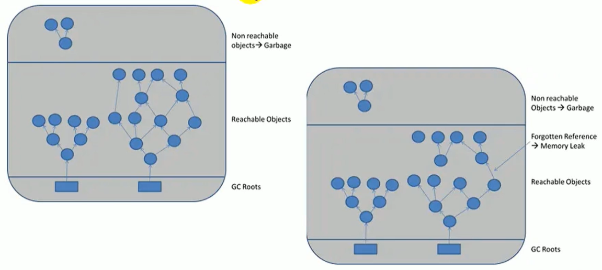

**举例：**

1. 单例模式

   单例的生命周期和应用程序是一样长的，所以单例程序中，如果持有对外部对象的引用的话，那么这个外部对象是不能被回收的，则会导致内存泄漏产生。

2. 一些提供close的资源未关闭导致内存泄漏

   数据库连接（dataSource.getConnection()），网络连接（socket）和io连接必须手动close，否则是不能被回收的。

   

#### 2.4.4 Stop The World

Stop-the-World，简称STW，指的是GC事件发生过程中，会产生应该用程序的停顿。停顿产生时整个应用程序线程会被暂停，没有任何响应，也有点像卡死的感觉，这个停顿称为STW。

​	场景：可达性分析算法中枚举根节点（GC Roots)时会导致所有Java执行线程停顿。

​	停顿原因:

	 1. 分析工作必须在一个能确保一致性的快照中进行。
	 2.  一致性指整个分析期间整个执行系统看起来像被冻结在某个时间点上。 
	            	 3. 如果出现分析过程中对象引用关系还在不断变化，则分析结果的准确性无法保证。

被STW中断的应用程序线程会在完成GC之后恢复，频繁中断会让用户感觉像是网速不快造成电影卡带一样，所以我们需要减少STW的发生。

STW事件和采用哪款GC无关，所有的GC都有这个事件。哪怕是G1也不能完全避免Stop-The-World情况发生，只能说垃圾回收器越来越优秀，回收效率越来越高，尽可能地缩短了暂停时间。

STW是JVM在**后台自动发起和自动完成**的。在用户不可见的请款下，把用户正常的工作线程全部停掉。开发中不要使用System.gc()，会导致Stop-The-World的发生。


#### 2.4.5 并行与并发

- **并发（Concurrent）**

  - 在操作系统中，是指**一个时间段**中有几个程序都处于已启动运行到运行完毕之间，且这几个程序都是在同样一个处理器上个运行。
  - 并发不是真正意义上的“同时执行”，只是CPU把一个时间段划分成几个时间片段（时间区间），然后在这几个时间区间之间来回切换，由于CPU处理的速度非常快，只要时间间隔处理得当，即可让用户感觉是多个应用程序同时在运行。

  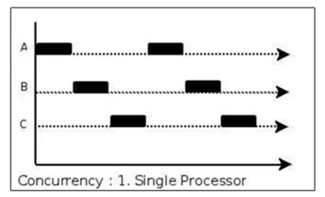


- **并行（Parallel）**

  - 当系统有一个以上CPU时，当一个CPU执行一个进程时，另一个CPU可以执行另一个线程，两个进程互不抢占CPU资源，可以同时进行，我们称之为并行。
  - 其实决定并行的因素不是CPU的数量，而是CPU的核心数量，比如一个CPU多个核也可以并行。
  - 适合科学计算，后台处理等弱交互场景。

  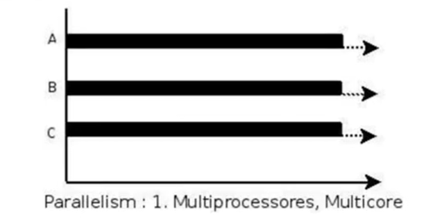

并发，指的是多个事情，在**同一个时间段内同时发生了。**

并行，指的是多个事情，在**同一时间点上同时发生了。**

并发的多个任务之间是互相抢占资源的。

并行的多个任务之间是不互相抢占资源的。

只有在多CPU或者一个CPU多核的情况下，才会发生并行。否则，看似同时发生的事情，其实都是并发执行的。


#### 2.4.6 垃圾回收中的并行与并发

并行与并发，在讨论垃圾收集器的上下文语境中，它们可以解释如下：

- 并行（Parallel）：指**多条垃圾收集线程并行工作**，但此时用户线程仍处于等待状态。如ParNew、Parallel Scavenge、Parallel Old；
- 串行（Serial）：相较于并行的概念，单线程执行。如果内存不够，则程序暂停，启动JVM垃圾回收器进行垃圾回收。回收完，再启动程序的线程。
- 并发（Concurrent）：指**用户线程与垃圾收集线程同时执行**（但不一定是并行的，可能交替执行），垃圾回收线程在执行时不会停顿用户程序的运行。
  - 用户程序在继续运行，而垃圾收集程序运行于另一个CPU上；如CMS、G1
  

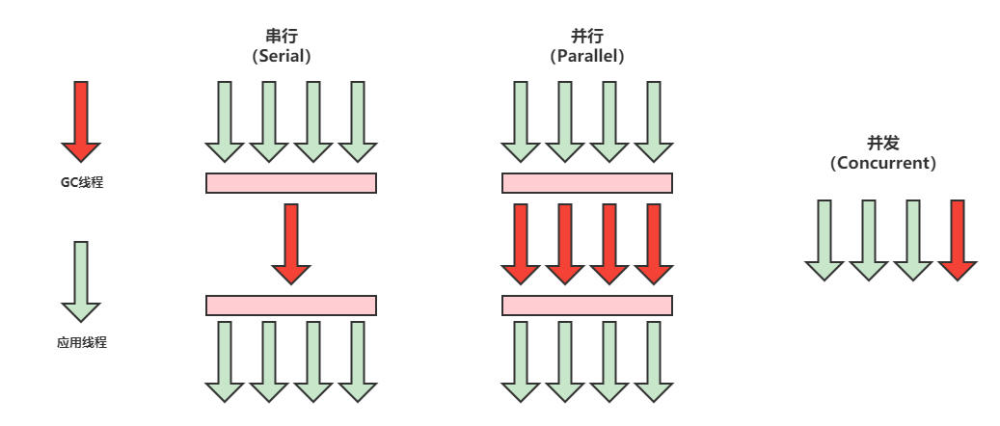

#### 2.4.7 安全点与安全区域（了解）

- **安全点**

  程序执行时并非在所有地方都能停顿下来开始GC，只有在特定的位置才能停顿下来开始GC，这些位置称为“安全点（Safepoint）”。

  Safe Point 的选择很重要，**如果太少可能导致GC等待的事件太长，如果太频繁可能导致运行时的性能问题**。大部分指令的执行时间都非常短暂，通常会根据“**是否具有让程序长时间执行的特征**”为标准。比如：选择一些执行时间较长的指令作为SafePoint，如**方法调用、循环跳转和异常跳转**等。

  如何在GC发生时，检查所有线程都跑到最近的安全点停顿下来呢？

  1. 抢先式中断：（目前没有虚拟机采用了）首先中断所有线程。如果还有线程不在安全点，就恢复线程，让线程跑到安全点。
  2. 主动式中断: 设置一个中断标志，各个线程运行到SafePoint的时候主动轮询这个标志，如果中断标志为真，则将自己进行中断挂起。

- **安全区域**

  SafePoint机制保证了程序执行时，在不太长的时间内就会遇到可进入GC的SafePoint。但是，程序“不执行”的时候呢？例如线程处于Sleep状态或者Blocked状态，这时候线程无法响应JVM的中断请求，从而无法”走“到安全点去中断挂起，JVM也不太可能等待线程被唤醒。对于这种情况，就需要安全区域（Safe Region）来解决。

  **安全区域是指在一段代码片段中，对象的引用关系不会发生变化，在这个区域中的任何位置开始GC都是安全的**。我们也可以把Safe Region看做是被扩展了的SafePoint。

  当线程运行到SafeRegion的代码时，首先标识已经进入了SafeRegion，如果这段时间内发生GC，JVM会忽略标识为SafeRegion状态的线程。

  当线程即将给离开SafeRegion时，会检查JVM是否已经完成GC，如果完成了，则继续运行，否则线程必须等待直到收到可以安全离开SafeRegion的信号为止。

#### 2.4.8 引用

我们希望能描述这样一类对象：当内存空间还足够时，则能保留在内存中；如果内存空间**在进行垃圾收集后还是很紧张**，则可以抛弃这些对象。

这涉及到一些比较高频且偏门的面试题： 如强引用、软引用、弱引用、虚引用有什么区别具体使用场景是什么？

在JDK1.2版本之后，Java对引用的概念进行了扩充，将引用分为**强引用（Strong Reference）、软引用（Soft Reference）、弱引用（Weak Reference）和虚引用（Phantom Reference）**，**这4种引用强度依次逐渐减弱**。

除强引用之外，其他3种引用均可以在java.lang.ref包中找到。如下图，显示了这三种引用类型对应的类，开发人员可以在应用程序中直接使用它们。

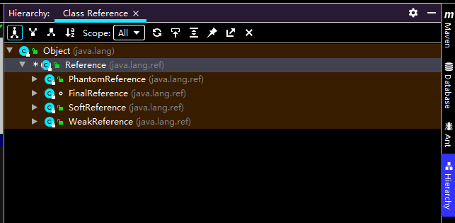

- **强引用（不回收）**：

  最传统的”引用“定义，是指在程序代码中普遍存在的引用赋值，即类似”Object obj = new Object()“这种引用关系。无论任何情况下，**只要强引用关系还存在，垃圾收集器就永远不会回收掉被引用的对象**。

  在Java程序中，最常见的引用类型是强引用（**普通系统99%以上都是强引用**），也就是我们最常见的普通对象引用，也是默认的引用类型。

  当在Java语言中使用new操作符创建一个新对象，并将其赋值给一个变量的时候，这个变量就成为指向该对象的一个强引用。

  **强引用的对象是可触及的，垃圾收集器就永远不会回收掉被引用的对象**。

  对于一个普通的对象，如果没有其他的引用关系，只要超过了引用的作用域或者显示地将相应（强）引用赋值为null，就是可以当作垃圾被收集了，当然具体回收时机还是要看垃圾收集策略。

  相对的，软引用、弱引用和虚引用的对象是软可触及、弱可触及和虚可触及的，在一定条件下，都是可以被回收的。所以，**强引用是造成Java内存泄漏的主要原因之一**。

- **软引用 (内存不足即回收)**：

  软引用是用来描述一些还有用，但非必要的对象。**只被软引用关联着的对象，在系统将要发生内存溢出之前，将会把这些对象列入回收范围之中进行第二次回收**。如果这次回收后还没有足够的内存，才会抛出内存溢出异常。

  软引用通常用来实现内存敏感的缓存。比如：高速缓存就用到软引用。如果还有空闲内存，就可以暂时保留缓存，当内存不足时清理掉，这样就保证了使用缓存的同时，不会耗尽内存。

  垃圾回收器在某个时刻决定回收软引用的可达对象的时候，会清理软引用，并可选地把引用存放到一个引用队列，类似于弱引用，只不过Java虚拟机会尽量让软引用的存活时间长一些，迫不得已才清理。

- **弱引用（发现即回收）：**

  弱引用也是用来描述那些非必须对象，**被弱引用关联的对象只能生存到下一次垃圾收集之前**。当垃圾收集器工作时，无论空间是否足够，都会回收掉被弱引用关联的对象。但是，由于垃圾回收器的线程通常优先级很低，因此，并不一定能很快地发现持有弱引用的对象。**在这种情况下，弱引用对象可以存活较长的时间**。弱引用和软引用一样，在构造弱引用时，也可以指定一个引用队列，当弱引用对象被回收时，就会加入指定的引用队列，通过这个队列可以跟跟踪对象的回收情况。软引用、弱引用都非常合适用来保存那些可有可无的缓存数据。如果这么做，当系统内存不足时，这些缓存数据会被回收，不会导致内存溢出。而当内存资源充足时，这些缓存数据又可以存在相当长时间，从而起到加速系统的作用。

  WeakHashMap内部的Entry就是继承了弱引用WeakReference。

- **虚引用（对象回收跟踪）**：

  也称为”幽灵引用“或”幻影引用“，是所有引用类型中最弱的一个。一个对象是否有虚引用的存在，完全不会决定对象的生命周期。如果一个对象仅持有虚引用，那么它和没有引用几乎是一样的，随时都有可能被垃圾回收器回收。它不能单独使用，也无法通过虚引用来获得一个对象的实例。当试图通过虚引用的get()方法取得对象是，总是null。**为一个对象设置虚引用关联的唯一目的在于跟踪垃圾回收过程。比如能在这个对象被收集器回收时受到一个系统通知**。

  虚引用必须和引用队列一起使用。虚引用在创建时必须提供一个引用队列作为参数。当垃圾回收器准备回收一个对象时，如果发现他还有虚引用，就会在回收对象后，将这个虚引用加入引用队列，以通知应用程序对象的回收情况。**由于虚引用可以跟踪对象的回收时间，因此，也可以将一些资源释放操作放置在虚引用中执行和记录。**

  ```java
  Object obj = new Object();
  
  ReferenceQueue phantomQueue = new ReferenceQueue();
  PhantomReference<Object> pf = new PhantomReference<Object>(obj,phantomQueue);
  obj = null;
  ```


### 2.5 垃圾回收器
#### 2.5.1 垃圾回收器的分类

垃圾收集器没有在规范中进行过多的规定，可以由不同的厂商、不同版本的JVM来实现。由于JDK的版本处于高速迭代过程中，因此Java发展至今已经衍生了众多的GC版本。从不同角度分析垃圾收集器，可以将GC分为不同的类型。

- **按线程数分，可以分为串行垃圾回收器和并行垃圾回收器**
  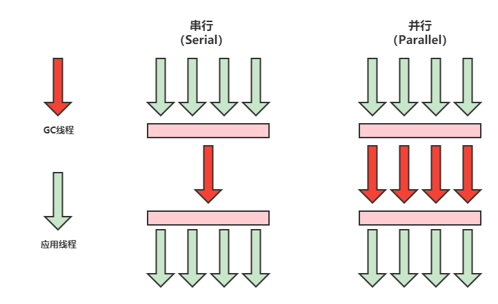
  
  - 串行回收指的是在同一时间段内只允许有一个CPU用于执行垃圾回收操作，此时工作线程被暂停，直至垃圾收集工作结束。
    - 在诸如单CPU处理器或者较小的应用内存等硬件平台不是特别优越的场合，串行回收器的性能表现可以超过并行回收器和并发回收器。**所以串行回收默认被应用在客户端的Client模式下的JVM中。**
    - 在并发能力较强的CPU上，并行回收器产生的停顿时间也要短于串行回收器。
  - 并行收集可以运用多个CPU同时执行垃圾回收，因此提升了应用的吞吐量，不过并行回收仍然与串行回收一样，采用独占式，使用了”Stop The World“机制。
  
  


- **按照工作模式分，可以分为并发式垃圾回收器和独占式垃圾回收器**

    - 并发式垃圾回收器与应用程序线程交替工作，以尽可能减少应用程序的停顿时间。
    - 独占式垃圾回收器一旦运行，就停止了应用程序中所有的用户线程，直到垃圾回收过程完全结束。
        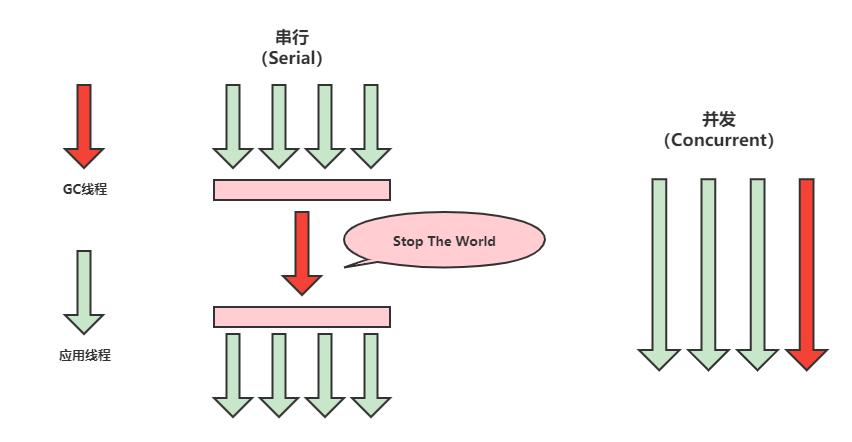
- **按碎片处理方式分，可以分为压缩式和非压缩式垃圾回收器**
  - 压缩式垃圾回收器会在回收完成后，对存活对象进行压缩整理，消除回收后的碎片。再分配对象空间使用指针碰撞。
  - 非压缩式的垃圾回收器不进行碎片整理。再分配对象空间使用空闲列表。
- **按工作的内存区间分，又可分为年轻代和老年代垃圾回收器**


#### 2.5.2 评估GC的性能指标

- **吞吐量：**运行用户代码的时间占总运行时间的比例（总运行时间= 程序运行时间 + 内存回收的时间）

  吞吐量就是CPU用于运行用户代码的时间于CPU总消耗时间的比值，即吞吐量 = 运行用户代码时间/（运行用户代码时间+垃圾收集时间）

  ​	比如虚拟机总共运行了100分钟，其中垃圾收集花掉1分钟，那吞吐量就是99%

  吞吐量优先的情况下，应用程序能容忍较高的暂停时间，因此高吞吐量的应用程序有更长的时间基准，快速响应是不必考虑的。意味着在单位时间内，STW的时间最短。
  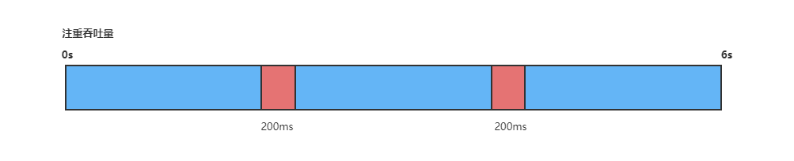
  
- **暂停时间：**执行垃圾收集时，程序的工作线程被暂停的时间

  ”暂停时间“是指一个时间段内应用程序线程暂停，让GC线程执行的状态，例如GGC期间100ms的暂停时间意味着这100ms期间内没有应用程序线程是活跃的。
  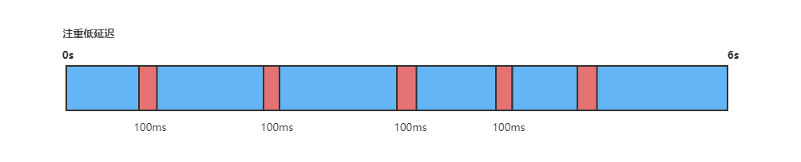


  暂停时间优先，意味着尽可能让单次STW的时间最短。

- **内存占用：**Java堆区所占的内存大小

- **垃圾收集开销：**吞吐量的补数，垃圾收集所用时间与总运行时间的比例。

- **收集频率：**相对于应用程序的执行，垃圾收集操作发生的频率

- **快速：**一个对象从诞生到被回收所经历的时间

吞吐量、内存占用、暂停时间这三个构成一个”不可能三角“。三者总体的表现会随着技术进步而越来越好。一款优秀的垃圾收集器通常最多同时满足其中的两项。

在这三项里面，暂停时间的重要性日益凸显。因为随着硬件发展，内存占用多些越来越能容忍，硬件性能的提升也有助于降低收集器运行时对应用程序的影响，即提高了吞吐量。而内存的扩大，对延迟反而带来负面效果。**简单来说，主要看重吞吐量和暂停时间。**

高吞吐量较好因为这会让应用程序的最终用户感觉只有应用程序线程在做”生产性“工作。直觉上，吞吐量越高程序运行越快。

低暂停时间（低延迟）较好因为从最终用户的角度来看不管是GC还是其他原因导致一个应用被挂起始终是不好的。这取决于应用程序的类型，有时候甚至短暂的200ms暂停都有可能打断终端用户体验。因此，具有低的较大暂停时间是非常重要的，特别是对于一个**交互式应用程序**。

“高吞吐量”和“低暂停时间”是一对互相竞争的目标（矛盾）。因为如果选择以吞吐量优先，那么必然需要降低内存回收的执行频率，但是这样搞会导致GC需要更长的暂停时间来执行内存回收。相反的，如果选择以低延迟优先为原则，那么为了降低每次执行内存回收时的暂停时间，也只能频繁地执行内存回收，但这又引起了年轻代内存的缩减和导致程序吞吐量的下降。

**现在的标准：在最大吞吐量优先的情况下，降低停顿时间。**


#### 2.5.3 垃圾回收器的组合关系

**经典的垃圾回收器有7种：**

**串行回收器：**Serial、Serial Old

**并行回收器：**ParNew、Parallel Scavenge、Parallel Old

**并发回收器：**G1、CMS

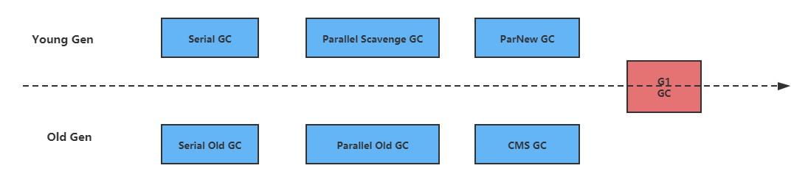


**垃圾回收器组合关系**

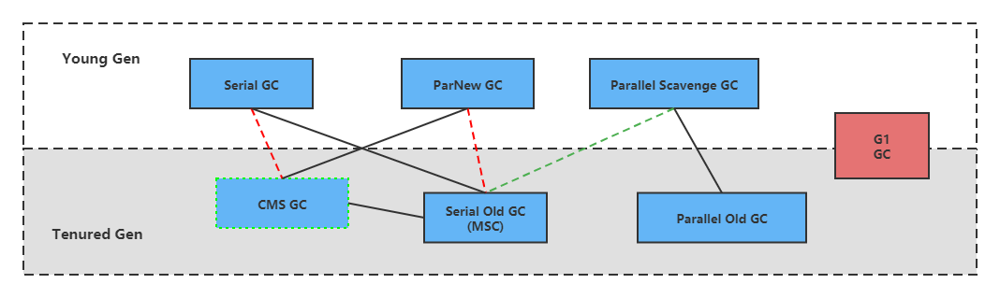

1. 两个收集器间有连线，表示它们可以搭配使用
2. 其中Serial Old 作为CMS出现“Concurrent Mode Failure”失败的后备方案
3. （红色虚线）由于维护和兼容性测试的成本，在JDK8时，将Serial+CMS、ParNew + Serial Old这两个组合声明为废弃（JEP 173），并且在JDK9种完全取消了这些组合的支持（JEP214），即：移除。
4. （绿色虚线）JDK14中，弃用Parallel Scavenge和Serial Old组合（JEP366）
5. （青色虚线）JDK14中，删除CMS垃圾回收器（JEP363）

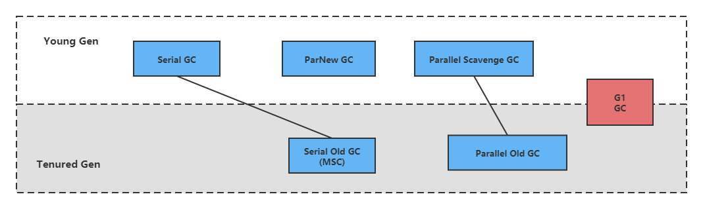

为什么需要有很多收集器，因为Java的使用场景很多，移动端、服务器等。所以就需要针对不同场景，提供不同的垃圾收集器，提高垃圾收集的性能。没有一种放之四海皆准、任何场景下都是用的完美收集器存在，更加没有万能的收集器。**我们选择的只是对具体应用最合适的收集器**。

**如何查看默认的垃圾回收器**

1. -XX:+PrintCommandLineFlags: 查看命令行相关参数（包含使用的垃圾收集器）
2. 使用命令行： jinfo -flag 相关垃圾回收器参数 进程ID （eg. jinfo -flag UserParallelGC 924）


#### 2.5.4 Serial回收器：串行回收

Serial收集器是最基本、历史最悠久的垃圾收集器了。JDK1.3之前回收新生代唯一的选择。

Serial收集器是Hotspot中Client模式下得默认新生代垃圾收集器（因为在单CPU或者硬件条件不优越的情况下，串行的性能相对较高，并行存在抢占资源的情况性能并不比串行高）。

**Serial收集器采用复制算法、串行回收和“Stop The World”机制的方式执行内存回收。**


除了年轻代之外，Serial收集器还提供用于执行老年代垃圾收集的Serial Old收集器。**Serial Old收集器同样也采用了串行回收和“Stop The World”机制，只不过内存回收算法使用的是标记-压缩算法。**

Serial Old是运行在Client模式下默认的老年代垃圾收集器。

Serial Old在Server模式下主要有两个用途：①与新生代的Parallel Scavenge配合使用。②作为老年代CMS收集器的后备垃圾收集方案

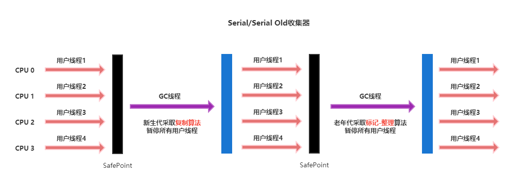

这个收集器是一个单线程的收集器，但它的“单线程”的意义并不仅仅说明**它只会使用一个CPU或者一条收集线程去完成垃圾收集工作**，更重要的是在它进行垃圾收集时，**必须暂停其他所有的工作线程**，直到它收集结束（Stop The World）。


**优势：**简单而高效（与其他收集器的单线程比）

对于限定单个CPU的环境来说，Serial收集器由于没有线程交互的开销，专心做垃圾收集自然可以获得最高的单线程收集效率。运行在Client模式下的虚拟机是个不错的选择）

在用户的桌面应用场景中，可用内存一般不大（几十MB至一两百MB），可以在较短时间内完成垃圾收集（几十ms至一百多ms），只要不频繁发生，使用串行回收器是可以接受的。

在Hotspot虚拟机中，使用 **-XX:+UseSerialGC** 参数可以指定年轻代和老年代都是用串行收集器。等价于新生代用Serial GC，老年代用Serial Old GC

**现在已经不用串行的了，而且在限定单核CPU才可以用。现在都不是单核的了。对于交互较强的应用而言，这种垃圾收集器是不能接受的。一般在Java Web应用程序中是不会采用串行垃圾收集器的。**


#### 2.5.4 ParNew回收器：并行回收

如果说Serial GC是年轻代中的单线程垃圾收集器。那么ParNew收集器则是Serial收集器的多线程版本。Par是Parallel的缩写，New：只能处理的是新生代

ParNew收集器除了**采用并行回收**的方式执行内存回收外，两款垃圾收集器之间几乎没有任何区别。ParNew收集器在年轻代中同样也是采用复制算法、“Stop The World”机制。

ParNew是很多JVM运行在Server模式下新生代的默认垃圾收集。

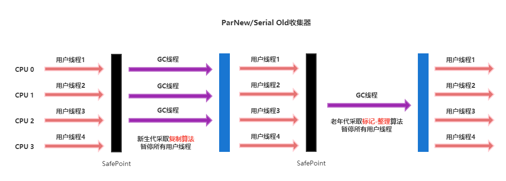

对于新生代，回收次数频繁，使用并行方式效率高效。

对于老年代，回收次数少，使用串行方式节省资源。（CPU并行需要切换线程，串行可以省去切换线程的资源）

虽然ParNew收集器是基于并行回收，但是不能断定ParNew收集器的回收效率在任何场景下都会比Serial收集器更高效。

ParNew收集器运行在多CPU的环境下，由于可以充分利用多CPU、多核心等物理硬件资源优势，可以更快速地完成垃圾收集，提升程序吞吐量。**但是在单个CPU的环境下，ParNew收集器并不比Serial收集器更高效**。虽然Serial收集器是基于串行回收，但是由于CPU不需要频繁的做任务切换，因此可以有效避免多线程交互过程中产生的一些额外开销。

除了Serial外，目前只有ParNew GC能与CMS收集器配合工作。

使用 -XX:+UseParNewGC 手动指定使用ParNew收集器执行内存回收任务。它表示年轻代使用并行收集器，不影响老年代。-XX:ParallelGCThreads 限制线程数量，默认开启和CPU核数相同的线程数。


#### 2.5.5 Parallel回收器：吞吐量优先

Hotspot的年轻代中除了拥有ParNew收集器是基于并行回收的以外，Parallel Scavenge收集器同样也采用了复制算法、并行回收和”Stop The World“机制。

Parallel收集器的出现是否多次一举？和ParNew收集器不同，Parallel Scavenge收集器的**目标则是达到一个可控制的吞吐量**，它也被称为吞吐量优先的垃圾收集器。自适应调节策略也是Parallel Scavenge与ParNew的一个重要区别。

高吞吐量则可以高效率地利用CPU时间，尽快完成程序的运算任务，**主要适合在后台运算而不需要太多交互的任务**。因此，常见再服务器环境中使用。例如，那些执行批量处理、订单处理、工资支付、科学计算的应用程序。

Parallel收集器在JDK6时提供了用于执行老年代垃圾收集的Parallel Old 收集器，用来替代老年代的Serial Old 收集器。

**Parallel Old**收集器**采用了标记-压缩算法**，但同样也是基于**并行回收**和**”Stop The World“机制**。

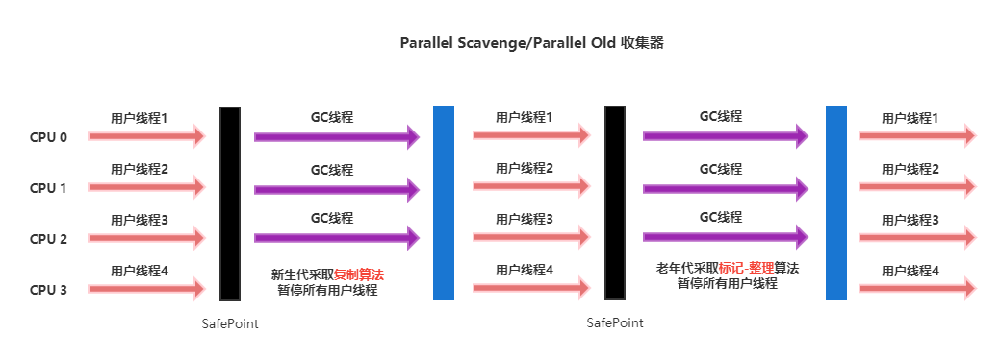

在吞吐量优先的应用场景中，Parallel 收集器和Parallel Old收集器的组合，在Server模式下的内存回收性能很不错。在JDK8中，默认是此垃圾收集器。

参数设置：

**-XX:+UseParallelGC**  手动指定年轻代使用Parallel并行收集器执行内存回收任务。

**-XX:+UseParallelOldGC** 手动指定老年代都是使用并行回收收集器。分别适用于新生代和老年代，JDK8默认时开启的，这个参数与上一个参数，默认开启一个，另一个也会被开启（互相激活）

**-XX:ParallelGCThreads** 设置年轻代并行收集器的线程数。一般地，最好与CPU数量相等，以避免过多的线程数影响垃圾收集性能。在默认情况下，当CPU数量小于8个，ParallelGCThreads的值等于CPU数量。当CPU数量大于8个，ParallelGCThreads的值等于 3 + (5 * CPU_Count/8)

**-XX: MaxGCPauseMillis** **设置垃圾收集器最大停顿时间**（即STW的时间）。单位是毫秒。为了尽可能把停顿时间控制在MaxGCPauseMillis以内，收集器在工作时会调整Java堆大小或者其他一些参数。对于用户来讲，停顿时间越短体验越好，但是在服务端，我们注重高并发，整体的吞吐量。所以服务器端适合Parallel，进行控制。该参数使用需谨慎。

**-XX:GCTimeRatio** **垃圾收集时间占总时间的比例** [ = 1/(N+1)]。用于衡量吞吐量的大小。取值范围（1，100）。默认值99,也就是垃圾回收时间不超过1%。与-XX:MaxGCPauseMillis参数有一定矛盾性。暂停时间越长，Radio参数就容易超过设定的比例。

**-XX:+UseAdaptiveSizePolicy** 设置Parallel Scavenge收集器具有自适应调节策略。在这种模式下，年轻代的大小，Eden和Survior的比例，晋升老年代的对象年龄等参数都会被自动调整，以达到在堆大小，吞吐量和停顿时间之间的平衡点。在手动调优比较困难的场合，可以直接使用这种自适应的方式，仅指定虚拟机的最大堆、目标的吞吐量（GCTimeRatio）和停顿时间（MaxGCPauseMillis），让虚拟机自己完成过调优工作。


#### 2.5.6 CMS回收器：低延迟

在JDK1.5时期，Hotspot推出了一款在**强交互应**用中几乎可认为有划时代意义的垃圾收集器：CMS（Concurrent-Mark-Sweep）收集器，**这款收集器是HotSpot虚拟机中第一款真正意义上的并发收集器，它第一次实现了让垃圾收集线程与用户线程同时工作**。

CMS收集器的关注点是尽可能缩短垃圾收集时用户线程的停顿时间。停顿时间越短（低延迟）就越适合与用户交互的程序，良好的响应速度能提升用户体验。**目前很大一部分的Java应用集中在互联网站或者B/S系统的服务端上，这类应用尤其重视服务的响应速度，希望系统停顿时间最短**，以给用户带来较好的体验。CMS收集器就非常适合这类应用的需求。

CMS的垃圾收集**采用标记-清除算法**，并且也会”Stop The World“。

CMS作为老年代的垃圾收集器，却无法与JDK1.4中已经存在的新生代收集器Parallel Scavenge配合工作,因为Parallel底层用的框架不一样。所以在JDK1.5中使用CMS来收集老年代的时候，新生代只能选择ParNew或者Serial收集器中一个。在G1出现之前，CMS使用还是非常广泛的。

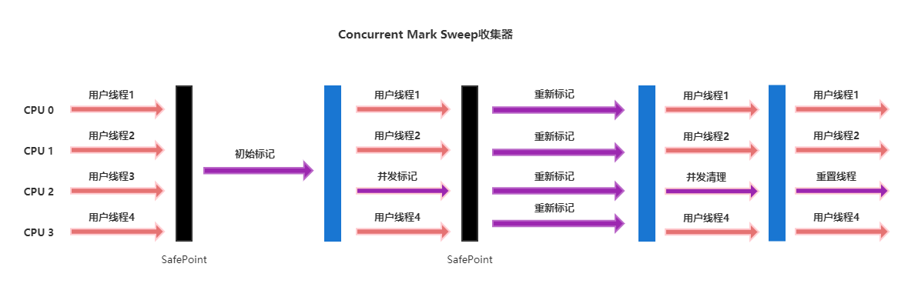

CMS整个过程比之前的收集器要复杂，整个过程分为4个主要阶段，即**初始标记阶段、并发标记阶段、重新标记阶段和并发清除阶段**。

- **初始标记：**

  在这个阶段中，程序中所有的工作线程都将会因为”Stop The World“机制而出现短暂的暂停，这个阶段**主要任务仅仅只是标记出GC Roots能直接关联到的对象**。一旦标记完成之后就会恢复之前被暂停的所有应用线程。由于直接关联对象比较小，所以这里的**速度非常快**。

- **并发标记：**

  从GC Roots的**直接关联对象开始遍历整个对象图的过程，这个过程耗时较长但是不需要停顿用户线程**，可以与垃圾收集线程一起并发运行。

- **重新标记：**

  由于在并发标记阶段中，程序的工作线程会和垃圾收集线程同时运行或者交叉运行，因此**为了修正并发标记期间，因用户程序继续运行而导致标记产生变动的那一部分对象的标记记录**，这个阶段的停顿时间通常会比初始标记阶段稍长一些，但也远比并发标记阶段的时间短。

- **并发清理：**

  此阶段**清理删除掉标记阶段判断的已经死亡对象，释放内存空间**。由于不需要移动存活对象，所以这个阶段以时可以与用户线程同时并发的。

尽管CMS收集器采用的是并发回收（非独占式），但是在其**初始化标记和再次标记这两个阶段中仍然需要执行”Stop The World“机制**暂停程序中的工作线程，不过暂停时间并不会太久，因此可以说明目前所有的垃圾收集器都做不到完全不需要”Stop The World“，只是尽可能地缩短暂停时间。

**由于最耗费时间的并发标记与并发清除阶段都不需要暂停工作，所以整体的回收是低停顿的。**

另外，由于在垃圾收集阶段用户线程没有中断，所以**在CMS回收过程中，还应该确保应用程序用户线程有足够的内存可用**。因此CMS收集器不能像其他收集器那样等到老年代几乎完全被填满了再进行垃圾回收，而是**当堆内存使用率达到某一阈值时，便开始进行回收**，以确保应用程序再CMS工作过程中依然有足够的空间支持应用程序运行。要是CMS运行期间预留的内存无法满足程序需要，就会出现一次**”Concurrent Mode Failure“**失败，虚拟机将启动后备预案：临时启用Serial Old收集器来重新进行老年代的垃圾收集，这样停顿时间就很长了。

CMS收集器的垃圾收集算法采用的是**标记-清除算法**，这意味着每次执行完内存回收后，由于被清理的无用对象所占用的内存空间极有可能是不连续的一些内存块，不可避免地**将会产生一些内存碎片**。那么CMS在为新对象分配内存空间时，将无法使用指针碰撞技术，而只能够选择空闲列表执行内存分配。为什么不把算法换成标记-压缩算法（Mark-Compact），因为当并发清除的时候，用Compact整理内存的化，原来的用户线程使用的内存无法使用（标记压缩的时候会移动对象，导致地址变动），要保证用户线程能够继续执行，前提是它运行的资源不受影响。Mark Compact更适合”Stop The World“这种场景下使用。

**优点：并发收集，低延迟。**

**弊端：**

1. **会产生内存碎片**，导致并发清楚后，用户线程可用的空间不足，在无法分配大对象的情况下，不得不提前触发Full GC

 	2. **CMS收集器对CPU资源非常敏感**。在并发阶段，它虽然不会导致用户线程给停顿，但是会因为占用了一部分线程而导致应用程序变慢，总吞吐量降低。
 	3. **CMS收集器无法处理浮动垃圾**。可能出现”Concurrent Mode Failure“失败而导致另一次Full GC的产生。在并发标记阶段由于程序工作线程和垃圾收集线程是同时运行或者交叉运行的，那么在并发标记阶段如果产生新的垃圾对象，CMS将无法对这些对象进行标记，最终会导致这些新产生的垃圾对象没有被及时回收，从而只能在下一次执行GC时释放这些之前未被回收的内存空间。

**参数：**

**-XX:+UseConcMarkSweepGC** 手动指定使用CMS收集器执行内存回收任务。开启该参数后会自动将-XX:+UseParNewGC打开。即ParNew（Young区用）+CMS（Old区用）+Serial Old GC 的组合

**-XX:CMSlnitiatingOccupanyFraction** 设置对内存使用率的阈值，一旦达到该阈值，便开始进行回收。JDK5及之前版本的默认值为68，即当老年代的空间使用率达到68%时，会执行一次CMS回收。**JDK6及以上默认值为92%**。如果内存增长缓慢，则可以设置一个稍大的值，大的阈值可以有效降低CMS的触发频率，减少老年代回收的次数可以较为明显地改善应用程序性能。反之，如果应用程序内存使用率增长很快，则应该降低这个阈值，以避免频繁触发老年代串行收集器。因此通过**该选项便可以有效降低Full GC的执行次数。**

**-XX:+UseCMSCompactAtFullCollection** 用于指定在执行完Full GC后对内存空间进行压缩整理，以此避免内存碎片的产生。不过由于内存压缩整理过程无法并发执行，所以带来的问题就是停顿时间变得更长了。

**-XX:CMSFullGCsBeforeCompaction** 设置在执行多少次Full GC后对内存空间进行压缩整理。

**-XX:ParallelCMSThreads** 设置CMS的线程数量。CMS默认启动的线程数时（ParallelGCThreads + 3)/4。ParallelGCThreads是年轻代并行收集器的线程数。当CPU资源比较紧张时，收到CMS收集器线程的影响，应用程序的性能在垃圾回收阶段可能会非常糟糕。


#### 2.5.7 G1回收器：区域化分代式
##### **2.5.7.1 G1 概述**

应用程序所应对的**业务越来越庞大、复杂，用户越来越多**，没有GC就不能保证应用程序正常进行，而经常造成STW的GC又跟不上实际的需求，所以才会不断地尝试对GC进行优化。G1（Garbage-First）垃圾回收器是在Java 7 update 4 之后引入的一个新的垃圾回收器。与此同时，**为了适应现在不断扩大的内存和不断增加的处理器数量**，进一步降低暂停时间，同时兼顾良好的吞吐量。**官方给G1设定的目标是在延迟可控的情况下获得尽可能高的吞吐量**，所以才担当起“全功能收集器”的重任与期望。

G1是一个并行回收器，它把堆内存分割为很多不相关的区域（Region）（物理上不连续的）。使用不同的Region来表示Eden、Survivor0、Survivor1、老年代等。G1 有计划地避免在整个Java堆中进行全区域的垃圾收集。G1 跟踪各个Region里面的垃圾堆积的价值大小（回收所获得的空间大小以及回收所需时间的经验值），在后台维护一个优先列表，**每次根据允许的收集时间，优先回收价值最大的Region**。由于这种方式的侧重点在于回收垃圾最大量的区间（Region），所以我们给G1一个名字：（Garbage First）

G1是一款面向服务段应用的垃圾收集器，主要**针对配备多核CPU及大容量内存的机器**，以极高概率满足GC停顿时间的同时，还兼具高吞吐量的性能特征。

在JDK7版本正式启用，移除了Experimental的标识，是JDK9以后的默认垃圾收集器，取代了CMS回收以及Parallel + Parallel Old组合。被Oracle官方称为“全功能的垃圾收集器”。与此同时，CMS已经在JDK9中被标记为废弃。在JDK8中还不是默认的垃圾回收器，需要使用 -XX:+UseG1GC来启用。

**G1中提供了三种垃圾回收模式：** Young GC、Mixed GC和Full GC，在不同的条件下被触发。


##### **2.5.7.2 分区Region：化整为零 **

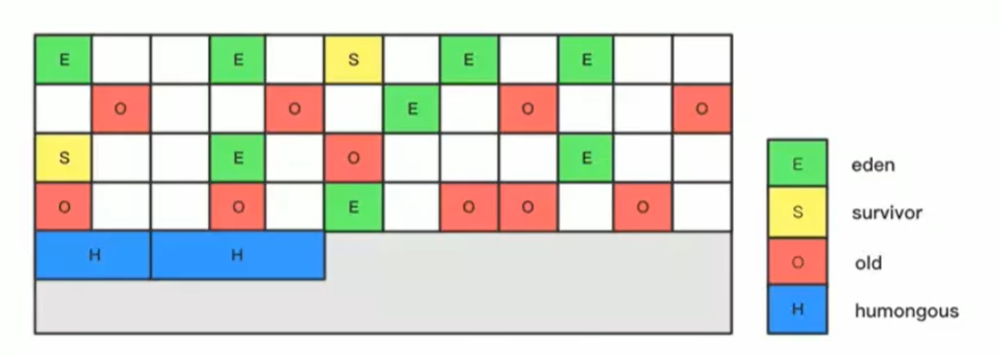

使用G1收集器时，它将整个Java堆划分成约2048个大小相同的独立Region块，每个Region块大小根据堆空间的实际大小而定，整体被控制在 1m~32m之间，且为2的N次幂。可以通过-XX:G1HeapRegionSize设定。**所有的Region大小相同，且在JVM生命周期内不会被改变**。虽然还保留有新生代和老年代的概念，但是新生代和老年代不再是物理隔离的了，它们都是一部分Region（不需要连续）的集合。通过Region的动态分配方式实现逻辑上的连续。

一个region有可能属于Eden、Survivor或者Old、Tenured内存区域。但是一个region只可能属于一个角色。途中的E表示该region属于Eden内存区域，S表示属于Survivor内存区域，O表示属于Old内存区域。途中空白的表示未使用的内存空间。

G1垃圾收集器还增加了一种新的内存区域，叫做Humongous内存区域，如图中的H块。**主要用于储存大对象**，如果超过1.5个region，就放到H。对于堆中的大对象，默认直接会被分配到老年代，但是如果它是一个短期存在的大对象，就会对垃圾收集器造成负面影响。为了解决这个问题，所以G1划分了一个Humongous区。如果一个H区装不下一个大对象，那么G1会寻找连续的H区来存储。为了能找到连续的H区，有时候不得不启动Full GC。G1的大多数行为都把H区作为老年代的一部分来看。

Region里面内存空间采用指针碰撞，并且也有TLAB。就可以并行的分配内存提高效率。


##### **2.5.7.3 G1特点 **

与其他GC收集器相比，G1使用了全新的分区算法。其特点如下：

- **并行与并发**

  - 并行性：G1在回收期间，可能有多个GC线程同时工作，有效利用多核计算能力。此时用户线程STW。
  - 并发性：G1拥有与应用程序交替执行的能力，部分工作可以和应用程序同时执行，因此，一般来说，不会在整个回收阶段发生完全阻塞应用程序的额情况

- **分代收集**

  - 从分代上看，**G1依然属于分代型垃圾收集器**，它会区分年轻代和老年代，年轻代依然有Eden区、Survivor区。但是从堆的结构上看，它不要求整个Eden区、年轻代或者老年代都是连续的，也不再坚持固定大小和固定数量。
  - **将堆空间分为若干个区域（Region），这些区域中包含了逻辑上的年轻代和老年代。**
  - 和之前的各类回收器不同，**它同时兼顾年轻代和老年代**。对比其他回收器，或者工作在年轻代，或者工作在老年代。
  
  
- **空间整合**

  - CMS：标记-清除算法、内存碎片、若干此GC后进行一次碎片整理。
  - G1将内存划分为一个个的Region。内存的回收是以Region作为基本单位的。**Region之间是复制算法，但整体上实际可看作是标记-压缩（MarkCompact）算法**，这两种算法都可以避免内存碎片。这种特性有利于程序长时间运行，分配大对象时不会因为无法找到连续内存空间而提前出发下一次GC。尤其是当Java堆非常大的时候，G1的优势更加明显。

- **可预测的停顿时间模型（即：软实时soft real-time）**

  这是G1相对于CMS的另一大优势，G1除了追求低停顿外，还能建立可预测的停顿时间模型，能让使用者明确指定在一个长度为M毫秒的时间片段内，消耗在垃圾收集上的时间不得超过N毫秒。

  - 由于分区的原因，G1可以只选取部分区域进行内存回收，这样缩小了回收的范围，因此对于全局停顿情况的发生也能得到较好的控制。
  - G1跟踪各个Region里面的垃圾堆积的价值大小（回收所获得的空间大小以及回收所需时间的经验值），在后台维护一个优先列表，每次根据允许的收集时间，优先回收价值最大的Region。保证了G1收集器在有限时间内可以获取尽可能高的收集效率。
  - 相比于CMS，G1未必能够做到CMS在最好情况下的延迟停顿，但是最差情况要好很多。

  

##### **2.5.7.4  G1适用场景**
相较于CMS，G1还不具备全方位、压倒性优势。比如在用户程序运行过程中，G1无论是为了垃圾收集产生的内存占用还是程序运行时的额外执行负载都要比CMS高。从经验上来说，在小内存应用上CMS的表现大概率会优于G1，而G1在大内存应用上则发挥其优势。平衡点在6-8GB之间。

G1的设计原则就是简化JVM性能调优，开发人员只需要简单的三步即可完成调优：①开启G1垃圾收集器 ②设置堆的最大内存 ③设置最大的停顿时间

**适用场景：**

1. 面向服务端应用，针对具有大内存、多处理器的机器。（在普通大小的堆里面表现并不惊喜）
2. 最主要的应用是需要低GC延迟，并且具有大堆的应用程序提供解决方案。如在堆大小约6G或更大时，可预测的暂停时间可以低于0.5（G1通过每次只清理一部分而不是全部的Region的增量式清理来保证每次GC停顿时间不会过长）
3. 用来替换掉JDK5中的CMS收集器。在 ①超过50%的Java堆被活动数据占用 ②对象分配频率或年代提升频率变化很大③GC停顿时间过程（长于0.5~1s）情况下时，使用G1可能比CMS好。
4. Hotspot垃圾收集器里，除了G1以外，其他的垃圾收集器使用内置的JVM线程执行GC的多线程操作，而G1 GC可以采用应用线程承担后台运行的GC工作，即当JVM的GC线程处理速度慢时，系统会调用应用程序线程帮助加速垃圾回收过程。


##### **2.5.7.5  G1回收器垃圾回收过程**

**Remembered Set概念：** 

一个Region不可能是孤立的，一个Region中的对象可能被其他任意Region中对象引用，如下图，判断对象存活时是否需要扫描整个Java才能保证准确? 回收新生代也不得不同时扫描老年代? 在其他的分代收集器，也有这样的问题，G1因为将区域分为一块块的region，这个问题更突出。如果这样的话，会降低Minor GC的效率。
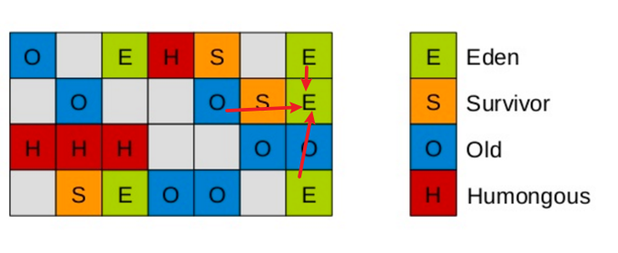

无论是G1还是其他分代收集器，**JVM都是用Remembered Set来避免全局扫描**：
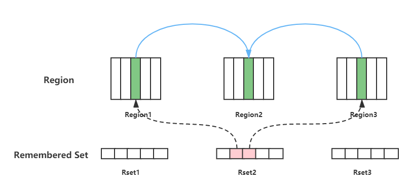

**每个Region都有一个对象的Remembered Set**，每次Reference类型数据写操作时，都会产生 一个Write Barrier（写屏障）暂时中断操作。

然后检查将要写入的引用指向的对象是否和该引用类型数据在不同的Region（其他收集器：检查老年代对象是否引用了新生代对象）。

如果不同，通过CardTable把相关引用信息记录到引用指向对象所在Region对应的Remembered Set中。（如上图Rset2中，两个粉色区域记录了Region1和Region3中的引用相关信息）

当进行垃圾收集时，在GC Roots中加入Remembered Set，就可以保证不进行全局扫描，也不会有遗漏。


**G1 回收过程：**

G1 GC的垃圾回收过程主要包括3个环节：

①年轻代GC（Young GC)

②老年代并发标记过程（Concurrent Marking）

③混合回收（Fixed GC)。

（如果需要，单线程、独占是、高强度的Full GC还是继续存在的，它针对GC的评估失败提供了一种失败保护机制，即强力回收）。
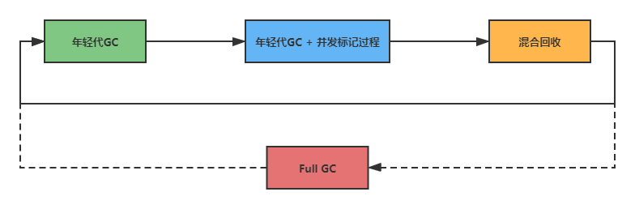

按照顺时针，Young GC --> Young GC + Concurrent Marking --> Mixed GC 顺序，进行垃圾回收。

① 应用程序分配内存，**当年轻代的Eden区用尽时开始年轻代回收过程**。G1的**年轻代收集阶段**是一个**并行的独占式收集器**。在年轻代回收期，G1 GC暂停所有应用程序线程，启动多线程执行年轻代回收。然后**从年轻代区间移动存活对象到Survivor区间或者老年区间，也有可能是两个区间都涉及**。

② 当堆内存使用达到一定值（默认45%）时，开始老年代并发标记过程。

③ 标记完成马上开始混合回收过程。对于一个混合回收期，G1 GC从老年区间移动存活对象到空闲区间，这些空闲区间也就成为了老年代的一部分。和年轻代不同，老年代的G1回收期和其他GC不同，**G1的老年代回收器不需要整个老年代被回收，一次只需要扫描/回收一小部分老年代的Region就可以了**。同时，这个老年代Region是和年轻代一起被回收的。


- **回收过程一：年轻代GC**
  JVM启动时，G1先准备好Eden区，程序在运行过程中不断创建对象到Eden区，当Eden区空间耗尽时，G1会启动一次年轻代垃圾回收过程。**年轻代垃圾回收只会回收Eden区和Survivor区**。YGC时，首先停止应用程序的执行（Stop The World），G1创建回收集（Collection Set），回收集是指需要被回收的内存分段的集合，年轻代回收过程的回收集包含年轻代Eden区和Survivor区所有的内存分段。然后开始如下回收过程
  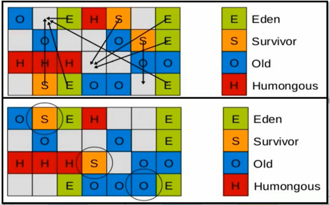

  - **第一阶段：扫描根**。根是指static变量指向的对象，正在执行的方法调用链上的局部变量等。根引用连同Remembered Set记录的外部引用作为扫描存活对象的入口。
  
- **第二阶段：更新Remembered Set（RSet)**。处理dirty card  queue中的card，更新Remembered Set。**此阶段完成之后，Remembered Set可以准确的反应老年代对所有在内存分段中对象的引用**。
    - 对于应用程序引用赋值语句object.field=object，jvm会在之前和之后执行特殊的操作以在dirty card queue中入队一个保存了对象引用信息的card。在年轻代回收的时候，G1会对dirty card queue中所有的card进行处理，以更新RSet,保证RSet事实准确的反应引用关系。（不在引用赋值语句直接跟新RSet是为了性能需要，RSet的处理需要线程同步，开销会很大，使用过队列性能会好很多）
  - **第三阶段：处理Remembered Se**t。识别被老年代对象指向的Eden中的对象，这些被指向的Eden中的对象被认为是存活的对象。
  - **第四阶段：复制对象。**此阶段，对象树被遍历，Eden区内存段中存活的对象会被复制到Survivor区中空的内存分段，Survivor区内存分段中存活的对象如果年龄未阈值，年龄会加1，达到阈值会被复制到Old区中空的内存分段。如果Survivor空间不够，Eden空间的部分数据会直接晋升到老年代空间。
  - **第五阶段：处理引用。**处理软、弱、虚等引用。最终Eden空间的数据为空，GC停止工作，而目标内存中的对象都是连续存储的，没有碎片，所以复制过程可以达到内存整理的效果，减少碎片。
  
  
  
- **回收过程二：并发标记过程（主要针对老年代）**

  - **初始化标记阶段：**标记从根节点直接可达的对象。这个阶段是STW的，并且会触发一次年轻代GC。
  - **根区域扫描（Root Region Scanning)：**G1 GC 扫描Survivor区直接可达的老年代区域对象，并标记被引用的对象。这一过程必须在young gc之前完成
  - **并发标记（Concurrent Making）：**在整个堆中进行并发标记（和应用程序并发执行），此过程可能被young gc中断。在并发标记阶段，**若发现区域对象中的所有对象都是垃圾，那这个区域会被立即回收**。同时并发标记过程中，会计算每个区域的对象活性（区域中存活对象的比例）
  - **再次标记（Remark)：**由于应用程序持续进行，需要修正上一次的标记结果。是STW的。G1中采用了比CMS更快的初始快照算法：snapshot-at-the-begging（SATB）
  - **独占清理（cleanup，STW）：**计算各个区域的存活对象和GC回收比例，并进行排序，识别可以混合回收的区域。为下一阶段做铺垫。是STW的。（这个阶段并不会实际上去做垃圾的收集）
  - **并发清理阶段：**识别并清理完全空闲的区域

  

- **回收过程三：混合回收**

  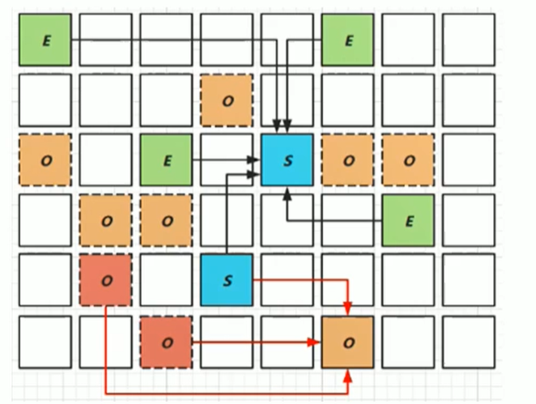

  当越来越多的对象晋升到老年代old region是，为了避免堆内存被耗尽，虚拟机会触发一个混合的垃圾收集器，即Mixed GC，该算法并不是一个Old GC，除了回收整个Young Region，还会回收一部分的Old Region。这里需要注意：**是一部分老年代，而不是全部老年代**。可以选择哪些Old Region进行收集，从而可以对垃圾回收时的耗时时间进行控制。也要注意的是Mixed GC并不是Full GC。

  - 并发标记结束以后，老年代中百分百为垃圾的内存分段被回收了，部分为垃圾的内存分段被计算了出来。默认情况下，这些老年代的内存分段会分8次（可以通过-XX:G1MixedGCCountTarget设置）被回收。
  - 混合回收的回收集包括八分之一的老年代内存分段，Eden区内存分段，Survivor区内存分段。混合回收的算法和年轻代回收的算法完全一样，只是回收集多了老年代的内存分段。具体过程参考上面的年轻代回收过程。
  - 由于老年代中的内存分段默认分8次回收，G1会优先回收垃圾多的内存分段。垃圾占内存分段比例越高的，越会先被回收。并且有一个阈值会决定内存分段是否被回收，-XX:G1MixedGCLiveThresholdPercent，默认为65%，意思是垃圾占内存分段比例要达到65%才会被回收。如果垃圾占比太低，意味着存活的对象占比高，在复制的时候会花费更多的时间。
  - 混合回收并不一定要进行8次。有一个阈值-XX:G1HeapWastePercent,默认值为10%，意思是允许整个堆内存中有10%的空间被浪费，意味着如果发现可以回收的垃圾占堆内存的比例低于10%，则不再进行混合回收。因为GC会花费很多时间但是会受到的内存却很少。

  

- 回收过程四：Full GC （可选）

    G1的初衷就是要避免Full GC的出现。但是如果上述方式不能正常工作，G1会停止应用程序的执行，使用单线程的内存回收算法进行垃圾回收，性能会非常差，应用程序停顿时间会很长。

    要避免Full GC的发生，一旦发生需要进行调整。什么时候会发生Full GC？ 比如堆内存太小，当G1在复制存活对象的时候没有空的内存分段可用，则会回退到Full GC，这种情况可以通过增大内存解决。

    导致G1 Full GC的原因可能有两个：① Evacuation（回收阶段）的时候没有足够的 to-space来存放晋升的对象 ② 并发处理过程完成之前空间耗尽。


**G1回收器优化建议**

- 年轻代
  - 避免使用-Xmn或-XX:NewRatio等相关选项显示设置年轻代大小
  - 固定年轻代的大小会覆盖暂停时间目标
- 暂停时间目标不要太过严苛
  - G1 GC的吞吐量目标是90%的应用程序时间和10%的垃圾回收时间
  - 评估G1 GC的吞吐量时，暂停时间目标太过严苛，会直接影响到吞吐量。


##### **2.5.7.3  G1相关参数设置**

**参数设置：**

**-XX:+UseG1GC**	手动指定使用G1收集器执行内存回收任务。

**-XX:G1HeapRegionSize**	设置每个Region的大小，值是2的幂，范围是1m ~ 32m，目标是根据最小的Java堆大小划分出约2048个区域。默认是堆内存的1/2000

**-XX:MaxGCPauseMillis**	设置期望达到的最大GC停顿时间指标（JVM会尽力实现，但不保证达到）。默认值是200ms。

**-XX:ParallelGCThread**	设置STW工作线程数的值。最多设置为8

**-XX:ConcGCThreads**	设置并发标记的线程数。将n设置为并行垃圾回收线程数（ParallelGCThreads)的1/4左右。

**-XX:InitiatingHeapOccupancyPercent**	设置触发并发GC周期的Java堆占用率阈值。超过此值，就触发GC。默认值是45。


### 2.6 GC日志分析

通过阅读GC日志，我们可以了解Java虚拟机内存分配与回收策略。

**相关参数：**

| 参数                   | 说明                                                         |
| ---------------------- | ------------------------------------------------------------ |
| -XX:+PrintGC           | 输出GC日志。类似： -verbose:gc                               |
| -XX:+PrintGCDetails    | 输出GC的详细日志                                             |
| -XX:+PrintGCTimeStamps | 输出GC的时间戳（以基准时间的形式）                           |
| -XX:+PrintGCDateStamps | 输出GC的时间戳（以日期的形式）                               |
| -XX:+PrintHeapAtGC     | 在进行GC的前后打印出堆的信息                                 |
| -Xloggc:../logs/gc.log | 日志文件的输出路径（输出的GC日志可以通过工具GCViewer等工具查看） |

 **举例说明：**

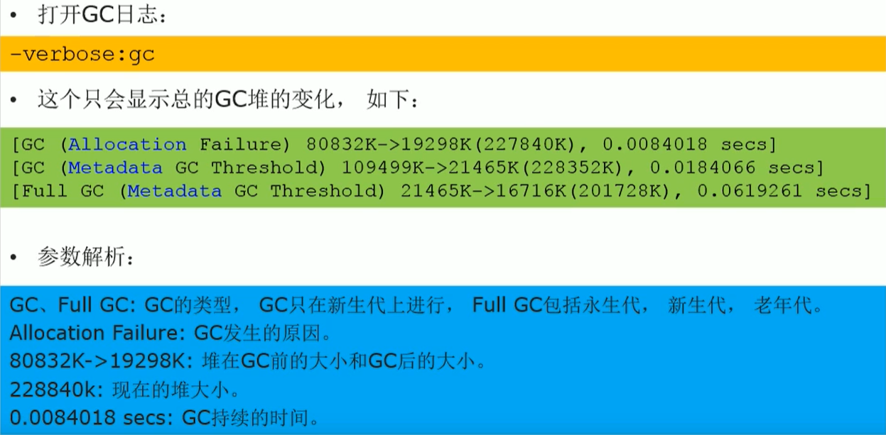

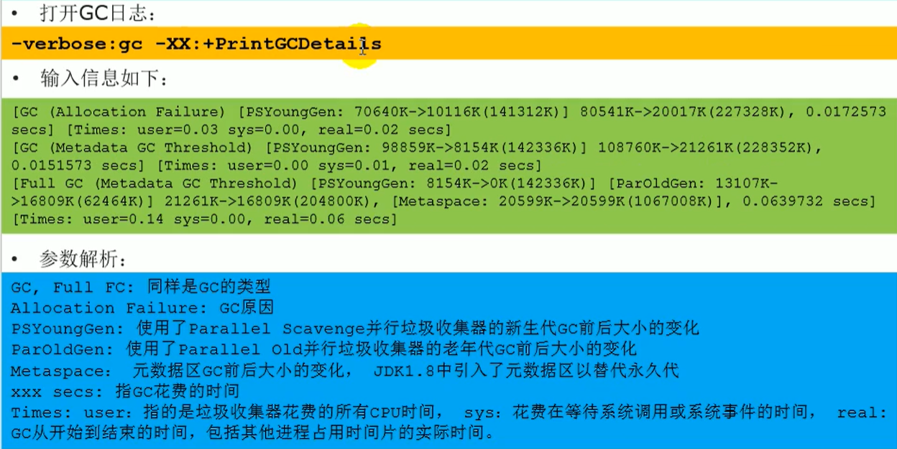

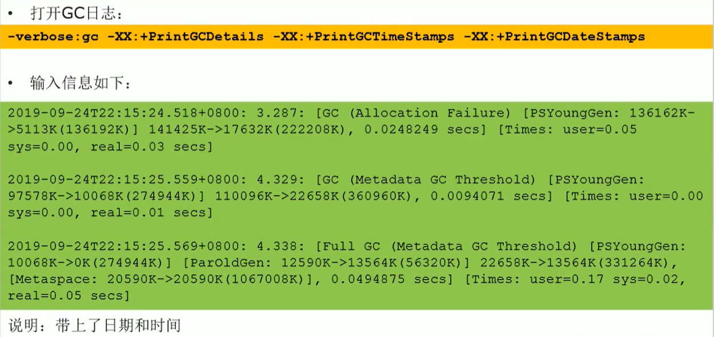

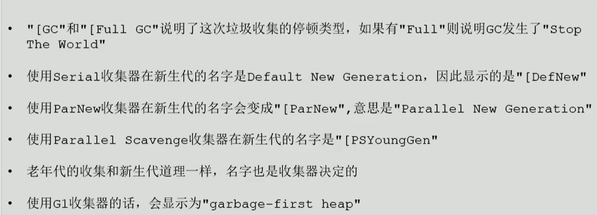

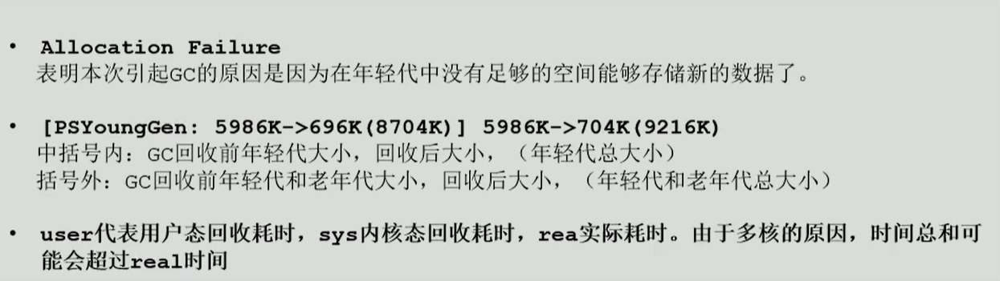

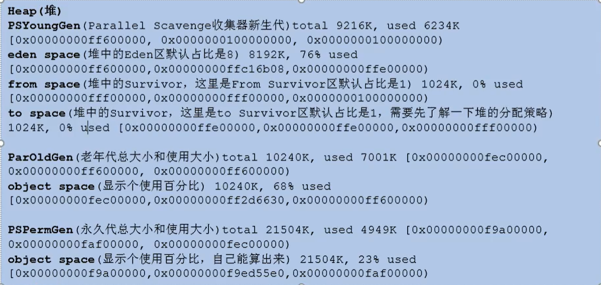

Young GC:
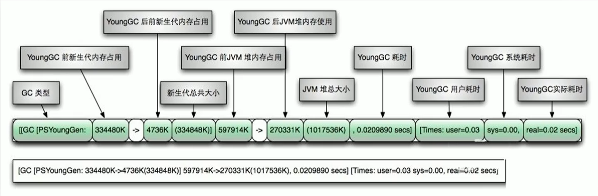

Full GC:
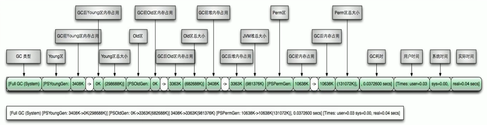


## 3. 字节码与类的加载

## 4. 性能监控与调优

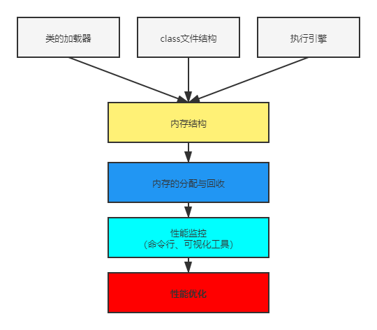