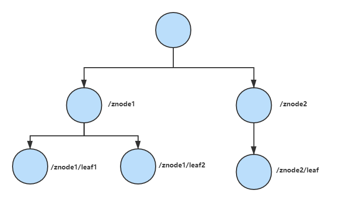
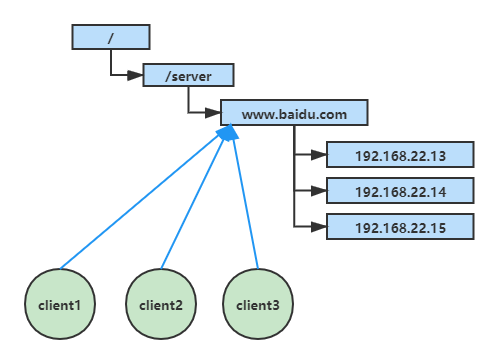
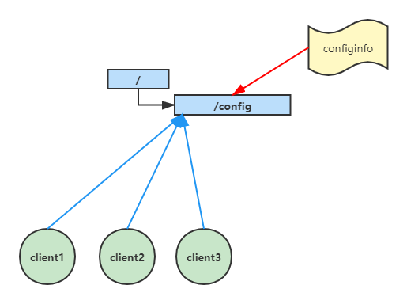
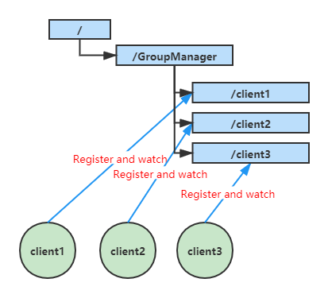
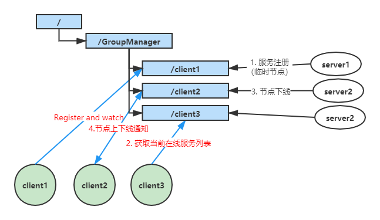
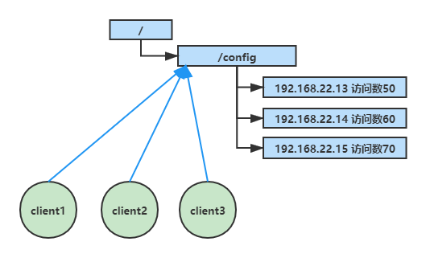

# Zookeeper 总结

## 一.  Zookeeper概述
### 1.1  Zookeeper概念

​	Zookeeper是有一个开源的分布式的为分布式框架提供协调服务的Apache项目。

​	Zookeeper从设计模式角度来理解：是一个基于观察者模式设计的分布式服务管理框架，它负责存储和管理大家都关心的数据，然后接受观察者注册，一旦这些数据的状态发生变化，Zookeeper就将负责通知已经再Zookeeper上注册的观察者做出相应的响应。

### 1.2  Zookeeper特点

​	① Zookeeper：一个领导者（leader），多个跟随者（follower）组成的集群。

​	② 集群中只要有超过半数以上节点存活，zookeeper集群就能正常服务。所以zookeeper适合安装奇数台服务器。

​	③ 全局数据一致：每个server保存一份相同的数据副本，client无论连接到哪个server，数据都是一致的。

​	④ 更新请求顺序执行，来自同一个client的更新请求按其发送顺序依次执行。

​	⑤ 数据更新原子性，一次数据更新要么成功，要么失败。

​	⑥ 实时性，在一定时间范围内，client能读到最新的数据。

### 1.3  Zookeeper数据结构

​	zookeeper数据模型的结构与Unix系文件系统类似，整体上可以看作是一棵树，每个节点称做一个ZNode。每一个Znode默认能够存储1m的数据，每个ZNode可以通过其路径唯一标识。

### 1.4  Zookeeper应用

​	zookeeper能够提供：统一命名服务、统一配置管理、统一集群管理、服务节点下动态上下线、软负载均衡等。

**统一命名服务：**

​	在分布式环境下，经常需要也要对应用/服务进行统一命名，便于识别。例如：IP不容易记住，而域名容易记住。

**统一配置管理：**

​	1） 分布式环境下，配置文件同步非常常见。

​		① 一般要求一个集群中，所有节点的配置信息是一致的，比如Kafka集群。

​		② 对配置文件修改后，希望能够快速同步到各个节点上。

​	2）配置管理可交由zookeeper实现。

​		① 可将配置信息写入zookeeper的一个ZNode

​		② 客户端服务器监听这个Znode

​		③ 一旦Znode中的数据被修改，Zookeeper将通知各个客户端服务器

**统一集群管理：**

​	1）分布式环境中，实时掌握每个节点的状态是必要的。

​		① 可根据节点实时状态做出一些调整。

​	2）zookeeper可以实现实时监控节点状态变化

​		① 可将节点信息写入zookeeper上的一个Znode

​		② 监听这个Znode可获取它的实时状态变化

**服务器动态上下线：**

**软负载均衡：**

​	在zookeeper中记录每台服务器的访问数，让访问数最少的服务取处理最新的客户端请求

